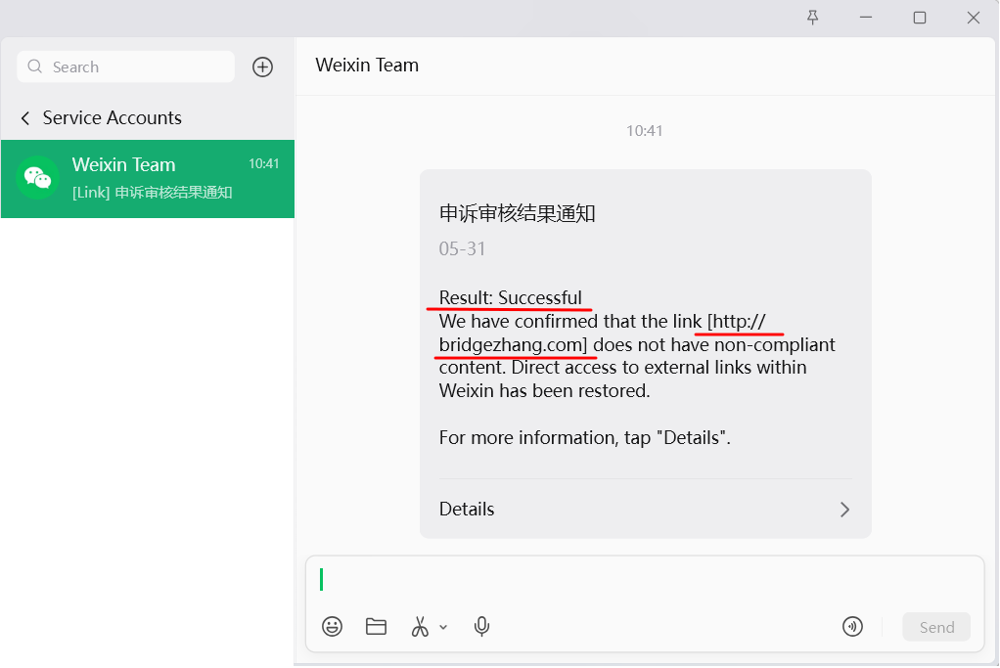

# 关于本文档站

## 1. 关于站点

- 本文档站用于沉淀机械专业学习的内容，取名"机械工程师之桥，Bridge between engineers",也作为公开输出的长期源站，主要内容包括：
    - 机械设计中的基础原则、思路与案例
    - 建模、出图、命名和版本管理等可执行规范
    - 制造、测量与检验中的关键问题
    - 学习路径、工作流与可复用的方法
- 建站使命：希望通过系统化的知识分享，连接更多机械工程师，共同提升行业规范意识。

欢迎关注微信公众号 { #wechat }

- 公众号名称：机械工程师之桥  
- 公众号 ID：`gh_2ad9a9d1c8b0`

{ .contact-qr }

!!! warning "外部链接提示"
    本站所有外部链接，其页面内容、可访问性与链接时效可能变化；访问前请适当判断安全性，并保持审慎态度。

!!! note "发布说明"
    对于站内提及的人物，已尽量逐一沟通并获得发布授权；未获授权或不宜公开的内容，则不予写入，或已做必要处理。

## 2. 关于作者

本文档站作者之一为张桥/bridge zhang，机械设计工程师，本硕皆毕业于杭州电子科技大学机械工程学院。联系方式：邮箱 `contact@bridgezhang.com`

- 曾就职于四川新川航空仪器有限公司，主要负责以梯形丝杠传动为代表的线性传动设备的机械结构开发工作。
- 现就职于余姚市机器人研究中心，主要负责耐压舱体与密封结构为核心的机械结构开发工作。

本文档站作者之一为……

## 3. 关于备案 { #filing }

本站目前采用的是静态文档站的部署方式，内容版本管理在 GitHub，静态站点托管在 Vercel，并通过 Cloudflare 管理 DNS 与访问链路。这意味着本站实际使用的源站服务器并不在中国大陆境内，因此无法按国内服务器网站的路径进行 ICP 备案。若要完成备案，通常需要将网站源站迁移到中国大陆境内的云服务器，例如阿里云、腾讯云等，并按服务商流程提交备案材料。

也正因为网站没有 ICP 备案，在微信内打开本站时，曾出现过外部链接访问警告。该提示并不代表网站内容本身存在违规问题，但会影响读者从微信环境直接访问本站。

后续我向腾讯公司微信团队提交了申诉。经审核，微信团队确认链接 `http://bridgezhang.com` 不含违规内容，外部链接在微信内的直接访问已恢复。

<figure markdown="span">
  { width="720" }
  <figcaption>微信外部链接申诉审核结果通知</figcaption>
</figure>

## 4. 关于 Logo

<figure markdown="span">
  { width="220" }
  <figcaption>站点标志</figcaption>
</figure>

本站 Logo 以“桥梁”为核心意象，采用简洁几何构成：

- 上下两条水平线象征稳定的基础
- 中间拱形结构象征连接、承载与跨越
- 整体风格尽量保持简洁、对称与克制，适合用于文档站点、图示和水印等场景

这个标志希望传递的，不只是视觉识别，更是一种工程表达上的取向：专业、稳定、清晰。

补充说明：

 - Logo 方案由我提供方向，经多轮讨论后AI逐步定稿；`favicon.ico` 由 [RealFaviconGenerator](https://realfavicongenerator.net/) 生成。
 - Logo 已在浙江省版权局完成版权登记，并取得电子证书：作品登记号：`浙作登字-2026-F-00006140`、证书查询链接：[浙江省版权局证书查询页面](http://zjbanquan.org/AppCertificates_Out/ViewCopyrightNo?copyrightid=%E6%B5%99%E4%BD%9C%E7%99%BB%E5%AD%97-2026-F-00006140&cid=7c61cfd0-b513-4fa4-95e5-51758e18e277)
