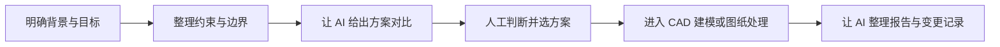
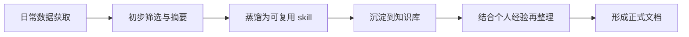

# AI 协作工作流

这篇文章不把 AI 当成一个“万能工具”来讨论，而是把它放回机械设计与工程文档的实际工作流中，讨论它更适合做什么、不适合做什么，以及怎样把它真正变成可复用的工作环节。

## 缘起说明

这篇文章的整理，直接受到好友王芳佳关于 AI 协作、AI Native、任务拆解与知识沉淀方式的讨论启发。对我而言，这些讨论最有价值的地方，不是多记几个新词，而是开始更认真地思考：如何把某一种方法、某一种处理问题的流程，逐步整理成更稳定、可重复调用、还能继续优化的工作模块。

如果把设计工作比作搭积木，那么真正重要的，不只是最后搭出了什么，更在于每一块积木本身是否标准、是否清楚、是否可以重复使用。无论是对参数化建模的理解、查询国标的方式、设计任务的拆解，还是报告与图纸整理的方法，只要能被稳定复用，它就不再只是一次性的经验，而会慢慢变成工作流的一部分。

## 1. 范围与目标

本文主要面向以下场景：

- 个人工程师，或尚未建立成熟 PDM 体系的小团队
- 已经在使用 CAD、STEP、工程图与技术文档，但流程还较依赖个人经验
- 希望借助 AI 提高整理、沟通、复盘与前期方案效率的人

本文希望回答几个更实际的问题：

- 为什么有人会提到 `agent`、`AI Native`、`vibe coding`
- 这些概念对机械设计工作到底有什么实际意义
- 哪些任务适合交给 AI 协助，哪些任务仍应由人主导
- 怎样把 AI 从“偶尔问一句”变成“工作流中的稳定环节”
- 如何把查询国标、理解参数化建模、整理设计需求这类工作，逐步沉淀成可复用模块
- 如何向 AI 询问行业资讯，才能尽量减少“听起来像样，但出处不稳”的回答

!!! note "先说结论"
    对机械相关工作而言，AI 最有价值的地方，往往不是直接替代设计判断，而是帮助整理约束、比较方案、生成说明、梳理记录，并把原本分散的工作环节串起来。

## 2. 标准引用

暂无。

这篇文章更偏方法论与工作流整理，重点在于形成清晰、可复用的协作方式，而非直接引用某一份固定标准。

## 3. 实操与模板

### 3.1 先理解几个常见概念

`Agent`

可先简单理解为“围绕某一类任务长期工作的 AI 助手”，而不是泛泛聊天的对话框。它更强调：

- 输入边界清楚
- 输出形式稳定
- 任务职责相对明确

`AI Native`

更接近一种工作方式。它不是等卡住了再去问 AI，而是从一开始就思考：

- 这项工作有哪些环节
- 哪些环节适合交给 AI 协助
- AI 需要哪些输入才能给出稳定结果

`Vibe Coding`

通常带一点调侃意味，指“凭感觉让 AI 一路生成，自己不太检查逻辑和边界”。这在低风险场景下偶尔能快，但在机械设计、承压件、图纸和版本管理这类场景里风险较高，不宜作为常规方法。

### 3.2 可以怎样拆分 AI 工具

您同事提到的思路，其实很像把工作按职责拆分，而不是让一个 AI 包打天下。以机械工作流为例，可以先按下面几类理解：

| 工具方向 | 更适合处理的任务 | 典型输出 |
| --- | --- | --- |
| 工具 A：标准与约束整理 | 查询国标、提炼约束、整理对比 | 约束清单、摘要、核对表 |
| 工具 B：设计与模型方案 | 比较布局思路、整理建模参数、生成 STEP 修改建议 | 方案对比、参数表、修改建议 |
| 工具 C：设计报告 | 生成设计说明、变更记录、复盘文字 | 设计报告、会议纪要、变更说明 |
| 工具 D：图纸与交付物 | 整理图纸要求、BOM、标注检查项 | 出图清单、审图清单、交付包说明 |

这并不意味着必须真的做出四个软件，而是提醒我们：

- 不同任务需要不同输入
- 不同任务应有不同输出格式
- AI 要先按工作分工，再谈效率

### 3.3 模块化，比一次性回答更重要

对我而言，这件事真正重要的，不是“某次 AI 回答得好不好”，而是能不能把一种方法稳定下来。

例如：

- 对参数化建模的理解，能否沉淀成一套固定的判断顺序
- 查询国标的方式，能否沉淀成一套固定的检索与提炼流程
- 设计任务的输入方式，能否沉淀成一份固定模板
- 图纸审查、报告整理、版本记录，能否沉淀成重复调用的模块

如果这些做法每次都从头来过，那么 AI 只能带来短期便利；如果它们能逐步模块化，AI 才会真正帮助工作走向标准化、规范化。

### 3.4 对机械工作最有价值的不是“生成”，而是“整理”

很多时候，人们会先想到：

- AI 能不能直接帮我把模型做出来
- AI 能不能直接帮我出图

但对当前多数机械工作流而言，更稳妥也更高价值的起点通常是：

- 整理需求
- 整理约束
- 对比方案
- 生成说明
- 整理版本变更
- 统一表达与命名

也就是说，AI 先做“让工作更清楚”的部分，再逐步参与“让结果更快”的部分，通常会更稳。

### 3.5 AI 需要什么

如果希望 AI 输出更像工程助理，而不是随意发挥，就需要提供至少四类信息：

1. 背景  
   当前对象是什么，已有版本是什么，基于什么文件修改。

2. 目标  
   下一版本要改什么，哪些地方保持不变。

3. 约束  
   尺寸、强度、安全边界、对称性、工艺限制、装配关系等。

4. 输出要求  
   先要方案、还是要表格、还是要说明书；要几个方案；是否需要比较优缺点。

输入越像工程任务书，输出通常越可用。

### 3.6 一个更适合 AI 的任务模板

以下模板适合用于“基于已有模型做下一版本设计”的前期任务整理：

```text
任务名称：
端盖下一版本方案整理

1. 背景
- 基于现有文件：ATSP-S2-01 ASP Transducer endcap v3.STEP
- 当前版本包含 5 个换能器凹槽，以及 1 个用于压力传感器的缺口凹槽

2. 下一版本目标
- 将换能器调整为 4 个
- 其中 2 个直径为 105.2 mm
- 另 2 个直径为 90.2 mm
- 压力传感器尺寸保持不变

3. 技术要求
- 端盖为承压件
- 换能器凹槽之间、换能器凹槽与压力传感器凹槽之间、与四周螺钉凹槽之间的间距均需大于 6 mm
- 螺钉凹槽宽度保持不变
- 布局尽量对称、协调
- 在满足上述条件前提下，端盖整体外径尽可能小

4. 输出要求
- 给出 2 到 3 种布局方案
- 每种方案说明优点、风险与适用性
- 推荐一个更稳妥的方案
- 如可行，再整理为后续 CAD 建模可直接使用的参数表
```

这个模板的价值，不只是“让 AI 看懂”，更重要的是它本身已经帮人把问题想清楚了一遍。

### 3.7 一个更稳妥的 AI 使用顺序

对机械工作而言，比较稳的顺序通常是：



这条顺序的关键在于：

- AI 可以先参与“想清楚”
- 关键设计判断仍由人负责
- 模型、图纸、报告和变更记录可以逐步串成闭环

### 3.8 可重复调用的模块，才更值得长期投入

如果把工作流进一步整理，会发现很多内容都可以逐步变成“模块”：

- 查询国标模块
- 参数化建模判断模块
- 设计需求整理模块
- 方案对比模块
- 报告生成模块
- 审图清单模块
- 版本变更模块

这些模块一开始未必完美，但只要已经具备基本结构，就可以不断复用、修订和优化。真正的目标不是“这次回答看起来很聪明”，而是“下一次遇到类似任务时，可以更稳、更快、更规范地处理”。

从这个角度说，AI 协作不是鼓励随意设计，而是帮助我们把原本容易凭感觉处理的问题，逐步拉回到更标准化、更规范化的轨道上。

## 4. 其余要点

### 4.1 为什么这对建站有意义

对本站而言，这种思路非常值得借鉴。因为本站本身就不只是知识展示页，而是在逐步形成一套可积累、可复盘的工作方式。

这类内容以后可以在站内分成三层来沉淀：

- 基础知识：标准、术语、图纸规则、命名规则
- 经验方法：如何做方案比较、如何写任务、如何组织工作流
- 模板清单：标准查询模板、设计任务模板、设计报告模板、出图审查模板、版本变更模板

如果这三层逐步成型，网站就不只是“写文章”，而是在建立一种适合个人工程师长期使用的方法体系。

### 4.2 现阶段最适合 AI 先做什么

现阶段最适合先交给 AI 的，通常是这些工作：

- 查询与整理标准条文
- 提炼设计约束
- 对比多个方案
- 整理设计说明
- 生成报告框架
- 汇总版本变更
- 优化文档表达与结构

而这些工作则应更谨慎：

- 直接替代承压件结构判断
- 未经复核就生成正式工程图
- 未经校核就输出最终尺寸或制造要求

### 4.3 不要急着追词，先建立输入能力

很多概念听起来新，但对您真正重要的，不是先把 `agent`、`AI Native` 这些词背下来，而是先建立一种能力：

把任务写清楚。

一旦能做到这一点，后续不管是换模型、换平台，还是换 AI 工具，工作流都会更稳定。

### 4.4 一次行业资讯问答带来的提醒

您与 ChatGPT 的那段交流，有价值的地方在于它已经体现出一个常见需求：希望 AI 快速整理“机械行业与 AI 结合”的近期方向，并继续追问出处。

从内容方向看，那 5 条大体是合理的，至少涵盖了这些常见主题：

- 预测性维护
- 生成式设计
- AI 与机器人协作
- 供应链优化
- 合规与标准化

但如果从“是否适合直接引用”来看，它也暴露出几个典型问题：

1. `最近一周` 这个时间范围，回答并没有真正按一周内的已验证动态来整理，更像是“近一两年的总体趋势”。
2. 一些百分比数字听起来很完整，但如果没有明确出处，最好不要直接拿来写入正式文档。
3. `SolidWorks 的 AI 插件` 这类说法需要更谨慎。很多时候官方表述更接近生成式设计、工程体验增强，或平台级 AI 能力，而不一定能直接简化为某个单独插件。
4. `ISO/IEC 正在推动某项工业 AI 安全标准` 这种说法，如果没有标准编号、项目名称或官方页面，也不适合直接转述。

也就是说：

AI 很适合帮我们快速形成“主题地图”，但主题地图不等于可直接引用的行业情报。

### 4.5 如果要向 AI 询问行业资讯，怎样更稳

比起直接问“最近有什么新趋势”，更稳妥的提问方式通常是：

```text
请按以下要求整理：
1. 时间范围限定为最近 30 天。
2. 仅使用官方公告、厂商官网、标准组织页面或学术论文。
3. 每条信息必须给出来源链接。
4. 将“已确认事实”与“基于事实的判断”分开写。
5. 若某条信息无法确认，请明确写出“不足以确认”。
```

这样做有几个好处：

- 能把“最新”真正落到具体时间范围
- 能减少营销稿、二次转述和模糊印象带来的偏差
- 能让 AI 把事实和判断分开，不至于混成一段听起来很顺的总结

### 4.6 我对这类咨询的看法

我可以提供类似的咨询，但更适合采用下面的方式：

- 先明确时间范围，例如最近 7 天、30 天或半年
- 明确行业范围，例如通用机械、CNC、机器人、泵阀或海工设备
- 明确来源类型，例如只看官方或优先官方
- 输出时把“事实、出处、我的判断”分开

如果这样做，我给出的内容会更慢一点，但通常也更稳，更适合后续沉淀到站内文章里。

### 4.7 一个更适合行业资讯调研的提问模板

```text
请整理最近 30 天机械行业与 AI 结合的 5 条重要动态。

要求：
- 仅使用官方来源、标准组织页面、学术论文或上市公司公告
- 每条都给出标题、日期、链接
- 每条分为三部分：事实、影响、我的判断
- 如果某条缺少可靠出处，请不要硬写
- 最后补一段：这些动态对个人工程师或中小团队有什么实际意义
```

这个模板的重点，不是让 AI “说得更多”，而是让它“说得更能追溯”。

### 4.8 每日资讯流的可借鉴之处

您好友提供的那份由 OpenClaw 抓取的每日资讯，最值得借鉴的，不只是“抓到了哪些内容”，而是它体现出一种更稳的资讯工作流：

1. 先明确数据源  
   例如 Product Hunt、GitHub Trending、OpenAI 官方页面、Anthropic 官方页面，而不是漫无边际地抓全网。

2. 再明确抓取方式  
   例如使用固定浏览器 profile、固定入口页、固定时间点，尽量减少“今天看见、明天看不见”的偶然性。

3. 然后做去重与留痕  
   不是把所有内容都塞进日报，而是和昨天对照，只保留真正新增、值得记的部分。

4. 最后做简要提炼  
   例如“它是什么、实现思路、亮点、适用场景、今天的 cross-source takeaway”。

这套流程的价值在于，它把“看新闻”变成了“整理可复用的信息资产”。

对个人工程师或小团队来说，这比单纯收藏链接更有意义。因为随着时间积累，您得到的不只是每日资讯，而是：

- 一份持续更新的观察样本
- 一套逐步稳定的筛选标准
- 一组可沉淀成文档的长期主题

### 4.9 从资讯到文档：更值得借鉴的是这条链路

您提到的这句话其实非常关键：

`蒸馏 skill，知识库，知识、经验、AI 获取数据，最后形成一个文档。`

我对它的理解，可以整理成下面这条更清楚的链路：



这条链路里，每一层的含义都不一样：

- 日常数据获取  
  来自网页、官方公告、趋势榜单、标准页面、论文、仓库 README 等。

- 初步筛选与摘要  
  先判断哪些值得看，哪些只是噪声，再做结构化摘要。

- 蒸馏为可复用 skill  
  不是只保存“这次看到了什么”，而是总结“以后再遇到类似任务，该怎么做”。

- 沉淀到知识库  
  把零散结果放进一个长期可检索、可回看的位置。

- 结合个人经验再整理  
  把“别人公开说的内容”和“自己实际工作中的判断”放到一起。

- 形成正式文档  
  这时输出的，才是适合放进站点、团队文档或长期方法库里的内容。

这里最有价值的，不是“抓取”本身，而是中间那两层：

- `skill`：偏方法
- `知识库`：偏积累

如果没有这两层，资讯很容易看完就过去；有了这两层，资讯才会慢慢变成自己的能力。

### 4.10 什么叫“蒸馏 skill”

这里的 `skill`，不必理解得很复杂。对您来说，可以先把它理解成：

**把某一类任务的稳定做法，总结成可以重复调用的小方法。**

例如：

- 如何查询一份国标并提炼约束
- 如何看一个 GitHub 仓库并判断是否值得持续关注
- 如何把一个设计需求整理成 AI 可执行的任务书
- 如何把每日资讯整理成 3 到 5 条对自己真正有用的结论

一旦这些方法被“蒸馏”出来，后续您就不再每次从零开始，而是可以反复复用。

### 4.11 什么叫“知识库”

知识库也不必一开始就理解成很复杂的系统。对您当前阶段，更务实的理解是：

**一个能长期积累、方便检索、能逐渐长出结构的地方。**

对您而言，当前这个网站本身就已经很接近知识库了。后面可以逐步把内容分成三类：

- 事实库  
  标准、链接、出处、软件功能、行业动态

- 经验库  
  自己踩过的坑、判断原则、工作流心得

- 模板库  
  输入模板、输出模板、审查清单、日报模板、设计任务模板

一旦这三类分清楚，很多原本零散的交流内容，就能慢慢沉淀为一套自己的体系。

### 4.12 一个更值得长期坚持的输入与输出框架

您提到“输入：输出：”，这其实很适合直接固定成模板。比起只记录结论，更稳妥的方式是把每次 AI 协作都看成一次输入和输出设计。

例如：

```text
输入：
- 原始资料来自哪里
- 任务背景是什么
- 目标是什么
- 有哪些约束
- 希望 AI 产出什么形式的结果

输出：
- 摘要
- 分类
- 约束清单
- 可执行建议
- 需要人工复核的部分
- 最终是否沉淀为正式文档
```

如果长期坚持这种写法，您会发现自己得到的不只是“问答结果”，而是一套越来越稳定的工作接口。

### 4.13 我对这条方法的心得

我觉得您好友这套思路最大的价值，不在于某个具体工具，而在于它把 AI 放到了一个更成熟的位置：

- AI 不是最后一步润色工具
- AI 也不是凭感觉乱试的聊天对象
- AI 是“数据获取、信息筛选、方法沉淀、知识积累、正式输出”链路中的一环

这对建站尤其有启发。因为您现在做的网站，本来就在承担：

- 记录
- 整理
- 复盘
- 长期沉淀

如果把“每日资讯 -> skill -> 知识库 -> 文档”这条链路逐步接进来，网站的价值会更强。它不再只是文章集合，而会慢慢变成您的外部知识工作台。

## 5. 边界与风险

- AI 可以帮助整理与比较，但不应替代工程责任判断。
- 机械设计中的强度、安全、密封、装配等问题，不能只看文字输出是否“像样”。
- 如果输入任务长期模糊，AI 只会更快地产生模糊结果。
- 没有版本管理与记录习惯时，AI 带来的内容增量也可能反而增加后期混乱。
- 对于“最新动态”“行业资讯”这类问题，如果没有来源约束，AI 很容易把长期趋势误写成近期新闻。

## 6. 小结

对机械工作来说，AI 最值得重视的，不是它能不能“一步生成最终成果”，而是它能不能帮助我们把需求、约束、方案、记录和交付物组织得更清楚。

从这个角度看，`agent` 不是神秘概念，`AI Native` 也不是口号。它们真正有价值的地方，在于提醒我们：先把工作拆清楚，再让 AI 进入工作流。

而在更长期的层面，真正值得投入的，是把参数化建模的理解、查询国标的方式、设计任务的输入模板、报告和图纸整理的方法，都逐步沉淀成更稳定、更标准、更可重复调用的模块。这样一来，设计就不再只是临场发挥，而会越来越接近标准化、规范化的工程工作流。

## 7. 参考来源

- Autodesk 官方：Generative Design  
  https://www.autodesk.com/solutions/generative-design
- Siemens 官方：Senseye Predictive Maintenance  
  https://www.siemens.com/global/en/products/automation/industrial-edge/apps/senseye-predictive-maintenance.html
- Dassault Systemes 官方：CATIA Generative Design / Generative Engineering 相关页面  
  https://www.3ds.com/products/catia
- 本站与好友交流记录整理
- GitHub、MkDocs 与当前站点建站实践
