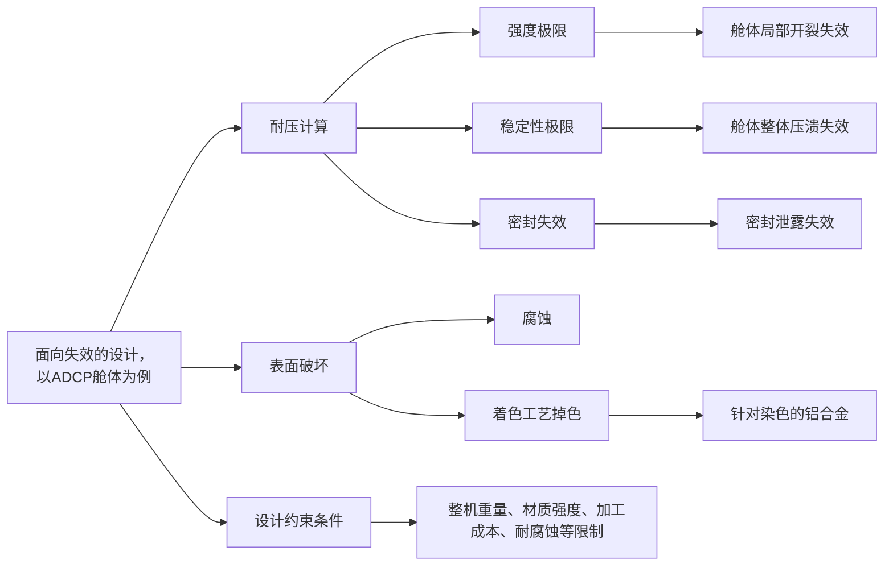

# 设计案例之面向失效的设计：以ADCP舱体为例

## 1. 范围与目标

- 简述面向失效的设计的含义。
- 以ADCP舱体为例，阐述主要失效形式及设计约束条件。

## 2. 标准引用

## 3. 实操与模板

### 3.1 背景介绍

- 此文

- 此处将不满足`设计约束条件`视为一种失效。

决策矩阵：

| 材料 | 密度 (kg/m³) | 抗拉强度 (MPa) | 典型应用深度 | 加工成本 / 难易度 | 耐腐蚀性 | 备注 |
| --- | --- | --- | --- | --- | --- | --- |
| 亚克力 (PMMA) | 1,180 | 70–80 | 近海/浅海 | 低 | 中 | BlueROV 等类似产品常见舱体材质，透明性好，适合观察罩 |
| POM(塑料) | 1,420 | 60–70 | 200m以内 | 低 | 中 | 轻量、易加工，耐温性和耐候性一般 |
| 铝合金 6061-T6 | 2,700 | ~310 | 近海/浅海 | 中 | 中 | 常用结构材料，强度/重量比优良 |
| 316 不锈钢 | 7,980 | ~515 | 中深海/海洋暴露 | 中高 | 高 | 耐腐蚀性好，但重量大、成本较高 |
| 钛合金(Ti-6Al-4V) | 4,430 | ~900 | 深海 | 高 | 高 | 轻强高耐腐蚀，适合高性能结构件 |

## 4. 其余要点

## 5. 边界与风险

## 6. 小结

## 7. 参考来源

- 濮良贵，陈国定，吴立言. 机械设计(第十版)【M】. 高等教育出版社，2019.7.