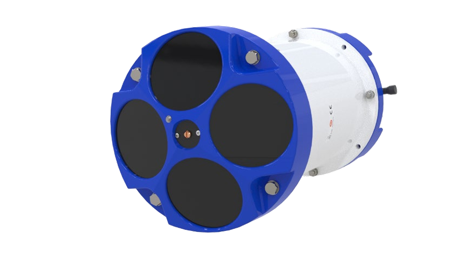
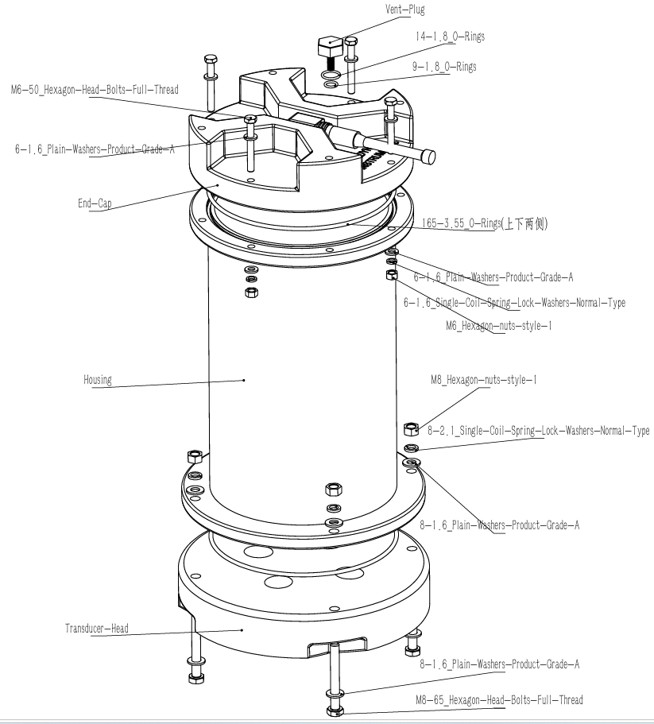
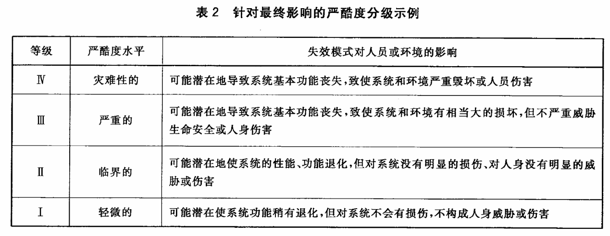

# 系统可靠性分析(FMEA) 

## 1. 范围与目标

- 系统可靠性分析(FMEA)技术对于识别潜在的设计缺陷和提高产品可靠性具有重要意义。
- 本文介绍相应的国家标准，并以ADCP系统为例，说明如何在设计阶段进行FMEA分析。 

## 2. 标准引用

- 本文依据 GB/T 7826-2012 系统可靠性分析技术 失效模式和影响分析
（FMEA）程序 进行撰文。 其重要观点简述如下：
    - FMEA(Failure Mode and Effects Analysis，失效模式和影响分析)，是对系统进行分析，以<mark>识别潜在失效模式、失效原因</mark>及其对系统性能（包括组件、系统或过程的性能）影响的<mark>系统化程序</mark>。
    - 术语“系统”表示硬件、软件（及其相互作用）或过程。分析应尽可能在开发周期的早期阶段成功进行，以获得消除或减少失效模式的最佳效率比。 

## 3. 实操与模板

### 3.1. 基础知识

- ADCP系统是水下声学多普勒流速剖面仪的简称，主要用于测量水体流速和流向。对机械结构而言，此类水下舱体设备，<mark>主要针对密封性能、耐压性能、防腐蚀性能等进行FMEA分析</mark>。
- 本文所论述的ADCP的 FMEA 分析，指的是正常工作状态下的失效影响，不关注由于人为失误造成的ADCP严重表面磕碰、结构损害等情况下的失效影响。据此来<mark>定义系统的边界条件</mark>。 
- ADCP设备的官方文档详见公开资料：[Operation Manual](https://www.teledynemarine.com/en-us/support/SiteAssets/RDI/Manuals%20and%20Guides/Workhorse%20II/WH2_Operation_Manual.pdf)，另存档于互联网档案馆[Operation Manual](http://web.archive.org/web/20260321082212/https:/www.teledynemarine.com/en-us/support/SiteAssets/RDI/Manuals%20and%20Guides/Workhorse%20II/WH2_Operation_Manual.pdf)。其外观及爆炸图如下图所示，第二图[来源](../modeling/exploded-view.md)。

<figure markdown="span">
  { width="720" }
  <figcaption>Workhorse II Sentinel ADCP 外观（来自官方文档）</figcaption>
</figure>

<figure markdown="span">
  { width="720" }
  <figcaption>Exploded-View-Example </figcaption>
</figure>

### 3.2. FMEA分析样表

FMEA一个重要的先决条件，是定义和确定ADCP系统中完整的失效影响严酷度和等级，此处引用GB/T 7826-2012 表2的分级示例，如下图所示。

<figure markdown="span">
  { width="720" }
  <figcaption>GB-T-7826-2012-Harshness-Classification-Table</figcaption>
</figure>

依据标准附录推荐的FMEA分析样表，编制ADCP的FMEA分析表，如下表所示，对ADCP的组成单元潜在的各种失效模式，均提出了探测方法和改进措施。注意，下表中的第3条，针对铝合金舱体的ADCP进行分析。

| 编号 | 零部件 | 功能 | 失效模式 | 失效影响（局部） | 失效影响（最终） | 探测方法或特征 | 严酷度等级 | 改进措施 |
| --- | --- | --- | --- | --- | --- | --- | --- | --- |
| 1 | O形圈 | 舱体密封 | a) 安装不规范；b) 老化 | 密封泄漏 | 设备严重损害 | 拆卸检测 | III | 规范操作；定期更换 |
| 2 | 舱体、端盖 | 承受水压 | 结构失稳被破坏 | 结构严重开裂 | 整个设备损坏 | 目视 | III | 执行国标舱体设计规范；留足裕度 |
| 3 | 舱体、端盖 | 防腐蚀 | 磕碰后防腐蚀性能下降 | 防腐蚀能力下降 | 产品寿命缩短 | 目视 | II | 加强阳极氧化工艺；避免严重磕碰 |

## 4. 小结

- 此文可作为FMEA分析的一个<mark>模板与样例</mark>，但需要根据具体项目情况进行调整和补充。
- GB/T 7826-2012中部分样例甚至给出了<mark>失效模式对应发生的概率等级</mark>，但本文未涉及，读者可自行查阅标准。显然针对大批量生产的产品，失效模式发生的概率等级是一个重要的参考指标。
- 值得注意的是，FMEA分析的结果并非一成不变，它更多<mark>体现的是设计者对失效模式的理解深度和应对策略</mark>，随着设计的深入和经验的积累，这些结果可能会得到优化和改进。
- 以ADCP系统为例，显然，如果对密封舱体的承压设计没有基本的理解，那么相应的FMEA分析将无从谈起。