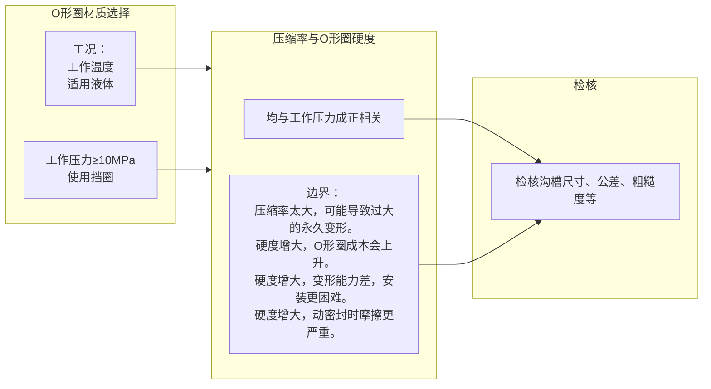

# 液压气动用O形橡胶密封圈

## 1. 范围与目标

- 本文主要讨论GB/T3452《液压气动用O形橡胶密封圈》标准的背景及应用。

## 2. 标准引用

GB/T3452由5个部分构成，并全部修改采用自 [ISO-3601 Fluid power systems — O-rings](https://www.iso.org/standard/85921.html)：

- GB/T3452.1：尺寸系列及公差。目的是用于尺寸设计或验收。
    - 标记示例：O形圈 8.75x1.80—G系列/A系列—N级/S级—GB/T 3452.1-2005。
    - 其中：d1内径/inside diameter = 8.75、d2线径/Diameter sections = 1.80；G为普通系列，A为航空级系列；N级为一般级，S级为较高级外观质量。
    - d2线径包括如下系列：1.80、2.65、3.55、5.30、7.00。

- GB/T3452.2：外观质量检验规范。
- GB/T3452.3：沟槽尺寸。目的是与O形橡胶密封圈的尺寸相匹配,以达到良好的密封效果。
    - 针对径向密封、轴向密封(受内部压力的沟槽、受外部压力的沟槽)两种大类的形式。
    - 对沟槽尺寸、同轴度公差、表面粗糙度进行了规定。
    - 明确了压缩率的取值范围。
- GB/T3452.4：抗挤压环(挡环)。目的是在高压条件下避免O形圈被挤出。
- GB/T3452.5-2022：弹性体材料规范。目的是评估O形圈弹性体材料(橡胶)的适用性。
    - 由工作条件(如工作压力、温度、适用液体等)选择O形圈的材料。由标准的表1、表B.1可整理出如下3种材质的情况：

| 材料/代号 | 硬度级别(IRHD) | 使用温度(℃) | 适用液体 |
| :--- | :--- | :--- | :--- |
| 丁腈橡胶/NBR | 70，80，90 | -40~+125 | 各种油类 |
| 氟橡胶/FKM | 70，80，90 | -10~+250 | 各种油类 |
| 三元乙丙橡胶/EPDM | 70，80 | -50~+150 | 不耐油，耐冷却液、水等 |

## 3. 实操与模板

### 3.1 标准理解

关于硬度级别：

- IRHD(International Rubber Hardness)硬度：值从0到100，其中0表示极软的材料，100表示极硬的材料。以其精确和科学服务于研发和标准制定。
- Shore A（邵氏A硬度），用于正式、标准的学术和工程术语。HS，Hardshore (A) 或 Hardness Shore (A)，工程领域的常用缩写。
- 注意：对于30-80 IRHD范围内的橡胶材料，Shore A和IRHD的读数在数值上通常比较接近。但不推荐对IRHD和Shore A进行相互换算，两者是独立的标准，各有适用的测试场景。
- Duro，Durometer 的缩写，行业内的通俗叫法、俚语。源于测量硬度的仪器叫“Durometer”，意为“硬度值”。

### 3.2 决策逻辑

GB/T3452.5-2022：弹性体材料规范 部分

- 每种材质一般多种硬度级别可选。工作压力越大，硬度参数需相应增大，以增大耐挤出性能。

GB/T3452.3：沟槽尺寸 部分

- 明确压缩率的取值范围，但具体取值需要根据工作压力等工况进行选择。工作压力越大，压缩率应相应的增大，以获得更大的接触应力。压缩率取定后沟槽深度相应确定。
- 但压缩率应在国标要求的上限以内，避免导致过大的永久变形，尤其是高温环境。
- 在可以几种截面O形圈的情况下，优先选用大截面的O形圈。

综上所述，基本决策逻辑如下：

## 4. 其余要点

- 美国标准[AS568](https://www.sae.org/standards/as568-aerospace-size-standard-o-rings/)也是比较常见的标准。

## 5. 边界与风险

- 暂无。

## 6. 小结

- 。