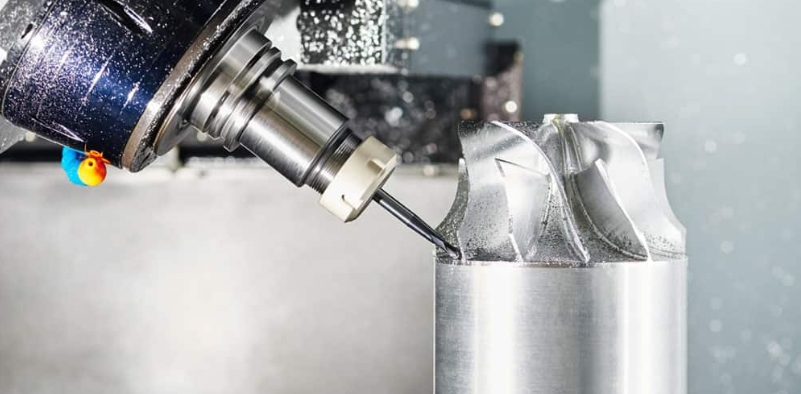
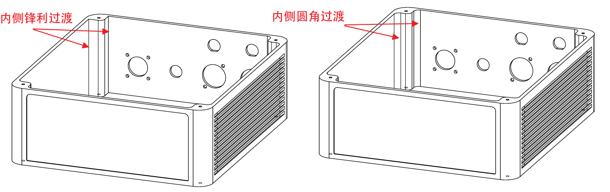
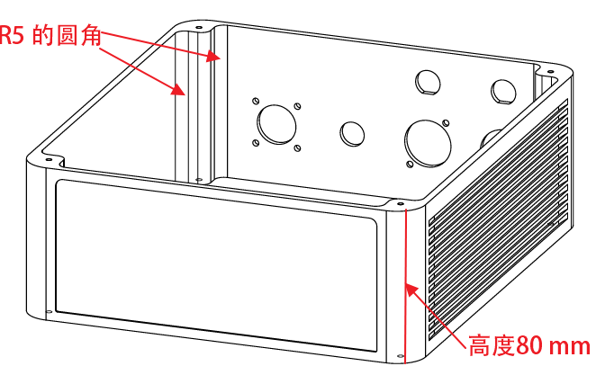
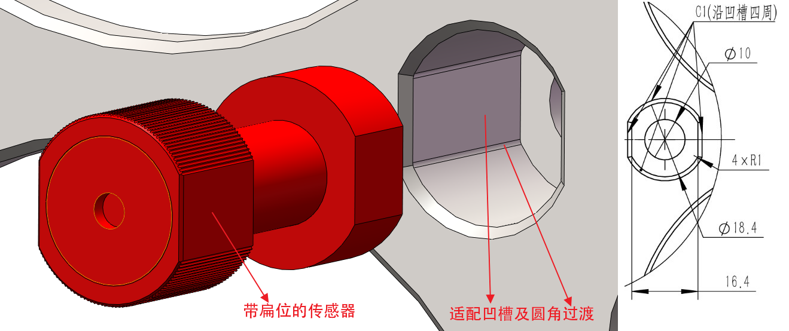
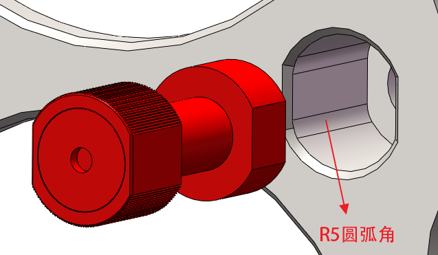

# 面向CNC加工的设计笔记

## 1. 概述

- 计算机数控(Computer Numerical Control, CNC)加工是利用精密机器配合刀具<mark>去除材料</mark>的加工方式，具体过程而言，是结合CAD文件和CAM(Computer Aided Manufacturing，计算机辅助制造)软件实现<mark>预编程</mark>的一种加工方式。
- 常见CNC加工设备：
    - CNC铣床：将原材料固定在床身上，利用高速旋转的主轴配合特定铣刀进行切削加工；如3轴、5轴CNC铣床，<mark>5轴CNC铣床包括3个垂直方向的直线轴和2个旋转轴</mark>，可加工复杂的三维曲面。下图为工作中的铣刀特写，[图片来源](https://xometry.asia/zh-hans/cnc-milling-all-you-need-to-know/)。

    <figure markdown="span">
        { width="720" }
        <figcaption>Close-Up-Of-A-Milling-Cutter-At-Work </figcaption>
    </figure>

    - CNC车床：主要用于经济的加工回转体零件。
- 尽管计算机可以实现对刀具切削的精密控制，但CNC加工仍然存在一些限制(包括加工限制与成本限制)，下面将讨论这些限制因素。

## 2. 尺寸限制

材料毛坯尺寸

## 3. 零件复杂性

## 4. 圆角

由于CNC铣床(立式、卧式)是旋转的铣刀去除材料加工，当使用铣床加工内侧交汇壁面时，交汇处不能锋利，必须是圆角过渡。下图中，左侧图不能利于铣刀加工出来。

<figure markdown="span">
    { width="720" }
    <figcaption>Sharp-Transitions-And-Rounded-Transitions </figcaption>
</figure>

铣床加工内侧圆角，圆角半径与圆角深度是关键。以下是一些具体的建议：

1. 使用尽可能大的半径：把原本铣削路径的“急弯”变成“缓弯”，让刀具能够“跑起来”，而不是在每一个转角处都必须“停下来”，这对产品的加工成本、质量和效率有较大影响。
2. 避免小而深的圆角半径，当圆角过小而深度过大时，可能没有此规格的铣刀，刀具直径过小将使刀柄直径和刀柄长度受限。以下提供两个实例供参考，具体情况需要与加工商协商确定。

    2.1. 如下图所示，在高度为80 mm的箱体中框的案例中，内侧圆角由R3被加工商建议增大为R5；此处由于是贯穿的中框，若执意要设计为R3，可选择电火花线切割，此时设计为直角过渡都可以，但成本会显著增加。

    <figure markdown="span">
      { width="720" }
      <figcaption>Frame-Case-With-Rounded-Corner-Transition </figcaption>
    </figure>

    2.2. 如下图所示，为带扁位的传感器设计适配凹槽，凹槽中设有圆角过渡，加工商反馈：19 mm深的槽，最小只能做到R1的圆弧角；若槽深达到22 mm，则圆弧角需要扩大到R1.5。

    <figure markdown="span">
      { width="720" }
      <figcaption>Sensor-Case-With-Rounded-Corner-Transition </figcaption>
    </figure>

    过大的内侧圆角将占据更大的空间，如下图所示(为使视觉上的直观性，特意将圆角增大到R5)，此时为使传感器顺利装入适配凹槽而不得不增大扁位间的间距。

    <figure markdown="span">
      { width="720" }
      <figcaption>Sensor-Case-With-R5-Corner-Transition </figcaption>
    </figure>

    为了避免过大的扁位间的间距，可考虑如下图所示的避让的形式，此方式也有助于降低加工难度和提升加工效率，并被加工商所建议。

    <figure markdown="span">
      { width="720" }
      <figcaption>Rounded-Corner-Transition-With-Clearance </figcaption>
    </figure>

3. 在铣削加工中，内侧圆角半径应大于所选铣刀半径（通常建议大0.5~1mm），以避免刀具没有<mark>合适的间隙转入铣削</mark>，此时刀具必须停止行进进行铣削，进而引发切削力突变、振动加剧及效率下降。遵循此设计原则，可确保切削路径的连续性，提升加工效率和表面质量，同时延长刀具寿命。常见的铣刀半径系列有3、4、5、6、8 mm等数值，若想用R4的铣刀，设计圆角为R4.5或R5比较合适。

## 5. 孔加工

## 6. 螺纹和螺纹孔

## 7. 底切

https://www.rapiddirect.com/zh-CN/blog/undercut-in-machining/ 
https://www.china-casting.com/zh-CN/%E5%BA%95%E5%88%87%E5%8A%A0%E5%B7%A5/
可参考该公司及其文章