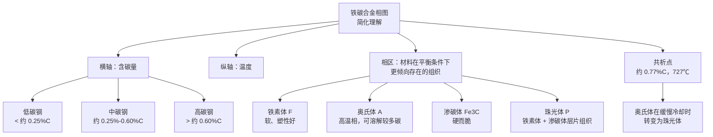
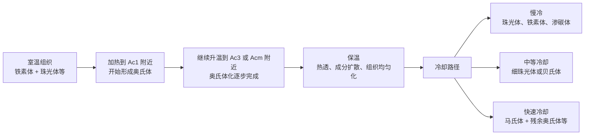
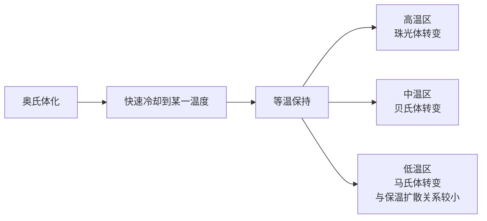
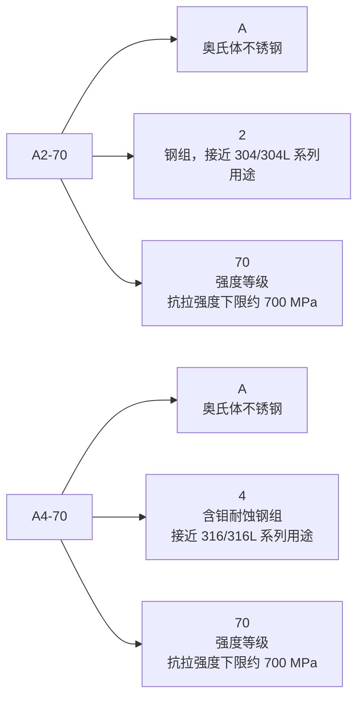

# 热处理基础：相图、相变与常见标记

## 1. 范围与目标

本文作为[热处理知识框架](heat-treatment.md)的基础补充，重点回答几个更底层的问题：

- 钢为什么能通过加热、保温、冷却改变性能。
- 铁碳合金相图、相变点、等温转变曲线大致在表达什么。
- 奥氏体、铁素体、珠光体、贝氏体、马氏体等术语如何理解。
- 遇到 `A2-70`、`A4-70`、`固溶 + 480℃ 时效` 等工程标记时，应该从哪里入手判断。

目标不是成为热处理专家，而是在机械设计、图纸审查、供应商沟通和失效分析中，能抓住关键概念，不把材料牌号、热处理状态和性能等级混为一谈。

## 2. 标准引用

- GB/T 12603 金属热处理工艺分类及代号
    - 用于统一退火、正火、淬火、回火、固溶处理、时效处理等热处理术语。
    - 本文只做基础理解，不替代标准中的正式定义和工艺分类。
- GB/T 3098.6 紧固件机械性能 不锈钢螺栓、螺钉和螺柱
    - 可用于理解 `A2-70`、`A4-70` 等不锈钢紧固件材料组和性能等级标记。
    - 设计和采购标准件时，标记、规格、性能等级和执行标准通常比自行指定热处理更重要。
- GB/T 1220 不锈钢棒
    - 可用于理解不锈钢棒材牌号、化学成分和交货状态等要求。
    - `05Cr17Ni4Cu4Nb` 等沉淀硬化不锈钢，应结合材料标准、热处理制度和力学性能要求一起理解。
- GB/T 20878-2007 不锈钢和耐热钢 牌号及化学成分
    - 可用于理解国内不锈钢新旧牌号及化学成分。
    - 例如 `06Cr19Ni10` 常对应 304 类奥氏体不锈钢，`06Cr17Ni12Mo2` 常对应 316 类含钼奥氏体不锈钢。

## 3. 实操与模板

### 3.1 铁碳合金相图的基本理解

钢的热处理之所以重要，是因为铁和碳在不同温度、不同含碳量下会形成不同组织。工程上常见碳钢和低合金钢的很多热处理，都可以先从铁碳合金相图建立直觉。



几个抓手：

- `A1` 线附近常被理解为共析转变温度，碳钢平衡状态下约为 727℃。
- `A3` 线与亚共析钢有关，表示铁素体与奥氏体相区之间的边界。
- `Acm` 线与过共析钢有关，表示奥氏体与渗碳体相区之间的边界；加热过程也常写作 `Accm`。
- 实际加热和冷却不是完全平衡过程，所以图纸、工艺中常见 `Ac1`、`Ac3`、`Ar1`、`Ar3` 等写法。

其中 `Ac` 表示加热时的临界点，`Ar` 表示冷却时的临界点。由于相变需要过热或过冷，实际加热时的 `Ac1` 通常高于平衡 `A1`，实际冷却时的 `Ar1` 通常低于平衡 `A1`。

### 3.2 加热与冷却中的相变点

同一块钢，在加热和冷却时并不是到某个温度就瞬间完成全部转变，而是会经历起始和终了区间。



这解释了为什么工艺不能只看最高温度：

- 加热温度决定是否进入奥氏体区，以及奥氏体化是否充分。
- 保温时间决定截面是否热透、组织和碳分布是否足够均匀。
- 冷却速度决定奥氏体最终转变为珠光体、贝氏体还是马氏体。

因此，常规碳钢和低合金钢的淬火，本质上常是“先奥氏体化，再用足够快的冷却避开珠光体/贝氏体转变区，获得马氏体”。但这只是钢热处理的一类，不适用于所有钢种和所有不锈钢。

### 3.3 共析钢过冷奥氏体等温转变曲线

等温转变曲线常称 TTT 曲线，用来描述奥氏体被快速冷却到某一温度后，在该温度保温时会如何转变。它不是普通加热炉的完整工艺曲线，而是帮助理解“时间、温度、组织”关系的工具。



读 TTT 曲线时，可以先抓住三点：

- 曲线左侧是“尚未开始转变”的过冷奥氏体区。
- 曲线鼻尖位置代表最容易发生扩散型转变的温度和时间范围。
- 如果连续冷却曲线绕过鼻尖，并降到 `Ms` 以下，奥氏体会开始转变为马氏体。

`Ms` 是马氏体开始转变温度，`Mf` 是马氏体转变基本完成温度。马氏体转变主要由过冷驱动，不是靠长时间扩散完成，所以“淬火后获得马氏体”依赖足够快的冷却，也依赖材料本身的淬透性。

### 3.4 基本术语

| 术语 | 简要理解 | 对设计和制造的意义 |
|---|---|---|
| 铁素体 | 碳在 α-Fe 中的固溶体，软而塑性好 | 有利于塑性和韧性，但强度和硬度较低 |
| 奥氏体 | 碳在 γ-Fe 中的固溶体，常见于高温状态 | 很多钢的淬火、正火、退火都先围绕奥氏体化展开 |
| 渗碳体 | Fe3C，硬而脆 | 提高硬度和耐磨性，但过多或形态不良会降低韧性 |
| 珠光体 | 铁素体和渗碳体的层片状混合组织 | 常见于退火、正火后的碳钢组织 |
| 贝氏体 | 中温转变组织 | 可获得较好的强韧性组合，常与等温淬火相关 |
| 马氏体 | 奥氏体快速冷却形成的过饱和固溶体 | 硬度高、强度高，但内应力和脆性也高，通常需要回火 |
| 残余奥氏体 | 淬火后未转变完的奥氏体 | 可能影响尺寸稳定性、硬度和后续服役表现 |
| 固溶处理 | 加热使合金元素充分溶入基体后快速冷却 | 常见于奥氏体不锈钢和沉淀硬化不锈钢，不等同于淬硬 |
| 时效处理 | 在一定温度保温，使强化相析出 | 常用于铝合金、沉淀硬化不锈钢等，提高强度 |

### 3.5 示例一：304 不锈钢螺钉、A2-70 与 A4-70

日常常说“304 不锈钢螺钉”，但在紧固件标准里，更常见的标记是类似 `A2-70`、`A4-70`。

先把常见材料牌号对照放在一起看：

| 习惯叫法 | 现行 GB/T 20878 牌号 | 旧国标牌号 | ASTM/UNS 常见对应 | JIS 常见对应 | 简要理解 |
|---|---|---|---|---|---|
| 304 | `06Cr19Ni10` | `0Cr18Ni9` | 304 / `S30400` | `SUS304` | 18-8 类奥氏体不锈钢，通用性强 |
| 316 | `06Cr17Ni12Mo2` | `0Cr17Ni12Mo2` | 316 / `S31600` | `SUS316` | 含 Mo，耐点蚀和氯离子环境能力通常优于 304 |

这张表适合做工程沟通中的“方向性对照”。真正采购材料、验收化学成分或处理跨国标准图纸时，仍应回到具体标准版本、材料质保书和供货协议。



需要注意：

- `A2` 不能简单等同于某一个唯一牌号，但工程沟通中常与 304 系列奥氏体不锈钢对应理解。
- `A4` 不能简单等同于某一个唯一牌号，但通常与 316 系列含钼奥氏体不锈钢对应理解；因为含 Mo，耐点蚀和氯离子环境能力通常优于 A2。
- `-70` 是紧固件性能等级，表示抗拉强度等级约为 700 MPa 下限，不是“硬度 70”，也不是“70℃处理”。
- 奥氏体不锈钢通常不能像中碳钢那样通过淬火获得马氏体高硬度。A2-70、A4-70 的强度往往来自材料成分、冷作硬化和紧固件制造状态，而不是普通淬火回火。
- 对 304、316 类奥氏体不锈钢，固溶处理通常是为了恢复耐蚀性、消除加工硬化影响、使碳化物重新溶入基体，而不是为了提高到碳钢淬火后的硬度。

所以，在图纸或采购中看到 `304，A2-70`，更合适的理解是：

- 材料体系：奥氏体不锈钢，接近 304 类。
- 产品对象：不锈钢紧固件。
- 性能等级：抗拉强度下限约 700 MPa。
- 设计关注：耐蚀性、强度等级、螺纹规格、标准号、是否有钝化或清洗要求，而不是指定“淬火”。

### 3.6 示例二：05Cr17Ni4Cu4Nb 固溶 + 480℃ 时效

`05Cr17Ni4Cu4Nb` 是一种沉淀硬化不锈钢，常与 17-4PH 不锈钢对应理解。它不是普通 304 奥氏体不锈钢，也不是普通碳钢。

若零件技术要求写作：

```text
材料：05Cr17Ni4Cu4Nb
热处理采用：固溶 + 480℃ 时效
σb > 1080 MPa
```

可以这样拆解：

- `05Cr17Ni4Cu4Nb`：大致表示低碳、约 17% 铬、约 4% 镍，并含铜、铌的沉淀硬化不锈钢。
- `固溶`：先加热到较高温度，使合金元素尽可能溶入基体，随后冷却，得到适合后续强化的组织状态。
- `480℃ 时效`：在 480℃ 附近保温，使铜等强化相析出，通过沉淀强化显著提高强度。
- `σb > 1080 MPa`：要求抗拉强度大于 1080 MPa，这是最终验收更应关注的性能指标之一。

这类材料的强化逻辑可以简化理解为：


这里的 `固溶 + 480℃ 时效` 与碳钢的“淬火 + 回火”容易在语言上混淆，但机制并不相同：

| 对比项 | 碳钢淬火 + 回火 | 05Cr17Ni4Cu4Nb 固溶 + 480℃ 时效 |
|---|---|---|
| 主要强化机制 | 马氏体形成，随后回火调整强韧性 | 固溶后析出强化相，形成沉淀强化 |
| 关键组织 | 马氏体、回火马氏体等 | 马氏体基体或沉淀硬化组织，取决于材料体系和状态 |
| 设计关注 | 硬度、淬透性、变形、开裂、回火脆性 | 时效状态、强度等级、耐蚀性、尺寸稳定性 |
| 示例指标 | HRC、HBW、冲击韧性等 | σb、Rp0.2、硬度、伸长率等 |

因此，这个图纸要求的核心不是让加工厂“随便热处理一下”，而是明确指定了材料体系、热处理状态和抗拉强度下限。若零件承载关键，还应进一步确认执行标准、热处理制度、力学性能取样方式、硬度范围和是否允许校直。

## 4. 其余要点

- 先识别材料体系：碳钢、低合金钢、奥氏体不锈钢、马氏体不锈钢、沉淀硬化不锈钢、铝合金等，热处理逻辑会完全不同。
- 不要把“加热后冷却”都叫淬火。固溶、时效、退火、正火、调质、渗碳、渗氮的目标不同。
- 图纸上优先写清楚材料牌号、材料状态、热处理方式、最终性能指标和检验依据。
- 若采用标准件，例如不锈钢螺钉，优先使用标准件标记和性能等级，不要额外指定不适合该材料的热处理。
- 对关键件，不要只写温度。温度只是工艺参数之一，最终还要用抗拉强度、屈服强度、硬度、冲击韧性、硬化层深度、金相组织等指标闭环。
- 与供应商沟通时，可以把问题从“能不能热处理”改成“该材料在该截面、该状态下，能否稳定达到这些性能指标”。

## 5. 边界与风险

- 铁碳合金相图主要帮助建立平衡状态下的基础直觉，不能直接替代具体钢号的 CCT/TTT 曲线、热处理规范和供应商工艺卡。
- `Ac1`、`Ac3`、`Acm` 等临界点会随化学成分、加热速度、原始组织和标准体系变化，不能把文中的示意温度当作所有钢材的固定工艺温度。
- `304`、`316`、`06Cr19Ni10`、`06Cr17Ni12Mo2` 之间的对应关系应按标准版本和化学成分理解，不宜只凭俗称替代正式材料牌号。
- `A2-70`、`A4-70` 是不锈钢紧固件标记，不宜简单反推为某一个唯一材料牌号，也不宜再额外套用普通碳钢淬火要求。
- `304`、`316` 等奥氏体不锈钢通常不靠普通淬火提高强度；若图纸错误要求“304 淬火至高硬度”，很可能需要重新审查材料选择。
- `05Cr17Ni4Cu4Nb 固溶 + 480℃ 时效` 属于沉淀硬化不锈钢的热处理思路，验收时不应只看是否写了温度，还应关注抗拉强度、屈服强度、硬度、伸长率和执行标准。
- 对关键承载件，基础概念只能帮助沟通和判断风险，最终仍应由材料标准、热处理报告、力学性能试验和供应商能力闭环。

## 6. 小结

- 铁碳相图帮助理解钢在接近平衡条件下的组织变化；相变点帮助理解实际加热和冷却过程。
- TTT 曲线帮助理解奥氏体在不同温度和时间下会转变成什么组织。
- 马氏体不是所有钢热处理的终点；奥氏体不锈钢、沉淀硬化不锈钢有各自的强化逻辑。
- `A2-70`、`A4-70` 是不锈钢紧固件材料组和性能等级标记，不应按普通碳钢淬火来理解。
- `05Cr17Ni4Cu4Nb 固溶 + 480℃ 时效` 的重点是沉淀硬化和最终强度指标，适合从材料状态与验收性能两个层面理解。

## 7. 参考来源

- 黎震，谢燕琴. 机械制造基础 [M]. 5版. 北京：高等教育出版社，2021.
- GB/T 20878-2007 不锈钢和耐热钢 牌号及化学成分.
- GB/T 1220 不锈钢棒.
- GB/T 3098.6 紧固件机械性能 不锈钢螺栓、螺钉和螺柱.
- 本文结合教材、标准线索和工程经验整理；具体项目应以实际采用的标准文本、材料质保书、热处理报告和技术协议为准。
