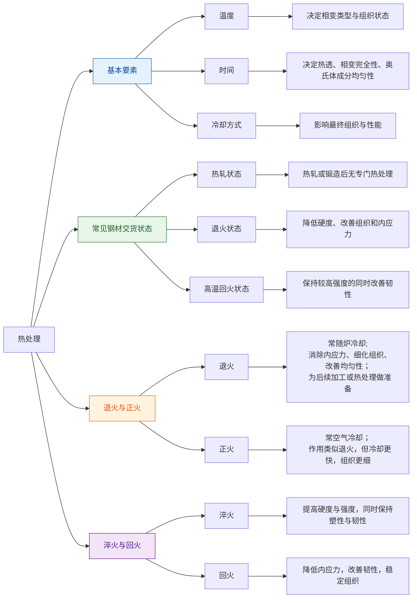

# 热处理知识框架

本章从“表面处理”和“热处理”两个层面构建知识框架，帮助把握工艺分类、功能目标、材料关联与工程取舍。

## 1. 总体框架：材料 → 表面 → 整体热处理 → 表面热处理

- 材料基础：钢、铝合金、铜合金等不同材料在表面处理与热处理中的行为不同。
- 目标层次：
  - 防腐、防锈、装饰、耐磨、耐疲劳等属于“表面处理”范畴；
  - 强度、硬度、韧性、残余应力等属于“热处理”范畴。
- 空间尺度：
  - 整体热处理作用于整件工件截面；
  - 表面热处理或表面处理主要作用于工件表层。

## 3. 热处理分类与工艺要素

### 3.3 相变温度与工艺控制
- Ac1
  - 珠光体向奥氏体转变的起始温度。
  - 回火一般低于 Ac1，用于调质、消除应力。
- Ac3 / Accm
  - 奥氏体转变的终了温度。
  - 一般热处理加热温度高于该温度 30–50℃。

### 3.5 淬火
- 工艺：加热到 Ac3/Accm 以上，保温充分后急冷。
- 冷却介质：水、油、空气，单液与双液淬火。
- 结果：产生马氏体与残余奥氏体混合结构。
- 目的：提高硬度与强度，同时保持塑性与韧性。
- 关键
  - 淬透性：代表能得到的淬硬层深度。
  - 对于中碳钢 7–15mm 厚度，不宜直接水淬，易裂纹，可采用亚温淬火。
- 典型代号
  - C42 表示淬火后硬度等级，约 HRC 40–45。

### 3.6 回火
- 工艺：淬火后再加热、缓慢冷却。
- 作用：降低内应力，改善韧性，稳定组织。
- 回火分类：低温回火、中温回火、高温回火。
- 目标典型硬度：整体硬度 25–40 HRC。

## 6. 工程取舍与关联知识

- 选工艺要看
  - 材料类型（钢、铝合金、铜合金）；
  - 设计要求（耐磨、耐蚀、强度、塑性、疲劳）；
  - 经济成本与可制造性；
  - 后续加工与装配要求。
- 知识框架思路
  - 把“铝合金阳极化”归入“表面电化学处理”和“防腐/装饰”；
  - 把“淬火”“回火”“渗碳”“渗氮”归入“热处理与硬度体系”；
  - 同时关联“腐蚀原理”“材料组织”“工件形态”“冷却介质”这些底层概念。

## 7. 进一步阅读与实践建议

- 将每个工艺放入“材料-结构-性能-工艺”链条中：
  - 材料的化学成分与相变温度；
  - 表面/整体工艺如何改变组织；
  - 组织变化如何影响力学性能与耐腐蚀性。
- 在实际工程中，常见组合：
  - 先退火/正火→机械加工→淬火+回火；
  - 先表面处理（酸洗、喷砂）→后涂层或钝化；
  - 复杂要求时采用 QPQ、渗碳、渗氮等复合表面热处理。

---

> 如果需要，我可以继续把这个框架扩展为“表面处理决策树”和“典型工件工艺对照表”。
