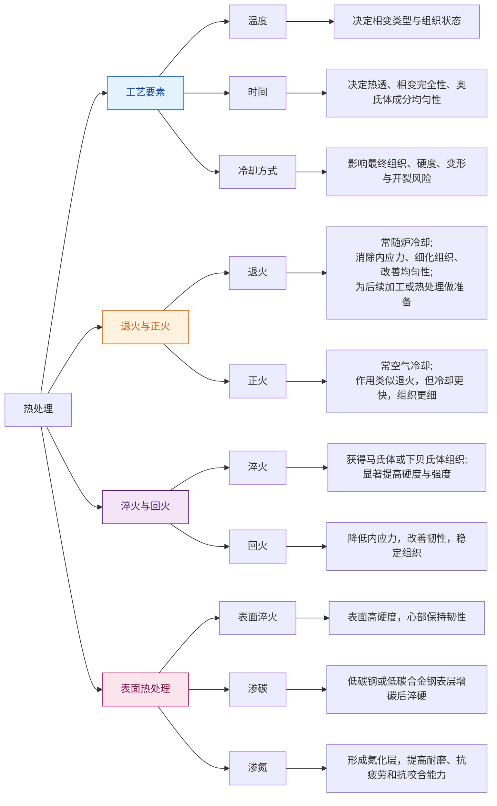

# 热处理知识框架

## 1. 范围与目标

- 热处理的大致分类和范围，辅助形成总体的知识框架。
- 对相应标准、图纸表达和加工沟通方式进行初步理解。
- 区分材料交货状态、整体热处理、表面热处理与表面处理之间的边界。

## 2. 标准引用

- GB/T 12603-2005 金属热处理工艺分类及代号
    - 用于统一退火、正火、淬火、回火、渗碳、渗氮等热处理术语。
    - 在图纸、工艺文件和检验报告中，术语的一致性比口头习惯更重要。
- GB/T 16923-2008 钢件的正火与退火
    - 可用于理解钢件退火、正火的工艺分类、目的和质量要求。
    - 这类处理常用于改善组织、降低硬度、消除内应力，为切削加工或后续热处理做准备。
- GB/T 16924-2008 钢件的淬火与回火
    - 可用于理解淬火、回火、调质等工艺的基本要求。
    - 对机械设计而言，通常更关注最终硬度、力学性能和变形控制，而不是直接指定完整炉温曲线。
- GB/T 9450-2025 钢件渗碳淬火硬化层深度的测定
    - 涉及渗碳淬火后的硬化层深度测定。
    - 当零件以表层耐磨为主要目标时，仅写“渗碳淬火”通常不够，应进一步说明有效硬化层深度、表面硬度、心部硬度等要求。
- GB/T 11354-2025 钢件渗氮层深度测定和金相组织检验
    - 涉及渗氮层深度及组织检验。
    - 渗氮层较薄但硬度高、变形小，适用于精密零件和耐磨、抗疲劳场景。

## 3. 实操与模板

### 3.1 背景简述

定义：

- 热处理是通过控制金属材料的加热、保温和冷却过程，改变其组织状态，从而改变硬度、强度、韧性、耐磨性、残余应力和尺寸稳定性的工艺。
- 对钢件而言，很多热处理的核心都围绕奥氏体转变、马氏体形成、碳化物析出和残余应力控制展开。
- 常见热处理的分类如下图。

```mermaid
flowchart LR
  A["热处理"]

  A --> B["工艺要素"]
  B --> B1["温度"]
  B1 --> B11["决定相变类型与组织状态"]
  B --> B2["时间"]
  B2 --> B21["决定热透、相变完全性、奥氏体成分均匀性"]
  B --> B3["冷却方式"]
  B3 --> B31["影响最终组织、硬度、变形与开裂风险"]

  A --> D["退火与正火"]
  D --> D1["退火"]
  D1 --> D11["常随炉冷却;
  消除内应力、细化组织、改善均匀性;
  为后续加工或热处理做准备"]
  D --> D2["正火"]
  D2 --> D21["常空气冷却;
  作用类似退火，但冷却更快，组织更细"]

  A --> E["淬火与回火"]
  E --> E1["淬火"]
  E1 --> E11["获得马氏体或下贝氏体组织;
  显著提高硬度与强度"]
  E --> E2["回火"]
  E2 --> E21["降低内应力，改善韧性，稳定组织"]

  A --> F["表面热处理"]
  F --> F1["表面淬火"]
  F1 --> F11["表面高硬度，心部保持韧性"]
  F --> F2["渗碳"]
  F2 --> F21["低碳钢或低碳合金钢表层增碳后淬硬"]
  F --> F3["渗氮"]
  F3 --> F31["形成氮化层，提高耐磨、抗疲劳和抗咬合能力"]

  classDef Item-B fill:#E3F2FD,stroke:#1565C0,color:#0D47A1;
  classDef Item-C fill:#E8F5E9,stroke:#2E7D32,color:#1B5E20;
  classDef Item-D fill:#FFF3E0,stroke:#EF6C00,color:#E65100;
  classDef Item-E fill:#F3E5F5,stroke:#6A1B9A,color:#4A148C;
  classDef Item-F fill:#FCE4EC,stroke:#AD1457,color:#880E4F;

  class B Item-B;
  class C Item-C;
  class D Item-D;
  class E Item-E;
  class F Item-F;
```

其中：

- 整体热处理主要改变整个截面或大部分截面的组织与性能。
- 表面热处理主要强化表层，常用于齿轮、轴、销、导轨、模具等承受磨损或接触疲劳的零件。
- 表面处理更多关注防腐、装饰、膜层、涂层等，可参考[表面处理知识框架](surface-finish.md)一文。

### 3.2 相变温度与工艺控制

铁碳合金相图、钢在加热和冷却时的相变点、共析钢过冷奥氏体等温转变曲线，以及奥氏体、马氏体等基础术语，已整理为独立补充页：[热处理基础：相图、相变与常见标记](heat-treatment-foundations.md)。

在阅读具体热处理工艺前，建议先建立以下直觉：

- `Ac1`、`Ac3`、`Acm` 等临界点用于理解钢在加热时的奥氏体化过程。
- 冷却速度决定奥氏体向珠光体、贝氏体或马氏体转变的路径。
- 保温不是越久越好，而是为了热透、扩散和组织转变服务。
- 不同材料体系的热处理逻辑不同；例如 A2-70/A4-70 不锈钢紧固件、05Cr17Ni4Cu4Nb 沉淀硬化不锈钢，不能简单套用普通碳钢“淬火 + 回火”的思路。

### 3.3 常见工艺理解

| 工艺 | 常见目的 | 典型结果 | 设计沟通重点 |
|---|---|---|---|
| 退火 | 降低硬度、改善切削性、消除内应力 | 组织趋于均匀、硬度降低 | 材料状态、后续加工性 |
| 正火 | 细化晶粒、改善组织、提高综合性能 | 比退火冷却快，组织更细 | 是否作为最终状态或预备热处理 |
| 淬火 | 获得高硬度和高强度组织 | 马氏体及少量残余奥氏体等 | 硬度、淬透性、变形和开裂风险 |
| 回火 | 降低内应力、改善韧性、稳定尺寸 | 回火马氏体、回火索氏体等 | 回火温度区间、最终硬度和韧性 |
| 调质 | 获得强韧性匹配 | 淬火后高温回火组织 | 轴类、连杆、螺栓等承载件 |
| 表面淬火 | 表面耐磨，心部保韧 | 表层马氏体，心部原组织 | 硬化层深度、表面硬度、硬化区域 |
| 渗碳淬火 | 表面高硬度，心部高韧性 | 表层高碳马氏体 | 有效硬化层深度、表面/心部硬度 |
| 渗氮 | 耐磨、抗疲劳、变形小 | 氮化物层和扩散层 | 渗氮层深度、白亮层控制、前置调质状态 |

### 3.4 淬火

- 工艺：将钢件加热到适当奥氏体化温度，保温充分后以合适介质冷却。业内口语中有时称作“蘸火、沾火”。
- 冷却介质：水、油、空气、盐浴、聚合物介质等，也可能采用单液淬火、双液淬火、分级淬火、等温淬火。
- 结果：常见目标是获得马氏体组织，也可能根据工艺获得贝氏体等组织。
- 目的：显著提高硬度与强度；但淬火后内应力大、韧性不足，通常需要回火。
- 关键：
    - 淬透性：材料在一定冷却条件下获得淬硬层深度的能力，并不等同于“淬火后一定很硬”。
    - 淬硬性：材料能达到的最高硬度，主要与含碳量有关。
    - 对中碳钢或截面较厚零件，直接水淬可能带来较高开裂风险，需要结合材料、尺寸和性能要求选择油淬、分级淬火、亚温淬火等方案。
- 典型代号：
    - 在特定行业标准中可能出现类似 `C42` 的热处理硬度等级表示。其中 `C` 可表示淬火，`42` 对应一定洛氏硬度范围。此类写法必须回到具体标准语境中理解，不能作为所有图纸的通用写法。

### 3.5 回火与调质

- 工艺：淬火后再加热到 Ac1 以下某一温度区间，保温后冷却。
- 作用：
    - 降低淬火内应力和脆性；
    - 改善韧性和塑性；
    - 稳定组织和尺寸；
    - 根据回火温度获得不同硬度和强韧性组合。
- 回火分类：
    - 低温回火：保持较高硬度，多用于工具、刃具、渗碳件表面等；
    - 中温回火：获得较高弹性极限，常用于弹簧类零件；
    - 高温回火：与淬火组合形成调质处理，常用于承载轴、连杆、螺栓等结构件。
- 常见目标硬度：
    - 结构钢调质后常见硬度范围约为 25-40 HRC，具体需结合材料牌号、截面尺寸和服役条件确定。

### 3.6 图纸表达示例

图纸上不宜只写“热处理”三个字。更好的表达方式，是尽量说明材料、处理方式、硬度或硬化层要求、处理区域和检验依据。

| 场景 | 可参考表达 | 说明 |
|---|---|---|
| 结构钢调质 | `调质处理，硬度 28-32 HRC` | 适用于整体强韧性要求明确的零件 |
| 表面感应淬火 | `指定区域感应淬火，表面硬度 50-55 HRC，硬化层深度 1.5-2.5 mm` | 应配合视图或技术要求标明区域 |
| 渗碳淬火 | `渗碳淬火，有效硬化层深度 0.8-1.2 mm，表面硬度 58-62 HRC` | 齿轮、销轴等常见 |
| 渗氮 | `调质后渗氮，渗氮层深度 0.3-0.5 mm，表面硬度按技术协议` | 常需控制变形和白亮层 |
| 去应力退火 | `粗加工后去应力退火` | 常用于焊接件、铸件、长轴或薄壁件 |

需要注意：

- 若硬度是关键指标，应写明硬度标尺，如 HRC、HBW、HV。
- 若只有局部需要热处理，应在图纸中明确处理区域、过渡区和不允许硬化的位置。
- 若热处理后还要精加工，应在工艺路线中预留磨削余量、变形修正和检验安排。
- 对精密件，尺寸稳定性、变形量、脱碳层、氧化皮和表面粗糙度可能与硬度同样重要。

## 4. 其余要点

- 材料交货状态会影响后续加工和热处理结果。采购材料时，`热轧`、`退火`、`正火`、`调质`、`固溶`、`时效`等状态不应混用。
- 同一材料牌号，不同截面尺寸下热处理后的硬度和心部性能可能不同。大型零件尤其需要关注淬透性。
- 热处理不是单独存在的工序，通常要和毛坯、粗加工、半精加工、表面处理、最终检验一起考虑。
- 有些零件需要先调质再表面强化，例如调质后感应淬火、调质后渗氮。
- 有些表面处理会受到前序热处理影响，例如氮化前的调质组织、阳极氧化前的铝合金热处理状态等。
- 对加工厂而言，“按图热处理”通常仍需要进一步明确检测方式、抽检比例、硬度位置和是否允许校直。

## 5. 边界与风险

- 图纸中写“淬火”不等于一定能得到目标硬度；材料含碳量、合金元素、截面尺寸和冷却条件都会影响结果。
- 只写“硬度 HRC 60”也不等于工艺合理；高硬度可能带来脆裂、变形、磨削裂纹和装配风险。
- 热处理参数并非越详细越好。设计图纸通常应提出性能和检验要求，完整炉温、保温时间、冷却曲线可由热处理工艺文件或供应商工艺卡控制。
- 对关键承载件、疲劳件、安全件，应避免仅凭经验指定热处理，应结合材料标准、行业标准、供应商能力和必要试验确定。
- 对已经完成精加工的零件，后续热处理可能导致变形、氧化、脱碳或表面粗糙度变化，应在工艺规划阶段前置考虑。

## 6. 小结

- 热处理的核心不是“把零件加热一下”，而是通过温度、时间和冷却方式控制材料组织，最终服务于硬度、强度、韧性、耐磨性和尺寸稳定性。
- 机械设计中更稳妥的做法，是在图纸上明确材料状态、热处理方式、性能指标、处理区域和检验依据，而不是孤立地写一个工艺名称。
- 热处理牵涉材料、结构、加工路线和供应商能力，越是关键零件，越需要在设计早期把热处理方案纳入讨论。

## 7. 参考来源

- 黎震，谢燕琴. 机械制造基础 [M]. 5版. 北京：高等教育出版社，2021.
- 本文有关标准名称、热处理术语和图纸表达的内容，整理了教材、标准线索、AI和搜索引擎反馈等资料；具体项目应以实际采用的标准文本和技术协议为准。
