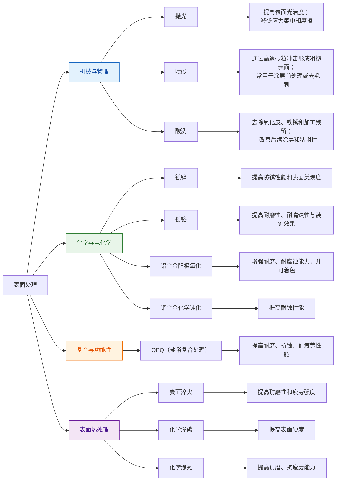

# 表面处理知识框架

## 1. 范围与目标

- 表面处理的大致分类和范围，辅助形成总体的知识框架。
- 对相应标准进行初步的理解。

## 2. 标准引用

- GB 1238-1976 金属镀层及化学处理表示方法，[万方数据](https://www.wanfangdata.com.cn/)显示该标准**已被废止**。
    - 该标准标记铝合金阳极氧化为`D.Y`，有更详细的下一级标注，如`D.Y (硫酸)`，最常用的阳极氧化工艺，泛指自然发白或透明封孔。
    - D：取自“电镀/电化学处理”的“电”字拼音（Dian）。
    - Y：取自“氧化/阳极氧化”的“氧”字拼音（Yang）。
    - 由于已被废止，其余表面处理的表示方法不予举例。
- GB/T 13911-1992 金属镀覆和化学处理标识方法，**已被废止**，但仍会出现在部分文献、公司等的图纸中。
    - 包含“铝及铝合金阳极氧化化学处理”的详细内容。
    - 标记示例：`Al/Et.A.cl(BK)`，铝材/Aluminum，电化学处理/Electrochemical treatment，硫酸阳极氧化/Anodizing，着黑色/coloring(Black)。
    - 标记示例：`Ct.P`，化学/Chemical Treatment，钝化/Passivating，通过化学方法在金属表面形成一层致密的钝化膜，以提高耐腐蚀性；常用于不锈钢、铜及铜合金等材料；在更早期的标准（如HB5033-76）中，Ct.P 对应的旧符号为 H·D，H代表化学处理的首字母，D代表钝化的首字母。
- GB/T 13911-2008 金属镀覆和化学处理标识方法，现行国标。
    - 该标准仅适用于“金属镀覆”（如镀锌、镀铬）；删除了“铝及铝合金阳极氧化化学处理”的详细内容。
    - 对于铝合金的阳极氧化，推荐写法：“表面处理：阳极氧化（硫酸），膜厚10-15μm，着黑色”。这种做法符合标准中“允许在有关的技术文件中加以说明”的规定，且不受标准版本变更的影响。
    - 若有明确的标准代号，应以标准代号为准并写全。

## 3. 实操与模板

### 3.1 背景简述

- 由第二节可知，表面处理有完善的国家标准和行业标准，这些标准的范围和目标可能有所不同。
- 材料基础：钢、铝合金、铜合金等不同材料在表面处理与热处理中的行为不同。
- 目标层次：
    - 防腐、防锈、装饰、耐磨、耐疲劳等属于“表面处理”范畴；
    - 强度、硬度、韧性、残余应力等属于“热处理”范畴。
- 空间尺度：
    - 整体热处理作用于整件工件截面；
    - 表面热处理或表面处理主要作用于工件表层。

按不同的处理原理，表面处理的分类和范围大致如下：

其中：

- QPQ（盐浴复合处理），即 Quench—Polish—Quench(淬火-抛光-淬火)：复合热处理与化学渗入；形成复合渗层，显著提高耐磨、抗蚀、耐疲劳性能；在表面处理中，QPQ可替代“淬火→回火→发黑/镀铬”等多道工序。
- 表面淬火定义：热处理深度只触及工件表面，内部保持原有组织。
    - 方法：火焰加热：表面加热后快速冷却，可获得表面硬度 52–54 HRC。
    - 表面硬化感应加热、激光加热等。
    - 典型用途：齿轮、轴类零件的表面硬化，以提高耐磨性和疲劳强度。
- 渗碳
    - 将碳渗入表层，形成强化层。
    - 表面硬度可达 58–64 HRC。
- 渗氮
    - 通过氮扩散形成硬化层和氮化物层，显著提高耐磨、抗疲劳能力。

## 4. 其余要点

- 我们无法就所有表面处理的国家标准进行详细阐述，只能在作者接触到的表面处理工艺中进行阐述。
- 关于铝合金阳极氧化的工艺，可参考[表面处理(铝合金阳极氧化)](anodic-coatings-for-aluminum-and-aluminum-alloy.md)一文。

## 5. 边界与风险

- 在讨论某一表面处理工艺时，明确执行的标准或是进一步提供更详细的工艺参数辅助理解是很有必要的，否则可能会导致理解错位，在图纸等技术资料中尤其如此。

## 6. 小结

暂无。

## 7. 参考来源

- 在本文有关国家标准的内容方面，整理了AI、搜索引擎反馈等的资料。

