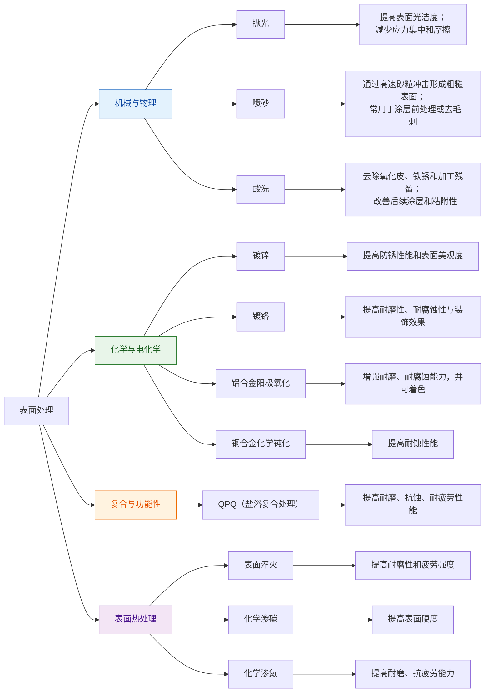

# 表面处理知识框架

本章从“表面处理”和“热处理”两个层面构建知识框架，帮助把握工艺分类、功能目标、材料关联与工程取舍。

## 1. 总体框架：材料 → 表面 → 整体热处理 → 表面热处理

- 材料基础：钢、铝合金、铜合金等不同材料在表面处理与热处理中的行为不同。
- 目标层次：
  - 防腐、防锈、装饰、耐磨、耐疲劳等属于“表面处理”范畴；
  - 强度、硬度、韧性、残余应力等属于“热处理”范畴。
- 空间尺度：
  - 整体热处理作用于整件工件截面；
  - 表面热处理或表面处理主要作用于工件表层。

## 2. 表面处理分类

### 2.2 化学与电化学表面处理
- 镀锌
  - 主要用于提高防锈性能和表面美观。
- 镀铬
  - 提高耐磨性、耐腐蚀性与装饰效果。
- 铜合金化学钝化
  - 新符号：Ct.P；旧符号：H.D。
  - 通过在金属表面形成致密氧化膜，提高耐蚀性能。
- 铝合金硫酸阳极化
  - 新符号：E(t).A；旧符号：D.Y。
  - 利用电解在铝合金表面生成致密氧化膜，增强耐磨、耐腐蚀能力，并可着色。

### 2.3 复合与功能性表面处理
- QPQ（盐浴复合处理）
  - 即 Quench—Polish—Quench：复合热处理与化学渗入。
  - 形成复合渗层，显著提高耐磨、抗蚀、耐疲劳性能。
  - 在表面处理中，QPQ可替代“淬火→回火→发黑/镀铬”等多道工序。

### 2.4 表面热处理-表面淬火
- 定义：热处理深度只触及工件表面，内部保持原有组织。
- 方法：
  - 火焰加热：表面加热后快速冷却，可获得表面硬度 52–54 HRC。
  - 感应加热：局部高频加热，控制精度高。
  - 激光加热：适用于薄层、高精度表面硬化。
- 典型用途：齿轮、轴类零件的表面硬化，以提高耐磨性和疲劳强度。

### 2.5 化学表面热处理
- 渗碳
  - 将碳渗入表层，形成强化层。
  - 表面硬度可达 58–64 HRC。
- 渗氮
  - 通过氮扩散形成硬化层和氮化物层，显著提高耐磨、抗疲劳能力。

## 6. 工程取舍与关联知识

- 选工艺要看
  - 材料类型（钢、铝合金、铜合金）；
  - 设计要求（耐磨、耐蚀、强度、塑性、疲劳）；
  - 经济成本与可制造性；
  - 后续加工与装配要求。
- 知识框架思路
  - 把“铝合金阳极化”归入“表面电化学处理”和“防腐/装饰”；
  - 把“淬火”“回火”“渗碳”“渗氮”归入“热处理与硬度体系”；
  - 同时关联“腐蚀原理”“材料组织”“工件形态”“冷却介质”这些底层概念。

## 7. 进一步阅读与实践建议

- 将每个工艺放入“材料-结构-性能-工艺”链条中：
  - 材料的化学成分与相变温度；
  - 表面/整体工艺如何改变组织；
  - 组织变化如何影响力学性能与耐腐蚀性。
- 在实际工程中，常见组合：
  - 先退火/正火→机械加工→淬火+回火；
  - 先表面处理（酸洗、喷砂）→后涂层或钝化；
  - 复杂要求时采用 QPQ、渗碳、渗氮等复合表面热处理。

---

> 如果需要，我可以继续把这个框架扩展为“表面处理决策树”和“典型工件工艺对照表”。
