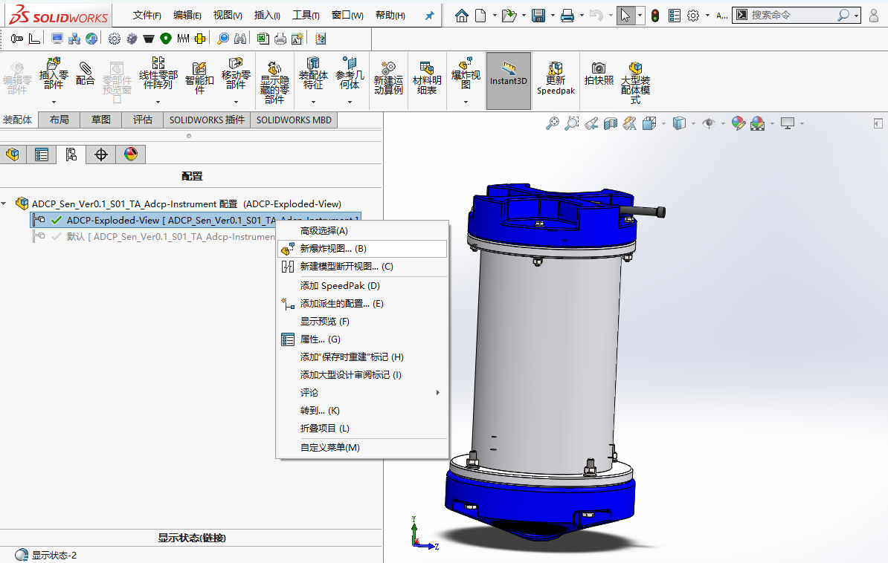
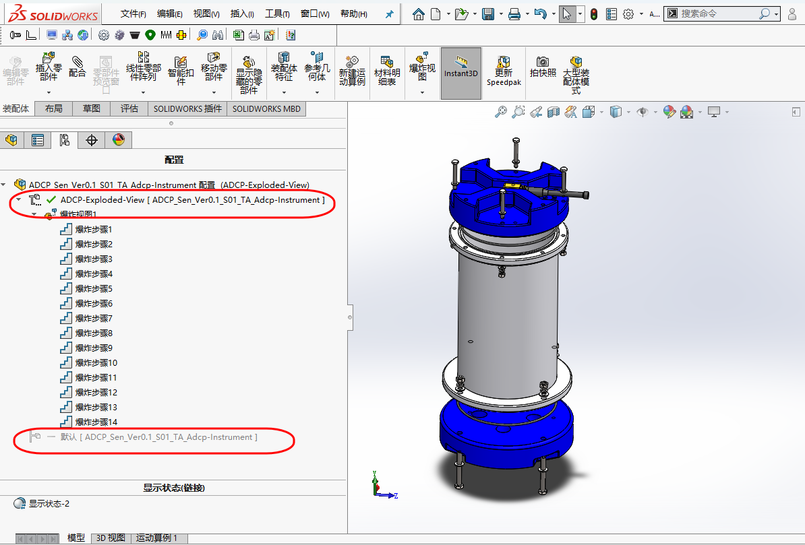

# 配置功能

## 1. 范围与目标

- 本文主要讨论配置功能适合解决什么问题、不适合处理什么差异，以及在实际使用中怎样降低后期维护风险。
- 以同一装配体的不同显示状态或爆炸状态为例，说明配置功能的使用方法。

## 2. 标准引用

暂无。

## 3. 实操与模板

### 3.1. 配置功能的定义

在同一个文件中创建多个变体，每个变体可拥有不同的尺寸、特征状态、属性等。

### 3.2. 配置功能的适用性对比

| 维度 | 适用场景 | 不适用场景 |
| :--- | :--- | :--- |
| **核心判断** | 同一对象的系列化变化，共享同一设计逻辑 | 结构路线差异明显，接近“新零件”的对象 |
| **典型示例** | - 同一零件的不同长度规格 - 同一零件的不同状态（如毛坯与机加状态） - 同一装配体的不同显示状态或爆炸状态 | - 结构路线差异明显的方案  - 特征树差异过大、难以共用的零件  - 实际上已经接近“新零件”的对象 |
| **维护成本** | 较低，变化仍受同一逻辑约束 | 较高，强行共用反而增加后期维护成本 |

> **总结**：配置功能适合处理“同一对象的系列化变化”，当变体差异过大时，应果断另存为新零件，而非强行共用。

### 3.3. 建模实现

1. 创建`ADCP_Sen_Ver0.1_S01_TA_Adcp-Instrument.sldasm`装配体的`新配置`。

    - 此文的示例配置用于生成`ADCP`装配体的爆炸视图。
    - 打开装配体，点击`Configuration Manager/鼠标右击配置/添加配置`，配置名称可具体为`ADCP-Exploded-View`。
    - 激活`ADCP-Exploded-View`配置，`鼠标右击该配置/新爆炸视图`，如下图所示：

    <figure markdown="span">
      { width="720" }
      <figcaption>Create-Exploded-View </figcaption>
    </figure>

2. 创建`爆炸步骤`：

    - 在爆炸界面，`设定区选择End-Cap及相关的零部件/拖动竖直向上的箭头/形成爆炸步骤1`，同样的操作可创建更多的`爆炸步骤`，如下图所示：

    <figure markdown="span">
      { width="720" }
      <figcaption>Create-Exploded-Steps </figcaption>
    </figure>

3. 创建`爆炸完成`步骤：

    - 整体爆炸完成后，双击不同的配置，可以激活相应的配置，如下图所示：

    <figure markdown="span">
      { width="720" }
      <figcaption>Switch-Between-Different-Configurations </figcaption>
    </figure>

## 4. 其余要点

配置功能另一个比较重要的运用场合是系列化零件的变体，尤其是类似紧固件的不同长度、直径等规格的控制。

## 5. 边界与风险

- 对系列化零件的变体而言，配置越多，复核成本越高。

## 6. 小结

配置功能对于实现同一装配体的不同形态，进而生成爆炸视图比较有利，详情可参考[爆炸视图的使用](../modeling/exploded-view.md)。

## 7. 参考来源

暂无。
