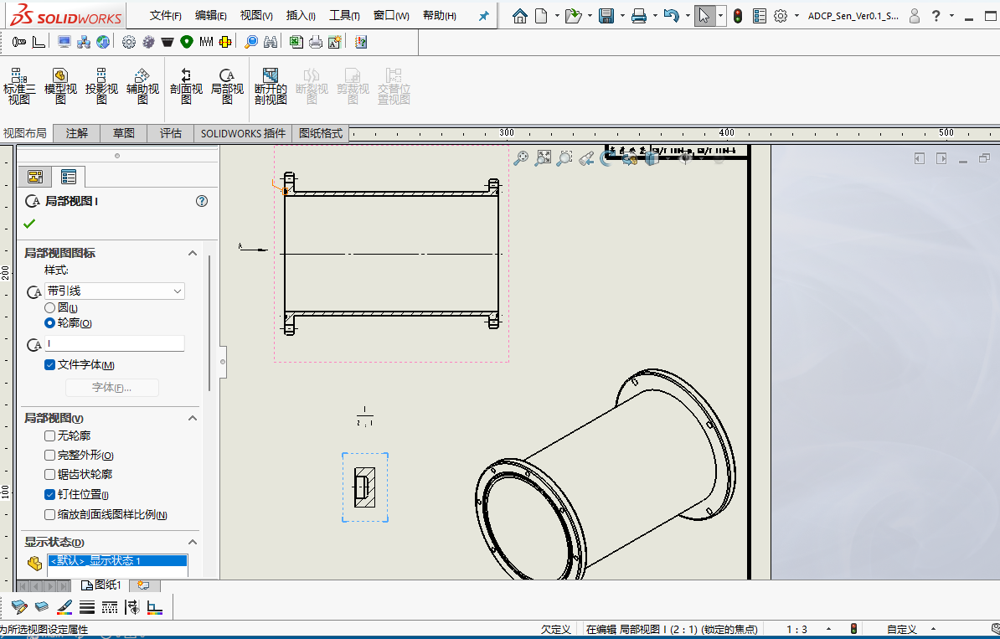
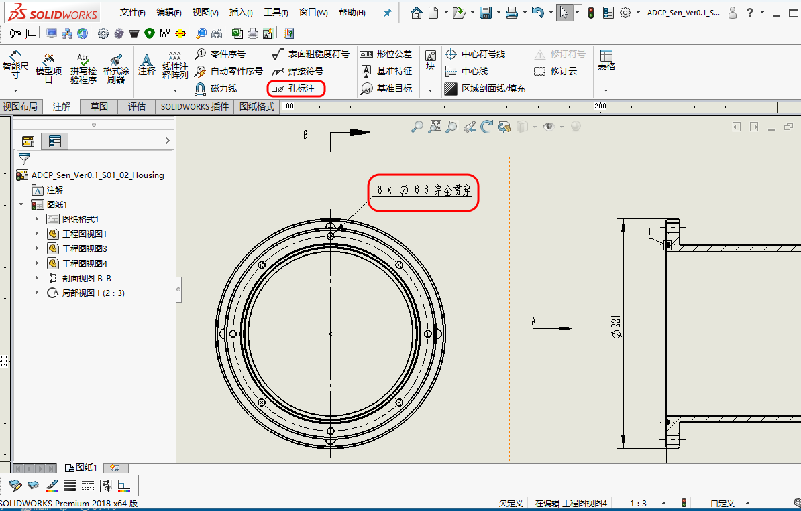
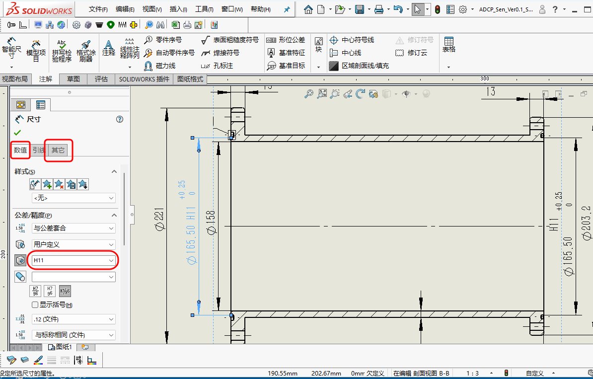

# 图纸规范--标注的基本要求

## 1. 范围与目标

本文主要讨论：

- 尺寸标注的基本规范
- 如何减少重复、遗漏和歧义

## 2. 标准引用

GB/T 4458.4-2003 机械制图 尺寸注法，部内内容如下：

- 唯一原则：图样上的每一个尺寸，原则上只能标注一次，并且应该标注在最清晰地反映该结构的视图上。
- 直径要标 φ，厚度标 t，统一使用这些符号可以避免文字描述，让图纸更简洁。

GB/T 16675.2-2012 技术制图 简化表示法 第2部分：尺寸注法，部内内容如下：

- 这个标准就是为了在保证不产生歧义的前提下，让制图和读图都更高效。
- EQS (均布)，即Equally Spaced。
- 统一说明：如果很多地方的倒角大小都一样，可以在图纸角落统一写上"全部倒角 C1"或"未注倒角 C0.5"，而不必每个倒角都去标注。

GB/T 4458.1-2002 机械制图 图样画法 视图，部内内容如下：

- 规定了视图的种类和画法：基本视图、向视图等。
- 规定了简化画法，断裂画法、局部放大图等。

## 3. 实操与模板

### 3.1 基本要求

- 优先标注功能尺寸
- 尺寸链尽量清晰，避免不必要的重复闭环
- 尺寸应服务于加工与检验，而不只是几何表达

### 3.2 绘图实现

1. 准备工作：

    - 按国标第一视角的要求，正确的布局视图；3个视图无法表达清楚的情况，可以使用向视图等辅助表达。
    - 局部视图，一般默认为圆形视图形式；若先利用草图绘制一个形状(如矩形)，随后直接点击`局部视图/轮廓`，可实现该形状的`局部视图`。如下图所示：

    <figure markdown="span">
      { width="720" }
      <figcaption>Detail-View </figcaption>
    </figure>

    - 添加中心线、圆心标记、剖面线等辅助标记。

2. 标注尺寸：

    - 通常而言，先标注总的长宽高，方便加工下料。
    - 尺寸链尽量清晰，避免不必要的重复闭环。

3. 针对螺纹孔、螺钉过孔：

    - 由于在[建模方式](../modeling/modeling-method.md)中已经说明，统一采用了`异形孔向导`生成，因此标注时选择`注解/孔标注`，能自动生成孔径和数量，如下图所示：

    <figure markdown="span">
      { width="720" }
      <figcaption>Annotation-Of-Hole-Thread-Callout </figcaption>
    </figure>

4. 针对配合公差：

    - 以O形圈凹槽内径为例，在数值一栏，公差类型选择`与公差套合`，在孔套合选择`H11`；在其它一栏，`公差字体大小/字体比例`输入0.75，整体会协调一些，如下图所示：

    <figure markdown="span">
      { width="720" }
      <figcaption>Dimension-Of-Tolerance-And-Precision </figcaption>
    </figure>

    - 注：O形圈凹槽内径、凹槽自身的宽度等公差、表面粗糙度等符合GB/T 3452.3-2005 液压气动用O形橡胶密封圈 沟槽尺寸的要求。

5. 其余细节检查：

    - 检查倒角、表面粗糙度等标注。
    - 检查热处理、表面处理等信息。
    - 检查加工要求、检验要求等信息。完成后如下图所示：

    <figure markdown="span">
      { width="720" }
      <figcaption>Drawing-Annotation-Example </figcaption>
    </figure>
    
## 4. 其余要点

### 4.1 自审核清单

- 是否符合三视图、相视图的视图布局要求。
- 辅助标记是否完整(中心线、圆心标记、剖面线等)。
- 对于通孔，若剖面能体现通孔特征最好，否则宜加注“贯穿”二字。
- 是否符合可读性(尺寸线、引出线和注释不应相互干扰等)的要求。
- 是否遵守了零件的尺寸链的基本要求进行标注。
- 

### 4.2 检验视角

尺寸不是只给设计人员看的，也应站在加工和检验角度复核一遍：这条尺寸能否测、是否容易误解、是否真的重要。

## 5. 边界与风险

- 过度依赖自动标注，容易出现信息堆叠
- 公差标注若脱离实际加工能力，容易形成纸面正确、制造困难
- 仅靠未注公差覆盖所有情况，通常不够稳妥

## 6. 小结

标注工作的重点，不在于把每个尺寸都写出来，而在于让真正重要的尺寸表达清楚、可制造、可检验。图纸越清楚，后续沟通成本越低。

## 7. 参考来源

- 机械制图相关标准

