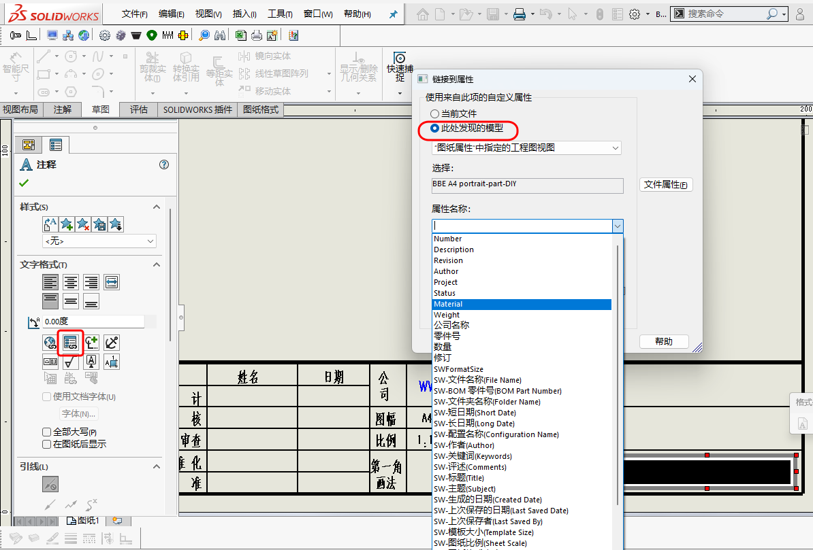

# 图纸规范--模板解析

## 1. 范围与目标

本文主要讨论图纸模板应当固定哪些基础信息，以及个人或尚未形成成熟体系的小团队，如何先搭出一套可长期复用的模板基础。

重点不在于一次性做得很复杂，而在于先把标题栏、页幅、字体、未注公差与基本识别信息稳定下来，减少后续每次出图时的重复设置。

## 2. 标准引用

以A4竖版的图纸模板举例，可以包含如下信息，如下图所示：

<figure markdown="span">
  { width="720" }
  <figcaption>Drawing-Template </figcaption>
</figure>

关于字体、字号的标准引用如下：

- GB/T 14691-1993 技术制图 字体，规定汉字为长仿宋，常用字号3.5、5。

关于未注公差的标准引用如下：

- GB/T 1804-2000 一般公差 未注公差的线性和角度尺寸的公差，标准按精度从高到低分为四级：f（精密级）、m（中等级）、c（粗糙级）、v（最粗级）。m级是机械加工中最常用的默认等级，大致相当于IT14级精度。
- GB/T 1184-1996 形状和位置公差 未注公差值，公差等级K级。形位公差的未注精度等级分为三级：H（高）、K（中）、L（低）。k级代表中等精度，是应用最广泛的通用等级。
- 不同机械领域可能有不同的标准，上述GB的适用范围最广。如中国航空行业标准，HB 5800-2021 一般公差，在内容上涵盖了线性与角度尺寸公差以及未注形位公差，它作为一个综合性标准，将多个GB标准中关于未注公差的要求整合在了一起。

!!! warning "关于未注公差"
    必要性举例：仅给定尺寸公差（如长度、直径），而未规定形位公差（如直线度），理论上意味着零件轴线可以是任意形状。因此，即便加工商加工成显著的“香蕉形”或“C”形，只要其局部尺寸合格，从图纸要求来看，仍无法判定为不合格。

关于表面粗糙度的标准引用如下：

- GB/T 131-2006 产品几何技术规范(GPS) 技术产品文件中表面结构的表示法。
- 标注 “不去材料” 符号意味着不进行切削加工，成本通常较低。
- 标注 “去材料” 符号意味着必须进行切削加工，会产生切屑，成本通常相应增加。

关于图纸审核流程的讨论如下：

!!! note "工程图纸审核流程"
    - “设计、审核、工艺审查、标准化、批准”的流程，是质量体系认证（如ISO 9001）和产品安全责任追溯的基本要求。
    - 对于中小型企业，除设计外，必须另一人审核，负责人批准。即核心逻辑（自检+他检）不能没有。
    - 没有这个流程，实质上是在用废品率、返工成本和客户信任来替代流程。
    - 没有这个流程，产品质量完全依赖于绘图者个人的水平和责任心，容易沦为“赌博式生产”。

关于投影法的标准引用如下：

- GB/T 14692-2008 技术制图 投影法，明确规定技术图样应采用正投影法绘制，并优先采用第一角画法。此外，第一角画法，ISO标准优先采用，欧洲主流。
- 必要时也可选用第三角画法(北美、日本主流，国际同等认可)，但在同一张图样上不得混合使用两种画法，且必须在标题栏中用规定的识别符号加以标明。

关于剖面线的标准引用如下：

- GB/T 17453-2005 技术制图 图样画法 剖面区域的表示法，规定了不同材质的零件的剖面线形式。

关于技术要求/说明的讨论：

- 序号尽量采用自动化序号方案，确保序号正确并方便增减。

### 3. 实操与模板

1. SolidWorks模板：

    - 模板通常存放于`C:\ProgramData\SolidWorks\SOLIDWORKS`，扩展名为`.drwdot` ，可根据自身需要创建自定义模板。
    - 可以对某些零件的属性与图纸模板进行链接，一边自动更新，以零件的材质举例，`双击材质字符/链接到属性/此处发现的模型/属性名称选择 material`，其余属性可酌情添加，如下图所示:

    <figure markdown="span">
      { width="720" }
      <figcaption>Link-To-Model-Properties </figcaption>
    </figure>

2. 引用模板：

    - 在创建工程图时，选择创建的相应模板即可。

## 4. 其余要点

暂无。

## 5. 边界与风险

- 模板字段过多，会增加维护成本。
- 未注公差栏不应成为省略关键尺寸要求的理由。
- 模板统一并不等于所有图纸都能不加判断地直接套用。

## 6. 小结

图纸模板的价值，不在于“做得多漂亮”，而在于它是否让标题栏、页幅、字体和未注公差这些基础表达长期稳定下来。

对个人或小团队而言，先把少量高频模板做稳，比一次性做出很多版本更有实际意义。

## 7. 参考来源

- 机械制图相关国家标准

