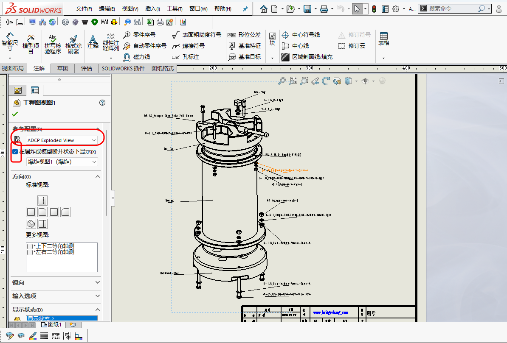
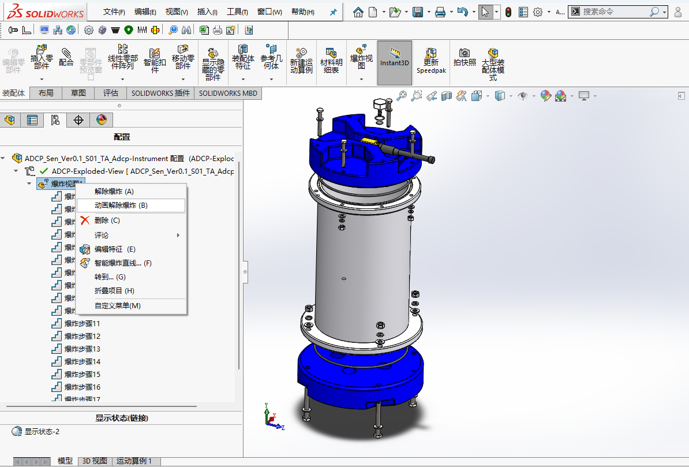

# 图纸规范--爆炸视图的使用

## 1. 范围与目标

本文讨论：

- 爆炸视图适合用在什么场景
- 配置与二维图纸如何配合

## 2. 标准引用

暂无。

## 3. 实操与模板

### 3.1 适用场景

- 装配说明
- 维修说明
- 带序号的总装图

### 3.2 建模实现

1. 创建`ADCP_Sen_Ver0.1_S01_TA_Adcp-Instrument.sldasm`装配体对应的工程图：

    - 从`视图调色板`拖入当前视图(默认的轴测图不一定能很好显示各部件的相互关系)，鼠标右击拖入的`工程图视图1/编辑特征/选择创建的`ADCP-Exploded-View`配置`，并勾选`在爆炸或模型断开状态下显示`，如下图所示:

    <figure markdown="span">
      { width="720" }
      <figcaption>Link-To-Explosion-Configuration </figcaption>
    </figure>

    - 为各零部件添加名称等操作，完成后呈现的状态如下图所示：

    <figure markdown="span">
      { width="720" }
      <figcaption>Exploded-View-Example </figcaption>
    </figure>

2. 生成爆炸步骤演示视频：

    - 回到`ADCP_Sen_Ver0.1_S01_TA_Adcp-Instrument.sldasm`装配体，`鼠标右击爆炸视图/动画解除爆炸`，可用于生成爆炸步骤演示视频，。操作如下图所示：

    <figure markdown="span">
      { width="720" }
      <figcaption>Explosion-Step-Demonstration-Video </figcaption>
    </figure>

  

## 4. 其余要点

暂无。

## 5. 边界与风险

- 爆炸方向若缺乏层次，会降低可读性
- 为爆炸而爆炸，会增加维护成本

## 6. 小结

  - 爆炸视图与爆炸步骤演示视频的配合能更好地支持阅读者的理解。

## 7. 参考来源

暂无。