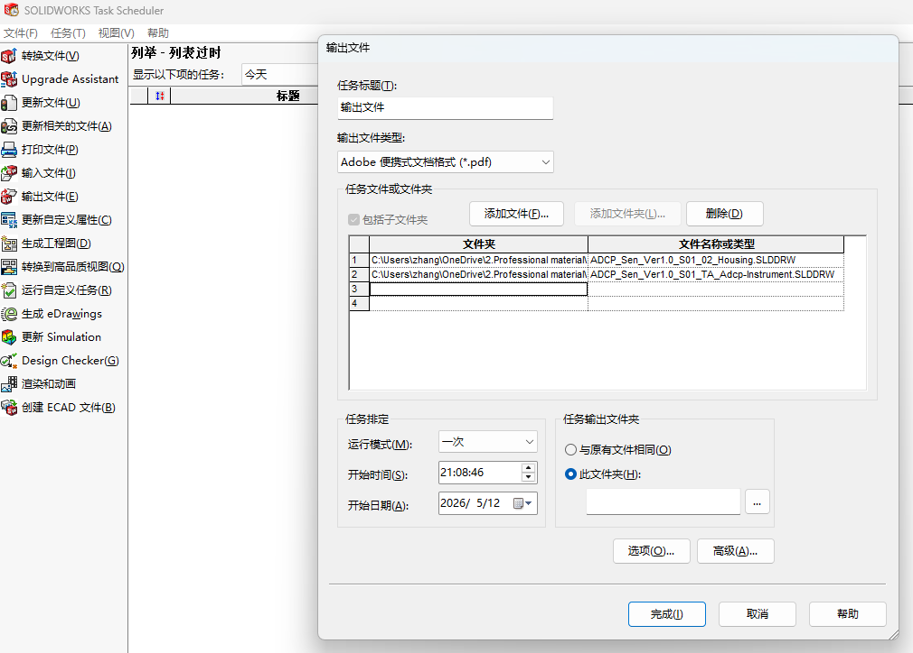

# Solidworks建模与图纸系列文章(补充-2)：对提升建模与图纸效率的一点心得

## 1. 范围与目标

- 本文主要讨论提升建模与图纸效率的一点心得，不是一种标准，也不是一种规范，但对建模与图纸效率的提升可能有益。

## 2. 标准引用

暂无。

## 3. 实操与模板

- 显然，大部分情况下，遵守国家、行业等的标准，对效率的提升是长远且稳定的，这也是此系列文章的目的之一。
- 下面举例一些其余提升效率的方式。

### 3.1 SOLIDWORKS Task Scheduler（任务调度程序）

- 专门用于批量处理重复性任务，无需逐个打开文件操作，以批量将工程图文件(.slddrw)转换为PDF举例，也可转换为DWG等格式。
- 运行：Windows 开始菜单/ SOLIDWORKS Task Scheduler 20xx。
- 选择 输出文件，控制 输出文件类型，添加文件/文件夹(遍历并选中该文件夹内所有的.SLDDRW) ，控制 输出位置， 点击 完成。如下图所示：

    <figure markdown="span">
      { width="720" }
      <figcaption>Solidworks-Task-Scheduler </figcaption>
    </figure>

- 输出的 PDF 文件名默认与原工程图文件名相同。
- 任务调度程序会在后台调用 SolidWorks 内核处理文件，尽量不要在运行时进行复杂的 3D 建模操作，以免占用资源导致转图失败或建模卡顿
- 如果你所在的企业已经部署了 SolidWorks PDM （产品数据管理） 系统，PDM 的 “转换任务” 功能可以将工程图批量输出为 PDF。

## 4. 其余要点

暂无。

## 5. 边界与风险

- 暂无。

## 6. 小结

暂无。

## 7. 参考来源

暂无。
