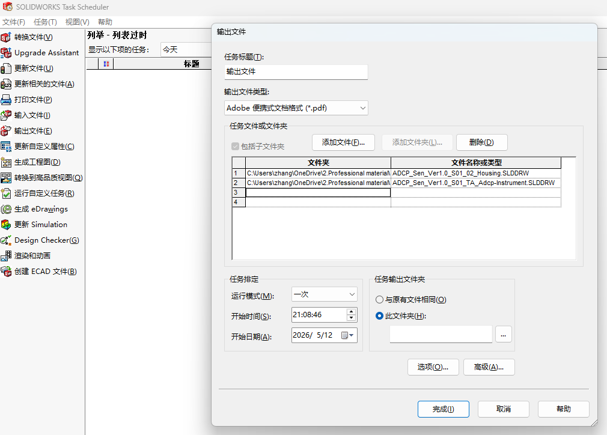

# Solidworks建模与图纸系列文章(补充-3)：对提升建模与图纸效率的一点心得

## 1. 范围与目标

- 本文主要讨论提升建模与图纸效率的一点心得，不是一种标准，也不是一种规范，但对建模与图纸效率的提升有益。

## 2. 标准引用

暂无。

## 3. 实操与模板

- 显然，大部分情况下，遵守国家、行业等的标准，对效率的提升是长远且稳定的，这也是此系列文章的目的之一。
- 下面举例一些其余提升效率的方式。

### 3.1 SOLIDWORKS Task Scheduler（任务调度程序）

- 专门用于批量处理重复性任务，无需逐个打开文件操作，以批量将工程图文件(.slddrw)转换为PDF举例，也可转换为DWG等格式。
- 运行：Windows 开始菜单/ SOLIDWORKS Task Scheduler 20xx。
- 选择 输出文件，控制 输出文件类型，添加文件/文件夹(遍历并选中该文件夹内所有的.SLDDRW) ，控制 输出位置， 点击 完成。如下图所示：

    <figure markdown="span">
      { width="720" }
      <figcaption>Solidworks-Task-Scheduler </figcaption>
    </figure>

- 输出的 PDF 文件名默认与原工程图文件名相同。
- 任务调度程序会在后台调用 SolidWorks 内核处理文件，尽量不要在运行时进行复杂的 3D 建模操作，以免占用资源导致转图失败或建模卡顿
- 如果你所在的企业已经部署了 SolidWorks PDM （产品数据管理） 系统，PDM 的 “转换任务” 功能可以将工程图批量输出为 PDF。

重要提醒，曾多次出现批量导出step文件时，部分文件导出失败的情况，影响了效率。

### 3.2. 批量处理文件的Macro(宏)

宏的背景：

- 宏目标：批量将打开的slddrw导出为PDF文件
    - 只打开 1 个工程图：导出当前 slddrw
    - 打开多个工程图：循环导出所有打开的 slddrw
    - 每个图纸都按“同目录 + 同文件名 + .pdf”生成
- 宏名称：save_slddrw_to_pdf.swp
- 使用方式：菜单选择 Tools/工具 > Macro/宏 > Run/运行，而后选择相应的宏文件。
- 宏的生成：宏由Microsoft的MAI-Code-1.1-Flash模型于September 15，2026生成，已由作者验证通过，但仍应谨慎、测试后使用；点击[此处](../images/docs_modeling/save_slddrw_to_pdf.swp)可获取宏原始文件。

使用的快捷方式：把宏放到打开的图纸文件上方的工具栏上，方便选择

- 菜单选择 Tools/工具 > Customize/自定义
- 进入 Commands/命令 选项卡
- 左侧选择 “Macros/宏”
- 将 “Run/运行” 按钮直接拖到标准工具栏、命令管理器，或者自定义工具栏上
- 这样以后就可以直接点击，不必再进入 Tools/工具 > Macro/宏 > Run/运行。

注意，若有其余需求，可用类似的方法创建sldprt导出为step文件的宏。

- 宏名称：save_sldprt_sldasm_to_step.swp
- 严格按“同目录 + 同文件名 + .step”生成。
- 宏的生成：宏由Microsoft的MAI-Code-1.1-Flash模型于September 19，2026生成，已由作者验证通过，但仍应谨慎、测试后使用；点击[此处](../images/docs_modeling/save_sldprt_sldasm_to_step.swp)可获取宏原始文件。
- 尽管运行完会出现如下警告提示，但都能成功导出step文件：在宏播放过程中发生严重错误，该宏可能无法在正确的前后关系中播放，系统现在可能正处于不稳定状态。

## 4. 边界与风险

- 善用利用宏和任务调度程序可以大幅提升建模与图纸的效率，但也要注意以下几点：
  - 在使用宏时，务必在测试环境中验证其功能，确保不会对现有数据造成损害。
  - 批量处理文件时，建议先备份原始文件，以防止意外操作导致数据丢失。
  - 在运行任务调度程序或宏时，尽量避免同时进行复杂的建模操作，以免占用系统资源，导致处理失败或卡顿。
  - 对于企业级用户，建议在使用宏和任务调度程序前，与IT部门或PDM管理员沟通，确保符合企业的工作流程和数据管理规范。
