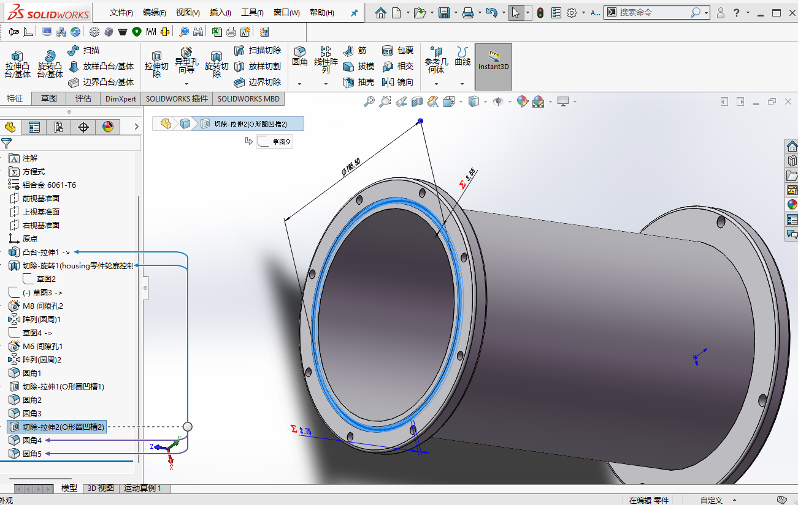
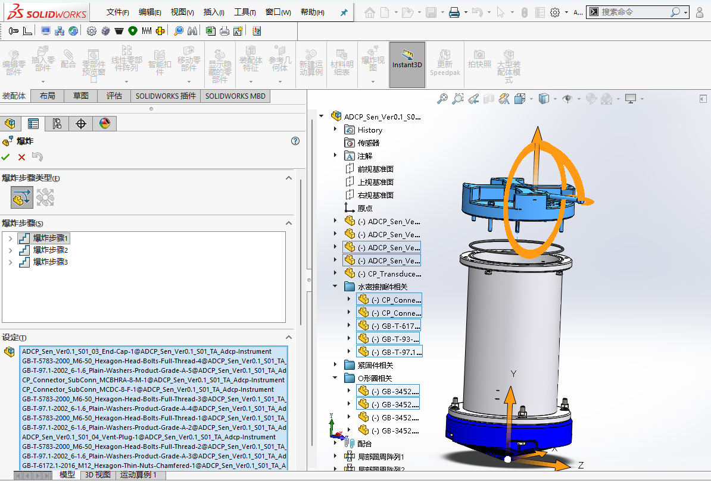
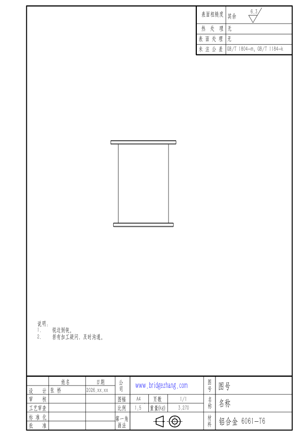
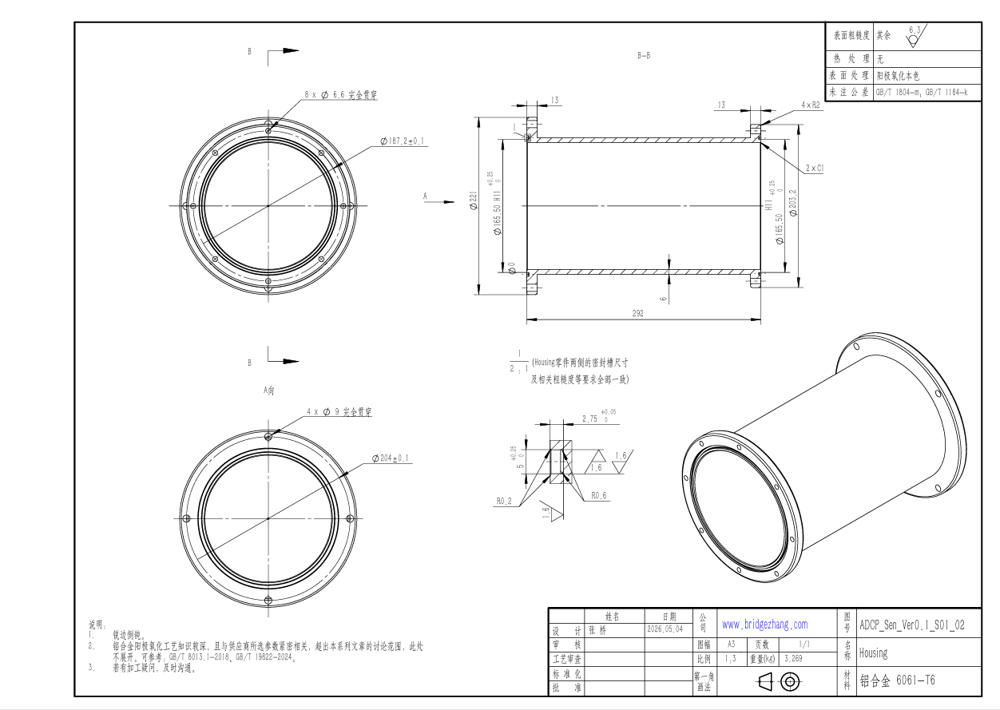
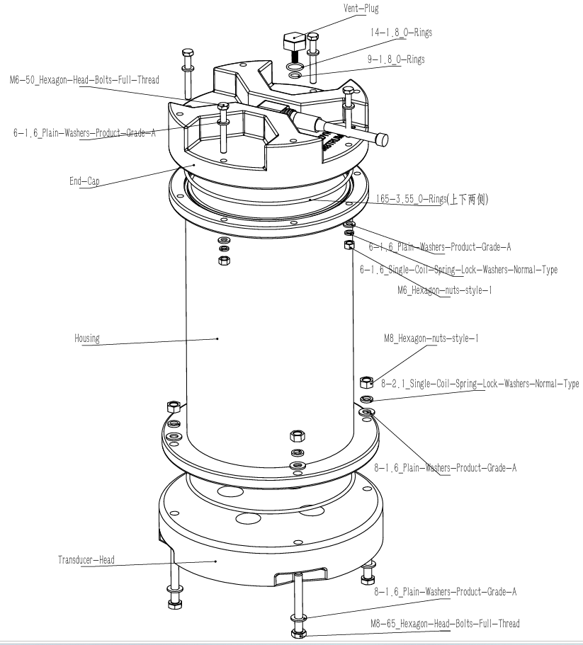
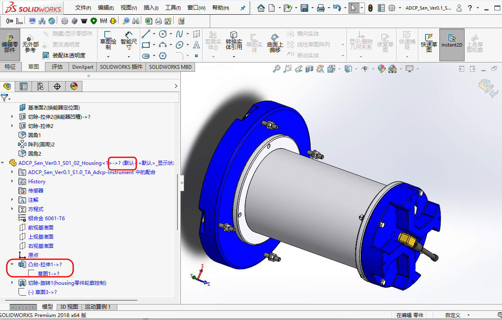

# 建模与图纸

!!! abstract "系列目标"

    - 此系列文章并不假定读者已经拥有完整的信息化管理(如成熟 PDM 体系)条件，而是从更现实的起点出发：先把命名、目录、建模方法、图纸表达和版本迭代这些基础环节梳理清楚。
    - 逐步引发对标准化建模的思考与实践；并形成**可复用**的建模、出图、命名和版本管理规范。
    - 规范不是束缚，而是确保模型、图纸的长期维护、更新的便利性。
    - 规范有助于减少建模过程中的随意性，也不必纠结于`螺钉过孔该设置多大`等问题，按照规范(国标)执行即可。
    - 在某些地方可以适当修改规范以适应具体要求，但一定要有清晰的文档记录，确保可追溯。
    - 对规范/标准化的尊重，某种程度上是专业性的必然要求。
   
## 背景介绍

在长期的建模实践中，我们积累了大量模型文件，也遇到了各种各样的困扰。这些问题看似零散，实则背后有着共性的根源——缺乏统一的规范。

本系列文章选取Teledyne Marine公司的 Workhorse II 水下耐压 ADCP 作为案例，属于典型的耐压舱设备，包含舱体(Housing)、换能器端盖(Transducer-Head)、尾部端盖(End-Cap)、密封件、紧固件等组件，其装配关系能够充分体现建模规范中的各类典型场景。Workhorse II 通过头部的换能器发射、并接收与分析反射声波，主要用于海洋水体流速剖面测量，可部署于船底、浮标、漂流平台或海床。

常见型号包括 Monitor、Sentinel 和 Mariner：

- Monitor：标准传感器主体，通常依赖外部供电，适合临时或固定安装。
- Sentinel：壳体加长，内置电池包，适合长期自容式部署。
- Mariner：水下传感器 + 甲板单元，适合船载实时测量。

这些型号在结构上的核心差异主要体现在壳体长度、内部空间与系统接口上。

此处以官方文档所给出的Workhorse2，300KHZ/600KHZ，Sentinel 为例进行建模，如下图所示。具体外观尺寸见官方文档P150-151(是PDF的页数，而非文档的页数，下同)，爆炸视图在P67中给出。由于该系列产品在不断迭代，因此我们描述的官方文档以互联网档案馆留存的为基准。

<figure markdown="span">
  { width="720" }
  <figcaption>Workhorse II Sentinel ADCP 外观（来自官方文档）</figcaption>
</figure>

该设备的官方文档详见公开资料：[Operation Manual](https://www.teledynemarine.com/en-us/support/SiteAssets/RDI/Manuals%20and%20Guides/Workhorse%20II/WH2_Operation_Manual.pdf)，另存档于互联网档案馆[Operation Manual](http://web.archive.org/web/20260321082212/https:/www.teledynemarine.com/en-us/support/SiteAssets/RDI/Manuals%20and%20Guides/Workhorse%20II/WH2_Operation_Manual.pdf)。

**软件说明**

- 本文对具体的建模软件描述，针对的是SolidWorks premium 2018。尽管各种建模软件在建模流程上有所差异，但对如`参数化`建模等思想的理解是一样的，也可作为参考。
- Solidworks的官方帮助文档，可作为重要参考：[SolidWorks Help](https://help.solidworks.com/2018/chinese-simplified/solidworks/sldworks/r_help.htm)。
- 建模与图纸系列文章的示例文件，可点击[ADCP-sample-file-2026.05.05-rar](../images/docs_modeling/bbe_docs_modeling_index_ADCP-sample-file-2026.05.05-rar.rar)、[ADCP 示例文件 2026.05.05](https://share.weiyun.com/N8L2xdVE)下载。

## 建议阅读顺序

本系列文章建议按照“先建立文件秩序，再建立模型秩序，最后进入图纸表达与版本维护”的顺序阅读。这样做的好处是：读者不只是学会某个按钮或某个命令，而是能够理解一个模型文件从命名、建模、出图到迭代交付的完整链条。

如果只想快速了解整体流程，也可以先浏览本节，再根据自己当前遇到的问题跳转到对应章节。但对于第一次系统整理建模规范的读者，仍建议按以下顺序推进。

1. [命名标准](naming-standards.md)：先把文件名和目录结构统一起来。

    命名是整个系列的起点。若零件、装配体、图纸和标准件在一开始就缺乏统一规则，后续很容易出现装配引用混乱、同名文件冲突、图纸链接断裂等问题。对没有成熟 PDM 系统的个人或小团队来说，清晰的目录结构本身就是最基础的管理工具。

    ADCP 示例文件大致采用如下目录结构：

    ```text
    ADCP/
    ├── ADCP_Standard-Parts/
    ├── ADCP_Commercial-Products/
    ├── ADCP_Sen_Ver0.1/
    │   ├── ADCP_Sen_S01_Adcp-Instrument/
    │   ├── ADCP_Sen_S02_Instrument-Fixture/
    │   └── ADCP_Sen_TA/
    ├── ADCP_Sen_Ver0.2/
    ├── ADCP_Sen_Ver1.0/
    └── README.md
    ```

2. [建模方式](modeling-method.md)：再判断零件之间应采用怎样的建模关系。

    本文重点比较`自下而上/Bottom-up`与`自上而下/Top-down`两种思路：标准件、外购件和相对独立的零件适合自下而上；而端盖、壳体、螺钉过孔等存在强配合关系的结构，则更适合在装配体中建立必要的关联。

    <figure markdown="span">
      { width="720" }
      <figcaption>自上而下建模中的关联尺寸示例</figcaption>
    </figure>

    需要注意的是，自上而下建模并不是越多越好。它的价值在于把真正需要联动的尺寸建立清楚，而不是让所有零件彼此依赖。关联关系越多，后期维护和排错成本也越高。

3. [参数化建模](parametric-modeling.md)：把稳定、重复、可计算的尺寸关系固化下来。

    参数化建模适合处理那些已经有明确规则的结构，例如 O 形圈沟槽。它并不是把所有尺寸都写成方程式，而是在尺寸关系稳定、复用价值明确时，用全局变量、方程式和链接尺寸减少重复输入与人为错误。

    <figure markdown="span">
      { width="720" }
      <figcaption>O 形圈沟槽参数化建模示例</figcaption>
    </figure>

    本文以 O 形圈国标沟槽为例，说明如何通过截面直径联动沟槽宽度、深度和圆角等尺寸。读者在阅读时应重点关注两个问题：哪些关系值得参数化，以及参数化之后如何让后来者仍能看懂。

4. [配置功能](configurations.md)：理解同一文件中的不同状态如何管理。

    配置功能适合表达“同一对象的不同状态或系列化变化”，例如同一装配体的普通状态与爆炸状态，或同一零件的不同长度规格。若两个对象的结构路线已经明显不同，则不宜强行塞进同一个文件配置中。

    <figure markdown="span">
      { width="720" }
      <figcaption>通过配置创建爆炸步骤</figcaption>
    </figure>

    在本系列中，配置功能主要为后续爆炸视图服务：先在装配体中创建爆炸配置，再在工程图中调用该配置，从而让模型状态和图纸表达保持一致。

5. [图纸模板](drawing-template.md)：建立稳定的工程图表达框架。

    模型完成后，图纸模板决定了信息如何被稳定地传递出去。标题栏、比例、图幅、材料、质量、图号、修订信息等内容，若能与模型属性建立链接，就可以减少重复录入，也能降低漏填、错填的概率。

    <figure markdown="span">
      { width="720" }
      <figcaption>工程图模板示例</figcaption>
    </figure>

6. [基本标注](dimensioning.md)：让图纸真正可加工、可检验、可沟通。

    有了图纸模板之后，还需要把尺寸、孔、螺纹、倒角、公差、表面粗糙度等信息标注清楚。标注的重点不是把模型中的每个尺寸都搬到图纸上，而是表达真正影响制造、装配和检验的尺寸。

    <figure markdown="span">
      { width="720" }
      <figcaption>工程图标注完成示例</figcaption>
    </figure>

7. [爆炸视图](exploded-view.md)：为装配理解和维护说明补充直观表达。

    爆炸视图适合用于总装图、装配说明和维修说明。它不是简单地把零件拉开，而是通过有层次的爆炸方向和零部件标识，让读者理解装配顺序、相对位置和部件归属。

    <figure markdown="span">
      { width="720" }
      <figcaption>ADCP 装配体爆炸视图示例</figcaption>
    </figure>

    爆炸视图还可以进一步生成爆炸步骤演示视频，帮助读者建立更直观的装配过程认识：[](https://www.bilibili.com/video/BV1M3ReBLEq7)。

8. [版本迭代](revision-control.md)：最后回到文件维护与版本边界。

    当模型、图纸和装配关系都建立之后，版本管理就成为长期维护的关键。本文讨论如何通过文件夹版本、Pack and Go、装配替换和必要的记录，避免“最终版”“最终版2”“真的最终版”这类不可追溯的混乱。

    <figure markdown="span">
      { width="720" }
      <figcaption>不规范版本迭代带来的文件混乱示例</figcaption>
    </figure>

    版本迭代是本系列的收束：前面的命名、目录、建模关系、参数化、配置和图纸表达，最终都要服务于长期可维护、可追溯和可交接。

## 写作原则

这组文章尽量采用相近的推进方式：

- 先说明问题为何存在。
- 再交代适用范围与目标。
- 然后给出可直接落地的实操建议。
- 最后补充边界、风险与参考来源。

这样做的目的，是让每篇文章都既能单独阅读，也能放回整个系列中理解。


## 边界与风险

- 在即将完成此系列文章时，方才意识到建模、图纸方面的国家标准很详尽、庞大；尽管在努力合乎标准，但仍有不少疏漏，望大家指出。
- 本系列文章讨论的是建模、图纸方面的知识，使用了ADCP设备的官方文档，但核心的参数信息如耐压水平如何确定的，我们无从得知。 
- 本系列文章选择的参数如`Housing`零件的壁厚，只是估计的，不对耐压水平负责。
- 本系列文章对O形圈进行了国产化适配，符合相应的国家标准。但不对密封的可靠性负责，原因如下：
    - GB/T 3452.3-2005 液压气动用O形橡胶密封圈 沟槽尺寸，`范围`一章明确指出：特殊应用的O形圈沟槽尺寸应由O形圈的制造商和使用者协商确定。
    - 此外，涉及压缩率等核心参数时，更得考虑特定制造商的O形圈的硬度等等参数。

## 致谢
