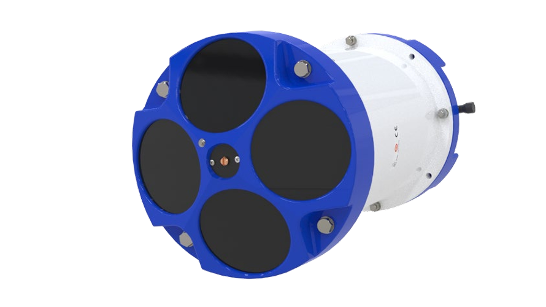

# 建模与图纸

!!! abstract "系列目标"

    - 这组文章并不假定读者已经拥有完整的信息化管理(成熟 PDM 体系)条件，而是从更现实的起点出发：先把命名、目录、建模方法、图纸表达和版本迭代这些基础环节梳理清楚。
    - 逐步引发对标准化建模的思考与实践；并形成**可复用**的建模、出图、命名和版本管理规范。

此系列文章，从构思到完成**资料整理**、撰写，历时一个半月的业余时间，在欣慰之余，也不负老师对自己“诚与尊重”的劝诫。

## 背景介绍

本系列文章选取 Workhorse II 水下耐压 ADCP 作为案例，属于典型的耐压舱设备，包含舱体、端盖、密封件、紧固件等组件，其装配关系能够充分体现建模规范中的各类典型场景。Workhorse II 主要用于海洋水体流速剖面测量，可部署于船底、浮标、漂流平台或海床。

常见型号包括 Monitor、Sentinel 和 Mariner：

- Monitor：标准传感器主体，通常依赖外部供电，适合临时或固定安装。
- Sentinel：壳体加长，内置电池包，适合长期自容式部署。
- Mariner：水下传感器 + 甲板单元，适合船载实时测量。

这些型号在结构上的核心差异主要体现在壳体长度、内部空间与系统接口上。标准版本通常为 200m 聚合物外壳，深海任务可选配 6000m 高压金属外壳。对本系列建模来说，重点关注以下结构细节：

- 壳体几何与装配基准：不同型号的壳体长度、端盖和支撑点需分别定义。
- 内部组件布局：Sentinel 的电池舱、线束走向与密封接口是关键建模要素。
- 系统连接与布线：Mariner 的水下电缆、甲板单元接口和连接器位置影响整体装配图。
- 耐压结构与材料：外壳材质、壁厚和密封形式应随深度等级调整。

此处以官方文档所给出的Workhorse2,300KHZ/600KHZ,Sentinel 为例进行建模，如下图所示。具体外观尺寸见官方文档P150-151(是PDF的页数，而非文档的页数，下同)，由于该系列产品在不断迭代，因此我们描述的官方文档以互联网档案馆留存的为基准。

<figure markdown="span">
  { width="720" }
  <figcaption>Workhorse II Sentinel ADCP 外观（来自官方文档）</figcaption>
</figure>

该设备的官方文档详见公开资料：[Operation Manual](https://www.teledynemarine.com/en-us/support/SiteAssets/RDI/Manuals%20and%20Guides/Workhorse%20II/WH2_Operation_Manual.pdf)，另存档于互联网档案馆[Operation Manual](http://web.archive.org/web/20260321082212/https:/www.teledynemarine.com/en-us/support/SiteAssets/RDI/Manuals%20and%20Guides/Workhorse%20II/WH2_Operation_Manual.pdf)。

**软件说明**

尽管各种建模软件在建模流程上有较多的一致，但仍有细节上的差异；本文针对具体的建模软件描述，针对的是SolidWorks 2018。

## 建议阅读顺序

1. [命名标准](naming-standards.md)：从零部件标准化命名开始，兼顾文件夹命名。
2. [建模方式](modeling-method.md)：对比自上而下与自底向上两种思路。
3. [参数化建模](parametric-modeling.md)：浅析参数化建模的适用边界。
4. [配置功能](configurations.md)：讨论配置功能的使用方式与边界。
5. [图纸模板](drawing-template.md)：讨论图纸模板的结构与使用重点。
6. [基本标注](dimensioning.md)：整理图纸标注中的基本要求。
7. [爆炸视图](exploded-view.md)：说明爆炸视图的使用场景与注意点。
官方文档所给的爆炸视图在P67中给出。
8. [BOM 表](bom-guide.md)：讨论 BOM 表的基本使用方法。
9. [版本迭代](revision-control.md)：以文件版本迭代管理收束整个系列。

## 写作原则

这组文章尽量采用相近的推进方式：

- 先说明问题为何存在。
- 再交代适用范围与目标。
- 然后给出可直接落地的实操建议。
- 最后补充边界、风险与参考来源。

这样做的目的，是让每篇文章都既能单独阅读，也能放回整个系列中理解。
