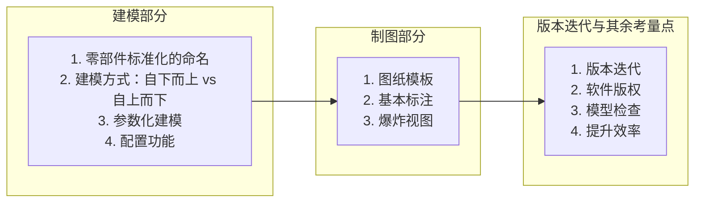
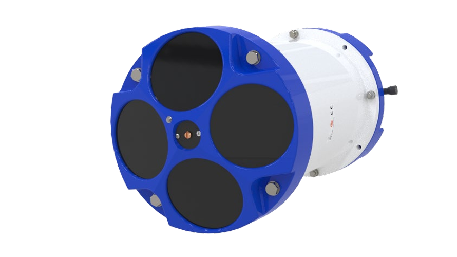

# 建模与图纸

本系列文章致力于提升建模与制图的规范性，有助于模型与图纸的<mark>长期维护与迭代升级</mark>，形成类似方法论的文档以<mark>实现复用</mark>。

该系列文章的主要框架如下图所示，对建模与制图的一些基本原则进行如下简要的讨论：

- 当面临的系统比较复杂或是真正的工业场景，都不得不建立详细的规范来进行建模与制图，这是长期维护的必然要求。当然，<mark>规范的详细程度与系统的复杂程度成正比</mark>。
- 零部件的命名影响着模型的表达、文件夹的设置、装配、后期维护等，很基础也很重要。
- 基本的拉伸、切除等命令是相对容易的，而自上而下、参数化建模、配置等功能，对于<mark>提升效率、减少人为的失误</mark>等方面有很大益处。主要针对下图的第一部分。
- 图纸的规范对于准确的向加工商传达设计意图是至关重要的。主要针对下图的第二部分。
- 版本迭代主要应对系列化的产品或是不断升级、改进的产品。针对下图的第三部分。

```mermaid

flowchart LR
    subgraph A [建模部分]
        A1[1. 零部件标准化的命名<br>2. 建模方式：自下而上 vs 自上而下<br>3. 参数化建模<br>4. 配置功能]
    end

    subgraph B [制图部分]
        B1[1. 图纸模板<br>2. 基本标注<br>3. 爆炸视图]
    end

    subgraph D [版本迭代与其余考量点]
        D1[1. 版本迭代<br>2. 软件版权<br>3. 模型检查<br>4. 提升效率]
    end

    A1 --> B1
    B1 --> D1

```

希望此系列文章对于提升机械行业建模与制图的规范性有所帮助。
   
## 1. 背景介绍

- 本系列文章选取Teledyne Marine公司的 Workhorse II 水下耐压设备(Workhorse2，300KHZ/600KHZ，Sentinel) 作为案例进行建模与制图，其外观如下图所示。
- 具体外观尺寸见官方文档P150-151(是PDF的页数，而非文档的页数，下同)，爆炸视图在P67中给出。该设备的官方文档详见公开资料：[Operation Manual](https://www.teledynemarine.com/en-us/support/SiteAssets/RDI/Manuals%20and%20Guides/Workhorse%20II/WH2_Operation_Manual.pdf)，另存档于互联网档案馆[Operation Manual](http://web.archive.org/web/20260321082212/https:/www.teledynemarine.com/en-us/support/SiteAssets/RDI/Manuals%20and%20Guides/Workhorse%20II/WH2_Operation_Manual.pdf)。

<figure markdown="span">
  { width="720" }
  <figcaption>Workhorse II Sentinel ADCP 外观（来自官方文档）</figcaption>
</figure>

**软件说明**

- 本文对具体的建模软件描述，针对的是SolidWorks premium 2018。尽管各种建模软件在建模流程上有所差异，但对如`参数化`建模等思想的理解是一样的，也可作为参考。
- Solidworks的官方帮助文档，可作为重要参考：[SolidWorks Help](https://help.solidworks.com/2018/chinese-simplified/solidworks/sldworks/r_help.htm)。
- 建模与图纸系列文章的示例文件，可点击[ADCP-sample-file-2026.05.05-rar](../images/docs_modeling/bbe_docs_modeling_index_ADCP-sample-file-2026.05.05-rar.rar)下载。

## 2. 边界与风险

- 本系列文章讨论的是建模、图纸方面的知识，使用了ADCP设备的官方文档，但核心的参数信息如`Housing`零件的壁厚，只是估计的，不对耐压水平负责。
- 本系列文章对O形圈进行了国产化适配，符合相应的国家标准。但<mark>不对密封的可靠性负责</mark>，原因如下：
    - GB/T 3452.3-2005 液压气动用O形橡胶密封圈 沟槽尺寸，`范围`一章明确指出：特殊应用的O形圈沟槽尺寸应由O形圈的制造商和使用者协商确定。
    - 此外，涉及压缩率等核心参数时，更得考虑特定制造商的O形圈的硬度等等参数。

