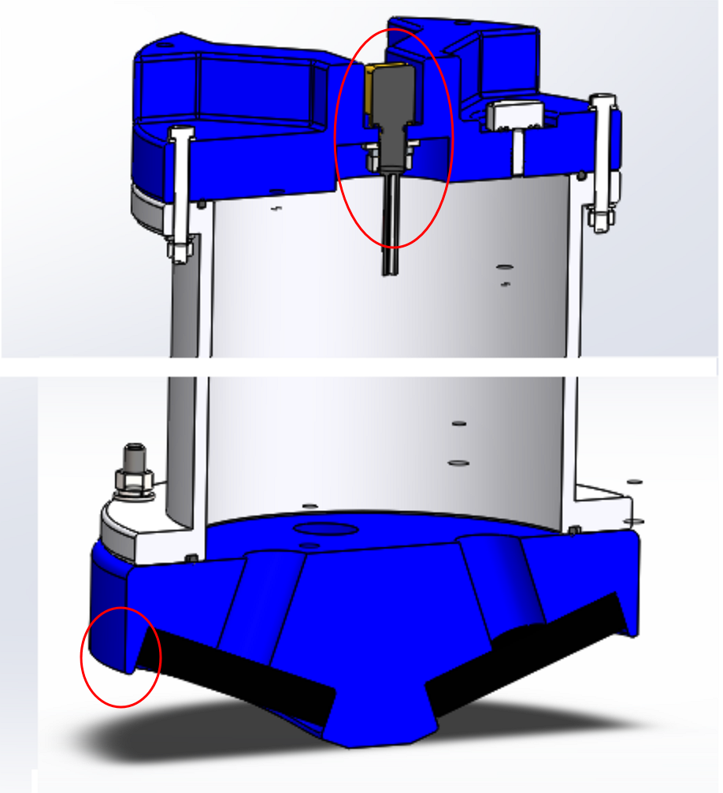

# Solidworks建模与图纸系列文章(补充-1)：对3D模型进行检查的一点心得

## 1. 范围与目标

- 本文主要讨论对3D模型进行检查的一点心得，不涉及到图纸的检查。

## 2. 标准引用

暂无。

## 3. 实操与模板

### 3.1. 善于利用剖面视图

- 在总装模型中，打开图像窗口中上部的`剖面视图/ section view`。
- 在多个平面(包括旋转角度的平面)逐切面的观察模型。

!!! note "留意层级"
    - 在总装配体中检查子装配体间的可能错误。
    - 在子装配体中检查零部件间的的可能错误。
    - 直接在总装配体中检查所有零部件间的的可能错误，可能导致效率低下。

### 3.2 剖面视图--检查是否含有不合理的薄壁特征，是否有干涉

- 在建模阶段可能更多关注功能的实现，在特征增多、模型复杂后，此步骤是对可能的薄壁特征、可能的干涉情况进行**建模层面**的纠偏。
- 下图(图形进行了裁剪)展示了换能器凹槽处的壁厚情况。

    <figure markdown="span">
      { width="720" }
      <figcaption>Section-View </figcaption>
    </figure>

### 3.3 剖面视图--检查重要接口尺寸的正确性

- 对于重要的接口尺寸，比如有配合关系的两个自制零件，它们的接口(如螺钉过孔)可能已经自上而下的联动建模，理论上无需担心。
- 但在[建模方式对比](modeling-method.md)，也指出联动建模有其边界存在，我们不能对所有接口进行联动建模，比如外购件。
- 对于没有联动建模的接口，应该仔细核查模型确保其接口尺寸、定位数据等的匹配性。以外购接插件举例，上图也展示了`End-Cap`零件的螺钉过孔适配接插件的情况。
- 注意：如果有螺钉、弹平垫等紧固件连接的地方，应添加这些紧固件以使情况得到最大程度的还原。

## 4. 其余要点

暂无。

## 5. 边界与风险

- 暂无。

## 6. 小结

暂无。

## 7. 参考来源

暂无。
