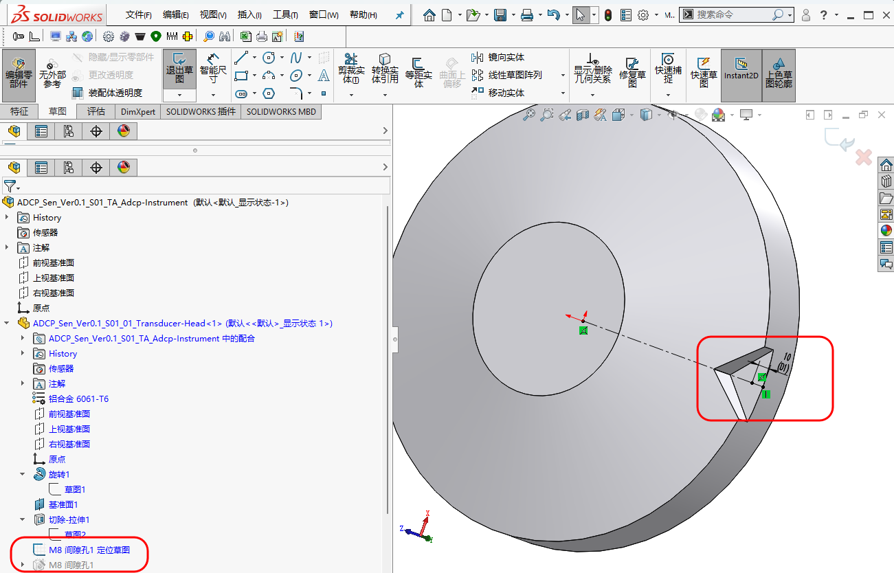
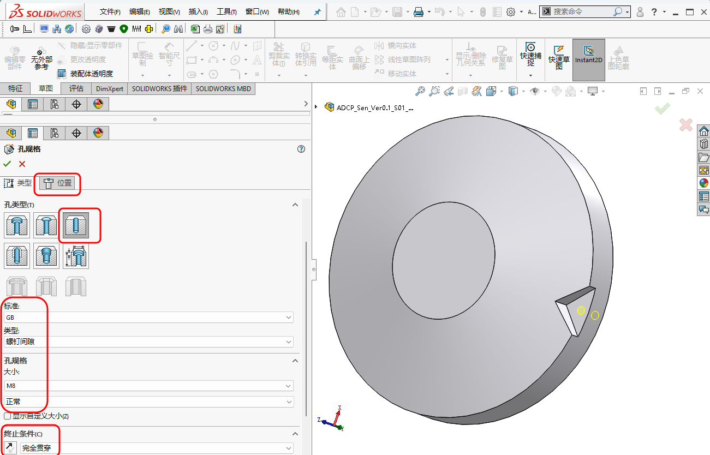
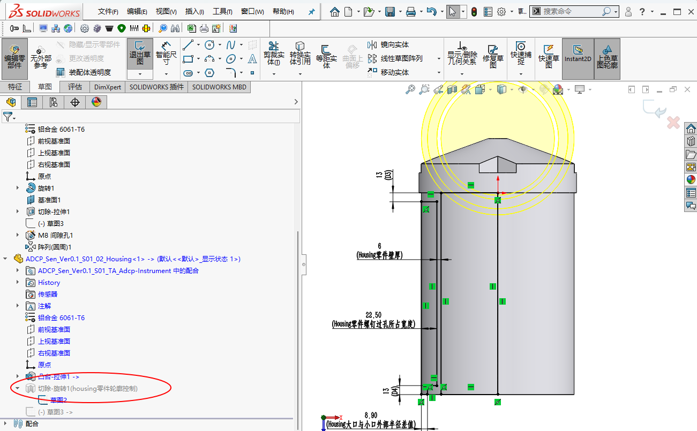
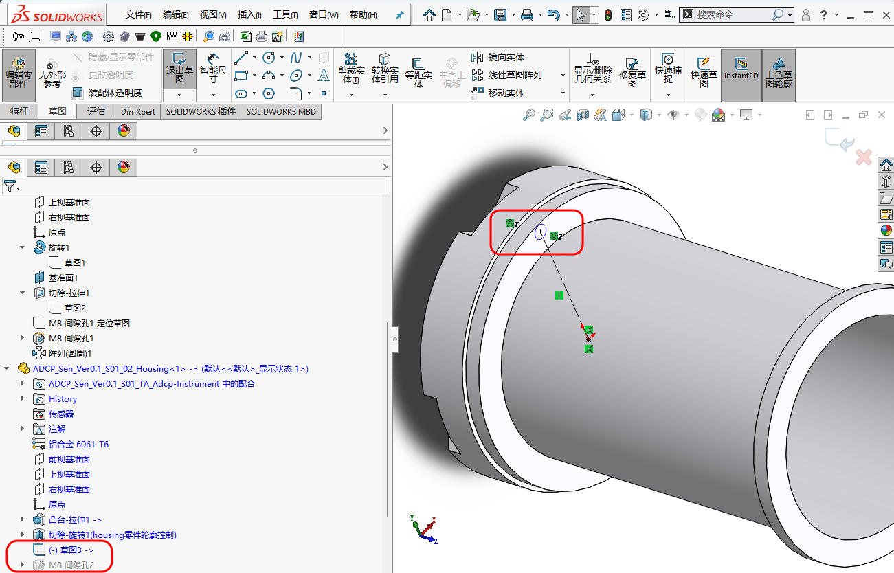
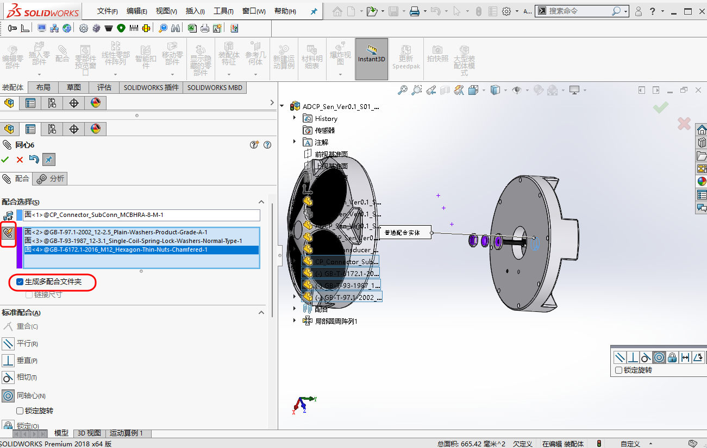
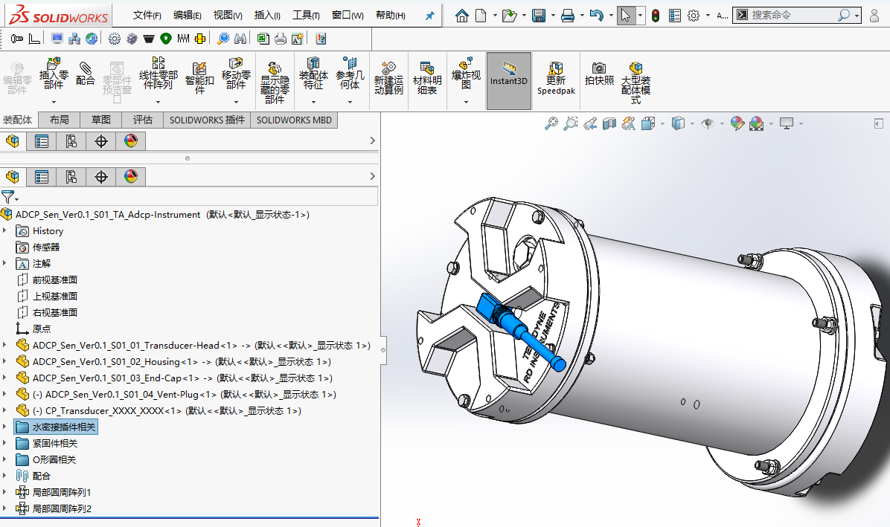
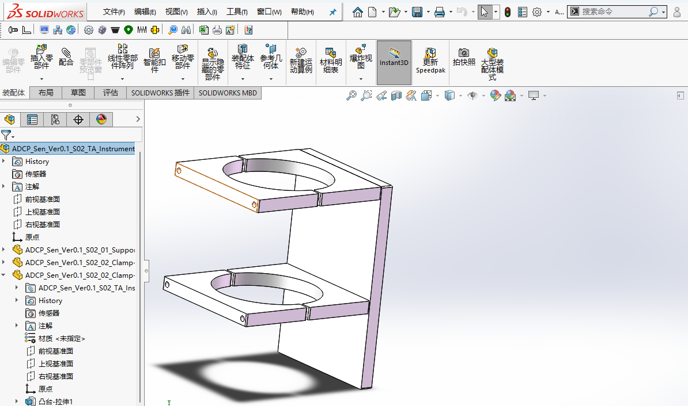
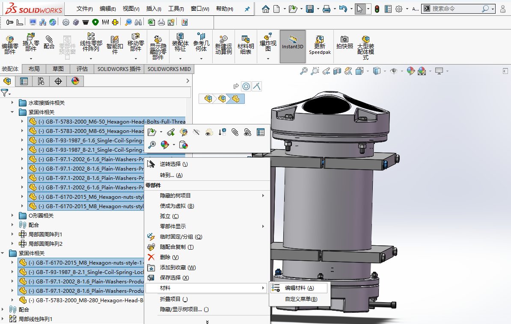
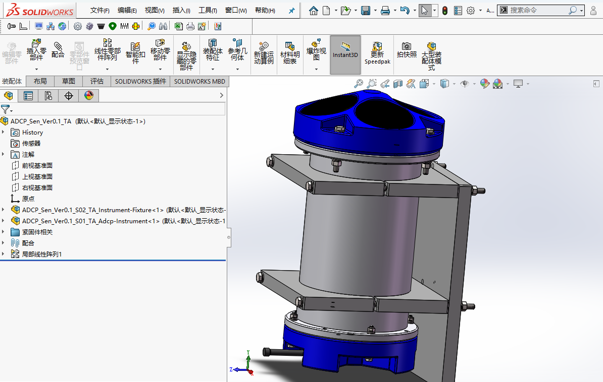

# 建模方式对比：自下而上/Top-down vs 自上而下/Bottom-up

## 1. 范围与目标

本文讨论 `自下而上/Top-down` 与 `自上而下(关联设计)/Bottom-up` 两种常见建模方式：

- 对两种建模方式适用范围的讨论，避免偏向于一种建模方式
- 结合ADCP的建模例子进行讨论

## 2. 标准引用

暂无。

## 3. 实操与模板

### 3.1 自下而上 vs 自上而下 

| 对比项 | 自下而上 | 自上而下 |
| --- | --- | --- |
| 适用对象 | 标准件 | 配合尺寸强关联的零件 |
|  | 外购件 | 需要一起调整孔位、定位面和界面尺寸的结构 |
|  | 尺寸基本固定的成熟零件 | 布局已较明确的核心装配 |
| 优点 | 结构独立、依赖少、后期迁移容易 | 改一处可带动多处更新 |
| 缺点 | 联动修改成本较高 | 依赖关系更复杂，层级不清时容易出错 |

### 3.2 关于自上而下

**两种实现方式**：

| 方式 | 特点 | 适用场景 |
|------|------|---------|
| 布局草图法 | 在装配体中创建草图定义关键尺寸，各零件参考此草图 | 顶层设计，核心配合关系；应尽量简化，只包含必要的尺寸和几何关系 |
| 关联特征法 | 在装配体中编辑零件，特征参考其他零件的几何体 | 单个零件对另一个零件的依赖关系 |

### 3.3 建模步骤

#### 3.3.1 分析模型特点，确定建模方案

针对ADCP而言，依次传递的联动关系，适合自上而下建模里的关联特征法构建。

| 零件名称 | 功能/作用 | 建模方式 | 关键尺寸/联动关系 | 其他说明 |
| :--- | :--- | :--- | :--- | :--- |
| **Transducer-Head** | 容纳换能器 | 自下而上 | 外径 228 mm（由换能器尺寸、个数决定） | 第一个建模的零件 |
| **Housing** | 适配 Transducer-Head 的端面；内部电路板尺寸可能成为限制因素 | 自上而下（联动于 Transducer-Head 的外径） | 螺钉过孔联动于 Transducer-Head 的螺钉过孔 | O形圈凹槽采用参数化建模，方便配置与复用 |
| **End-Cap** | 适配 Housing 的另一端面 | 自上而下（联动于 Housing 的另一外径） | 另一外径 203.2 mm；螺钉过孔联动于 Housing 另一侧的螺钉过孔 | — |
| **Vent-Plug** | 通气塞 | 自下而上 | 无联动关系 | 独立建模 |

此外，`Housing`零件的轮廓使用了参数化建模，可灵活调整尺寸，包括壁厚等参数。
上述联动关系以Transducer-Head为核心，在ADCP系列产品中，当换能器数量、规格变化后，对Transducer-Head外径的更改，能联动传递给Housing、End-Cap，包括螺钉过孔的位置。以此实现：

- 自上而下的联动关系，带来更高效的建模。
- 联动关系的更大作用，体现在对整个系列的建模进行规划。

#### 3.3.2 软件设置

- 启用`选项/系统选项/Feature Manager/允许通过Feature Manager 设计树重命名零部件文件`，以方便在Feature Manager中重命名零件。
- 启用`视图菜单/隐藏-显示/尺寸名称`，在重命名尺寸名称后可增强可读性，便于创建全局变量和方程式。

#### 3.3.3 建模实现

1. 自下而上建立第1个`ADCP_Sen_Ver0.1_S01_01_Transducer-Head.sldprt`零件：

    - 在创建`Transducer-Head`与`Housing`零件连接的螺钉过孔时，首先在草图中设置定位位置，并且该位置与`Transducer-Head`零件外径关联，当`Transducer-Head`零件外径发生变化时，该位置也会跟着发生变化。如下图所示：

    <figure markdown="span">
      { width="720" }
      <figcaption>M8-Screw-Through-Hole-Positioning </figcaption>
    </figure>

    - 其次，对于M8的螺钉过孔(Solidwork称之为间隙孔),利用`异形孔向导`生成。如下图所示：

    <figure markdown="span">
      { width="720" }
      <figcaption>M8-Screw-Through-Hole-Setting </figcaption>
    </figure>

    !!! note "关于异形孔向导"
        - 利用`异形孔向导`而非手动创建圆拉伸切除，是利用Solidwork内置的符合国标(GB)的孔数据，可以大大提高建模效率；并减少手动输入的可能错误。具体标准为：GB 5277-85 紧固件 螺栓和螺钉通孔。
        - 对于所有的螺纹孔、螺钉过孔等,均可在`异形孔向导`中进行设置、使用。
        - `异形孔向导`，选择`类型/孔`，而后选择`GB、螺钉间隙 孔、M8 大小、套合状态：正常`。
        - 关于`套合状态`，紧密、正常、松弛分别对应孔直径为8.4 mm、9 mm、10 mm，可根据自身情况选择或是自定义。
        - `利用异形孔向导`，孔的位置，点击`位置`后，可直接在3D模型上选择点位。

    - 以该零件为基础建立装配体`ADCP_Sen_Ver0.1_S01_TA_Adcp-Instrument.sldasm`。如下图所示。注意：在装配体中才能运用自上而下建模。

    <figure markdown="span">
     { width="720" }
     <figcaption>Building-Adcp-Instrument.sldasm </figcaption>
    </figure>

2. 自上而下建立第2个`ADCP_Sen_Ver0.1_S01_02_Housing.sldprt`零件：

    - 选择`工具栏/插入零部件/新零件/gb_part 模板`，弹出`请选择放置新零件的面或基准面`时，选择`Transducer-Head`零件的下端面，而后如下图所示；右上角的返回箭头、蓝色显示的`零件1`，均意味着我们在`ADCP_Sen_Ver0.1_S01_TA_Adcp-Instrument.sldasm`装配体层级编辑`零件1`。

    <figure markdown="span">
      { width="720" }
      <figcaption>Building-Housing.sldprt </figcaption>
    </figure>

    - 草图画出同心圆，并标注依附于`Transducer-Head`外径的关联尺寸，如下图所示。因此，当我们修改`Transducer-Head`的外径时，`Housing`的尺寸也会随之变化。

    <figure markdown="span">
      { width="720" }
      <figcaption>Building-Associated-Dimensions </figcaption>
    </figure>

    - 拉伸上述草图292 mm生成凸台轮廓，鼠标右击重命名为  `ADCP_Sen_Ver0.1_S01_02_Housing.sldprt`，保存，弹出如下对话框，选择`(外部保存(指定路径))`，点击确定；鼠标右击`Housing`零件，选择`保存文件(在外部文件中)`，弹出如下对话框，选择`与装配体相同`。即自动在`ADCP_Sen_S01_Adcp-Instrument`文件夹下生成`ADCP_Sen_Ver0.1_S01_02_Housing.sldprt`。

    <figure markdown="span">
      { width="720" }
      <figcaption>Save-Housing.sldprt-1 </figcaption>
    </figure>

    <figure markdown="span">
      { width="720" }
      <figcaption>Save-Housing.sldprt-2 </figcaption>
    </figure>

    - 此时，可测试修改`Transducer-Head`的外径，`Housing`的尺寸也会随之变化。

3. `Housing`零件轮廓控制：

    - 大口外径为基准，其小口外径、螺钉过孔所占宽度、壁厚，均依附于`Housing`零件大口外径，创建`切除-旋转`特征，实现尺寸联动，并将特征重命名为`切除-旋转1(housing零件轮廓控制)`，增强可读性。如下图所示。
    注：此处的尺寸关联，局限于`Housing`零件内部，属于参数化建模的范围。

    <figure markdown="span">
     { width="720" }
     <figcaption>Housing-Part-Contour-Definition </figcaption>
    </figure>

4. `Housing`零件螺钉过孔：

    - 大口端面，其螺钉过孔联动于`Transducer-Head`的螺钉过孔，在定位草图中，创建一个`圆(构造线)`，而后创建与`Transducer-Head`的螺钉过孔的`同心`关系(`草图/显示-删除几何关系/添加几何关系/同心`)，以此实现螺钉过孔的尺寸联动。如下图所示:

    <figure markdown="span">
      { width="720" }
      <figcaption>Concentric-Link-Relationship </figcaption>
    </figure>

    !!! warning "注意"
        此处没有直接使用`转换实体引用`方法确定`Housing`零件的螺钉过孔，此方法在定位直径改变时，会导致螺钉过孔的尺寸联动失效。

    - 小口端面，类似方法创建M6的螺钉过孔。

5. 自上而下建立第3个`ADCP_Sen_Ver0.1_S01_03_End-Cap.sldprt`零件：

    - 其外径联动于`Housing`零件的另一外径，螺钉过孔联动于`Housing`零件另一侧的螺钉过孔。
    - 创建4周及中部凹槽、Vent-Plug零件的端面及配套螺纹孔、水密接插件的螺纹过孔。
    - 标印字体，添加必要的倒角圆。

6. 整体完善：

    - 为`Transducer-Head`零件添加换能器凹槽(及走线的过孔)、必要的倒角。
    - 为`Housing`零件添加必要的倒角。
    - 紧固件、O形圈等在P67、P71有提及规格型号，建立同尺寸的`Transducer`替换模型。
    - 水密连接件线缆在P14提及为MCIL-8-F(供应商暂定选择SubConn)，配套插座型号MCBHRA-8-M，堵头型号为MCDC-8-F，详情可访问[官网](https://www.macartney.com/connectivity/subconn/)，模型下载自官网。
    - 将它们添加进文件`ADCP_Commercial-Products`、`ADCP_Standard-Parts`。
    
7. ADCP装配：
    - 注意：装入`O形圈`之前，请参阅[参数化建模](../modeling/parametric-modeling.md)中的内容，将`O形圈`凹槽创建完成。
    - 将上述所有零件插入`ADCP_Sen_Ver0.1_S01_TA_Adcp-Instrument.sldasm`装配体中。
    - 注意：在插入水密插座后，其配套的弹平垫、螺母在添加配合关系时，以插座为基础，选择`多配合模式/生成多配合文件夹`的`同心`关系，有助于装配模型的简洁性。其余有多配合模式的地方，均可类似操作。如下图所示：

    <figure markdown="span">
      { width="720" }
      <figcaption>Multiple-Part-Fit-Modes </figcaption>
    </figure>

    - 装配完成后，在`Feature Manager`中将`水密接插件相关`零部件统一放入一个文件夹，有助于装配模型的简洁性，如下图所示：

    <figure markdown="span">
      { width="720" }
      <figcaption>Folders-In-Feature-Manager </figcaption>
    </figure>

8. 创建夹持零件及相应装配体：

    - 根据官方文档  P36，`Mounting the Instrument`的要求，创建夹持零件及相应装配体，如下图所示：

    <figure markdown="span">
      { width="720" }
      <figcaption>Create-Instrument-Fixture-Assembly </figcaption>
    </figure>

9. 整体装配及赋予材料：

    - 将上述子装配体添加到`ADCP_Sen_TA.sldasm`中，添加必要的紧固件，完成整体装配。
    - 参考官方文档，将所有紧固件赋予钛合金(最可能为Ti-6Al-4V)材质，此处选中所有的紧固件，然后`鼠标右击/材料/编辑材料`，方便统一赋予材质，如下图所示。无法确认材质的零部件，暂时不赋予材质。完成后，如下图所示：

    <figure markdown="span">
      { width="720" }
      <figcaption>Assign-Material-To-Parts </figcaption>
    </figure>

    <figure markdown="span">
      { width="720" }
      <figcaption>ADCP_Sen_Total-Assembly </figcaption>
    </figure>

## 4. 其余要点

### 4.1 可参考的技巧

- 零件建模、装配时，尽量保证零件关于三个基准面对称，对于修改零件和装配都大有益处。具体而言，如零件拉伸时，选择`方向/终止条件/两侧对称`。  来自好友黄玉琳(机械设计工程师)。
- 12

## 5. 边界与风险

- 对于自上而下的联动关系，应有清晰的文档记录，否则自上而下建模带来的便利在长期缺乏维护的情况下，可能会得不偿失。
- 在装配体中编辑时，应始终留意当前处于哪个层级，是总装、子装配体，还是单个零件。层级判断错误时，外部参考与位置关系往往最容易混乱。
- 子装配体中的零件若直接依赖总装层级，后续调整时容易发生引用混乱。

## 6. 小结

建模方式没有绝对优劣，关键在于是否与对象类型、层级关系和修改频率相匹配。对个人或小团队来说，通常是适度混用，而不是坚持单一方法。

## 7. 参考来源

- [SolidWorks Help 设计方法（自下而上设计和自上而下设计）](https://help.solidworks.com/2018/chinese-simplified/SolidWorks/sldworks/c_Design_Methods.htm?id=5.2)，另存档于互联网档案馆，[详见](https://web.archive.org/web/20260501121115/https://help.solidworks.com/2018/chinese-simplified/SolidWorks/sldworks/c_Design_Methods.htm?id=5.2)。
