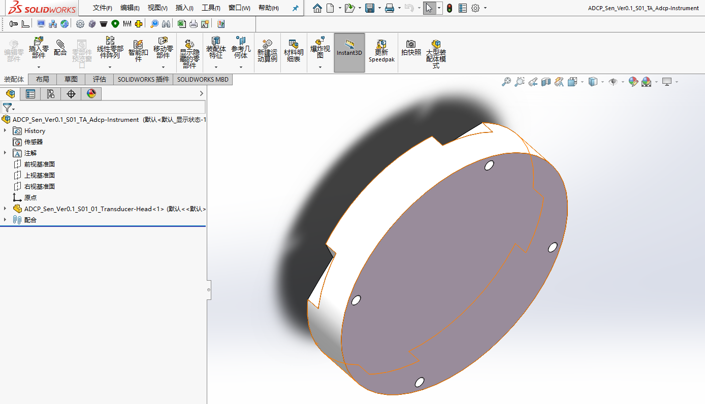
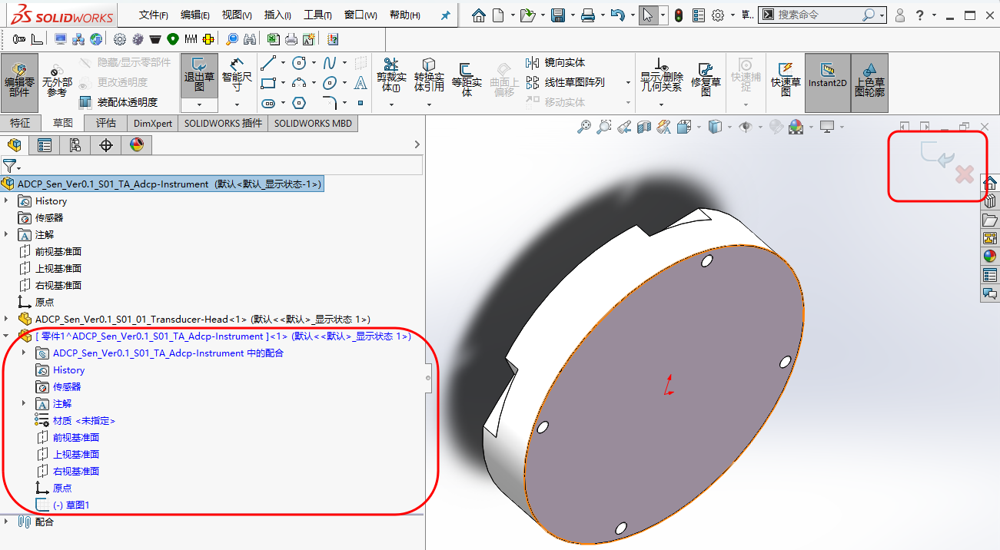
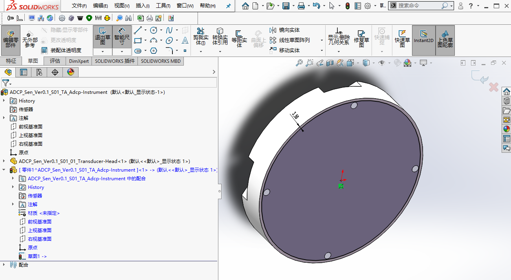
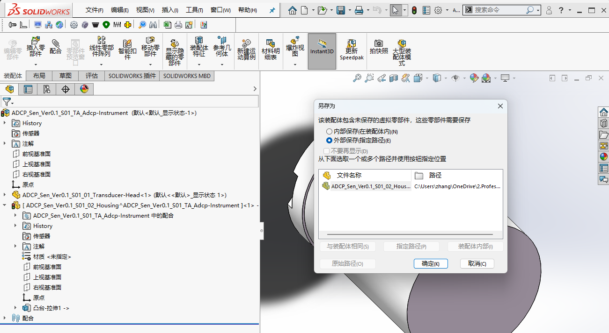
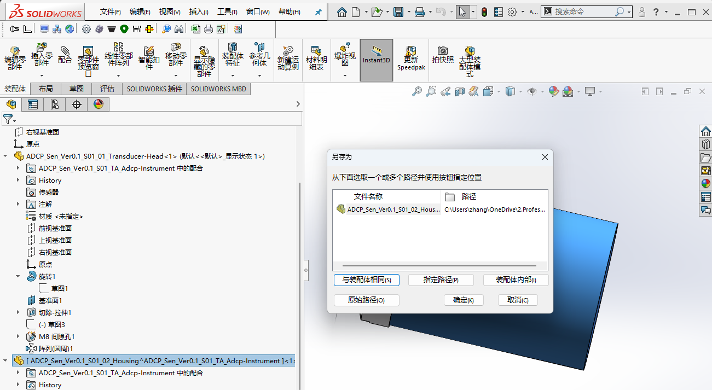

# 建模方式对比：自底向上/Top-down vs 自上而下/Bottom-up

## 1. 范围与目标

本文讨论 `自底向上/Top-down` 与 `自上而下(关联设计)/Bottom-up` 两种常见建模方式：

- 对两种建模方式适用范围的讨论，避免偏向于一种建模方式
- 结合ADCP的建模例子进行讨论

## 2. 标准引用

暂无。

## 3. 实操与模板

### 3.1 自底向上 vs 自上而下 

| 对比项 | 自底向上 | 自上而下 |
| --- | --- | --- |
| 适用对象 | 标准件 | 配合尺寸强关联的零件 |
|  | 外购件 | 需要一起调整孔位、定位面和界面尺寸的结构 |
|  | 尺寸基本固定的成熟零件 | 布局已较明确的核心装配 |
| 优点 | 结构独立、依赖少、后期迁移容易 | 改一处可带动多处更新 |
| 缺点 | 联动修改成本较高 | 依赖关系更复杂，层级不清时容易出错 |

### 3.2 关于自上而下

**两种实现方式**：

| 方式 | 特点 | 适用场景 |
|------|------|---------|
| 布局草图法 | 在装配体中创建草图定义关键尺寸，各零件参考此草图 | 顶层设计，核心配合关系；应尽量简化，只包含必要的尺寸和几何关系 |
| 关联特征法 | 在装配体中编辑零件，特征参考其他零件的几何体 | 单个零件对另一个零件的依赖；如转换实体引用 |

### 3.3 建模步骤

#### 3.3.1 分析模型特点，确定建模方案

针对ADCP而言，依次传递的联动关系，适合自上而下建模里的关联特征法构建。

| 零件名称 | 功能/作用 | 建模方式 | 关键尺寸/联动关系 | 其他说明 |
| :--- | :--- | :--- | :--- | :--- |
| **Transducer-Head** | 容纳换能器 | 自底向上 | 外径 228 mm（由换能器尺寸、个数决定） | 第一个建模的零件 |
| **Housing** | 适配 Transducer-Head 的端面；内部电路板尺寸可能成为限制因素 | 自上而下（联动于 Transducer-Head 的外径） | 螺钉过孔联动于 Transducer-Head 的螺钉过孔 | O形圈凹槽采用参数化建模，方便配置与复用 |
| **End-Cap** | 适配 Housing 的另一端面 | 自上而下（联动于 Housing 的另一外径） | 另一外径 203.2 mm；螺钉过孔联动于 Housing 另一侧的螺钉过孔 | — |
| **Vent-Plug** | 通气塞 | 自底向上 | 无联动关系 | 独立建模 |

- **全局关联说明**
    - 尺寸传递链：Transducer-Head (228 mm) → Housing → End-Cap (203.2 mm)
    - 螺钉过孔联动：Transducer-Head ← Housing → End-Cap
    - O形圈凹槽采用参数化建模，方便配置与复用

上述联动关系以Transducer-Head为核心，在ADCP系列产品中，当换能器数量、规格变化后，对Transducer-Head外径的更改，能联动传递给Housing、End-Cap，包括螺钉过孔的位置。以此实现更高效的建模。

!!! warning "自上而下建模的利与弊"
    对于自上而下的联动关系，应有清晰的文档记录，否则自上而下建模带来的便利在长期缺乏维护的情况下，可能会得不偿失。

2. 要点记录
- 结合文档P71 Spare Parts一节，同等外径的Housing零件的ADCP选择的O形圈在Spare Parts中标记为2-260，可知此为英制标准O形圈 AS568 2-260，线径、内径分别为3.53 mm、164.69 mm，最接近的国标型号为GB/T 3452.1-2005 165*3.55。

#### 3.3.2 建模实现

建立第1个`ADCP_Sen_Ver0.1_S01_01_Transducer-Head.sldprt`零件，以该零件为基础建立装配体`ADCP_Sen_Ver0.1_S01_TA_Adcp-Instrument.sldasm`。如下图所示：
注意：在装配体中才能运用自上而下建模。

<figure markdown="span">
  { width="720" }
  <figcaption>Building-Adcp-Instrument </figcaption>
</figure>

自上而下建模建立第2个`ADCP_Sen_Ver0.1_S01_02_Housing.sldprt`零件：

- 选择`工具栏/插入零部件/新零件/gb_part 模板`，弹出`请选择放置新零件的面或基准面`时，选择`Transducer-Head`零件的下端面，而后如下图所示；左上角的返回箭头、蓝色显示的`零件1`，均意味着我们在`ADCP_Sen_Ver0.1_S01_TA_Adcp-Instrument.sldasm`装配体层级编辑`零件1`。

<figure markdown="span">
  { width="720" }
  <figcaption>Building-Housing.sldprt </figcaption>
</figure>

- 草图画出同心圆，并标注依附于`Transducer-Head`外径的关联尺寸，如下图所示。因此，当我们修改`Transducer-Head`的外径时，`Housing`的尺寸也会随之变化。

<figure markdown="span">
  { width="720" }
  <figcaption>Building-Associated-Dimensions </figcaption>
</figure>

- 拉伸上述草图292 mm生成凸台轮廓，鼠标右击重命名为  `ADCP_Sen_Ver0.1_S01_02_Housing.sldprt`，保存，弹出如下对话框，选择`(外部保存(指定路径))`，点击确定；鼠标右击`Housing`零件，选择`保存文件(在外部文件中)`，弹出如下对话框，选择`与装配体相同`。即自动在`ADCP_Sen_S01_Adcp-Instrument`文件夹下生成`ADCP_Sen_Ver0.1_S01_02_Housing.sldprt`。

<figure markdown="span">
  { width="720" }
  <figcaption>Save-Housing.sldprt-1 </figcaption>
</figure>

<figure markdown="span">
  { width="720" }
  <figcaption>Save-Housing.sldprt-2 </figcaption>
</figure>

- 此时，可测试修改`Transducer-Head`的外径时，`Housing`的尺寸也会随之变化。

12

## 4. 其余要点

### 4.1 层级意识

在装配体中编辑时，应始终留意当前处于哪个层级，是总装、子装配体，还是单个零件。层级判断错误时，外部参考与位置关系往往最容易混乱。

### 可参考的技巧

- 零件建模、装配时，尽量保证零件关于三个基准面对称，对于修改零件和装配都大有益处。具体而言，如零件拉伸时，选择`方向/结束条件/中面`。  来自好友黄玉琳(机械设计工程师)。
- 

## 5. 边界与风险

- 子装配体中的零件若直接依赖总装层级，后续调整时容易发生引用混乱

## 6. 小结

建模方式没有绝对优劣，关键在于是否与对象类型、层级关系和修改频率相匹配。对个人或小团队来说，通常是适度混用，而不是坚持单一方法。

## 7. 参考来源

- SolidWorks Help
- 本站参考资料整理
