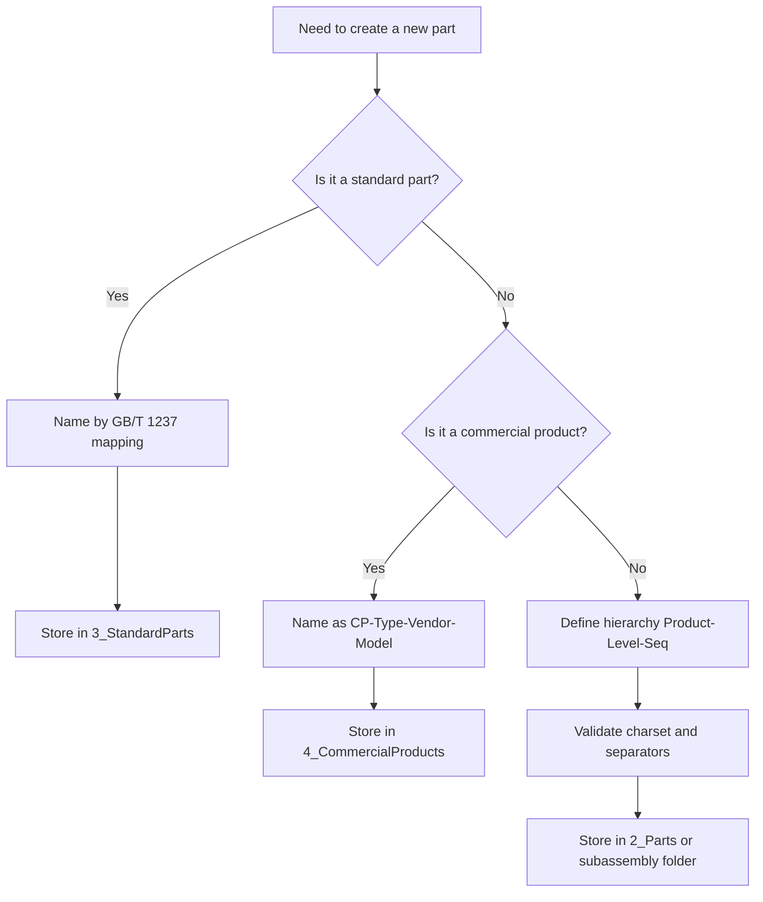

# SolidWorks 建模命名标准（团队可执行版）

> 面向 SolidWorks 与通用三维 CAD 的命名规范。目标是减少返工、避免采购错误、提升跨部门协作效率。

!!! quote "一个 80 元螺钉的时间成本"
    在某海洋仪器项目中，同样是 `M5x20` 内六角螺钉：

    - 非标准命名：采购前需要重新开模、测量、比对目录，约 20 分钟。
    - 标准命名：`GB_T-70.1-2000-M5x20`，采购约 30 秒完成。

    命名规范不是形式，而是用几秒钟命名，换几小时维护时间。

---

## 1. 适用范围与目标

**适用对象**

- 零件（自制件、标准件、外购件）
- 装配体与子装配体
- 工程图、交换文件（STEP/IGES）
- 项目目录结构

**核心目标**

- 可读：名称即信息，不依赖口头解释
- 可检索：同一规则可批量查询
- 可交换：跨软件、跨供应链不乱码
- 可追溯：从文件名回溯结构与来源

!!! warning "先统一规则，再开始建模"
    项目进行中再改命名，通常会触发装配引用丢失、图纸链接断裂与 BOM 映射混乱。

---

## 2. 命名总则（必须遵守）

| 规则 | 要求 | 说明 |
|---|---|---|
| 字符集 | 使用 `A-Z`、`0-9`、`-`、`_`、`.` | 兼容主流文件系统与交换格式 |
| 语言 | 文件名禁止中文 | 避免 STEP/IGES 或第三方系统乱码 |
| 分隔符 | 统一使用 `-` 或 `_`，不要混用空格 | 便于脚本处理与模糊搜索 |
| 易混字符 | 避免在流水号字段使用 `O`、`I` | 防止与 `0`、`1` 混淆 |
| 版本管理 | 禁止 `v1`、`最终版`、`修改后` | 版本应交由 PDM/PLM 或修订字段管理 |

!!! info "推荐格式"
    文件名遵循“**类别前缀 + 结构字段 + 关键规格**”原则，避免把信息塞进备注或口头传递。

---

## 3. 标准依据与工程化解释

???+ note "GB/T 17825.3-1999（CAD 文件管理 编号原则）"
    - 作用：定义 CAD 文件编号基本字符与原则。
    - 落地：优先采用英文、数字、短横线；避免可能造成跨系统异常的字符。

???+ note "JB/T 5054.4-2000（产品图样及设计文件 编号原则）"
    - 作用：强调“隶属编号”，名称应反映产品结构层级。
    - 落地：从产品代号向下展开，如 `PIES-S01-SS02-01`。

???+ note "GB/T 1237-2000（紧固件标记方法）"
    - 作用：定义紧固件标记语义。
    - 落地：文件名中将不合法字符替换后保留完整识别信息，例如 `/` 改为 `_`。

!!! tip "关于 O/I 的实务处理"
    若产品代号历史原因已包含 `O` 或 `I`，可保留在产品代号字段；
    但**流水号、隶属号等可枚举字段必须禁用**，并在规范中明确。

---

## 4. 命名模板（可直接套用）

=== "自制件"
    **模板**：`<Product>-<Level1>-<Level2>-<Seq>`

    **示例**：

    - `PIES-S01-SS02-01`
    - `PIES-S01-01`

    **说明**：

    - `Seq` 采用两位或三位数字（如 `01`、`001`），项目内保持一致。
    - 层级“够用即可”，无需为凑格式硬加层级。

=== "标准件"
    **模板**：`<STD>-<Spec>-<KeySize>-<EN_DESC>`

    **示例**：

    - `GB_T-70.1-2000-M5x20-HEX_SOCKET_CAP_SCREW`
    - `GB_T-97.1-2002-5-PLAIN_WASHER`

    **说明**：

    - 将标准号中的 `/` 替换为 `_`。
    - 建议尺寸统一写作 `x`（如 `M5x20`），避免乘号编码差异。

=== "外购件"
    **模板**：`CP-<Type>-<Vendor>-<Model>`

    **示例**：

    - `CP-CONNECTOR-SUBCONN-BH3M`
    - `CP-TRANSDUCER-SONARDYNE-AT01`

    **说明**：

    - 外购件以采购识别为主，不强求隶属层级。

---

## 5. 新建零件快速决策（流程图）



!!! note "Mermaid 渲染提示"
    若页面未渲染流程图，请在 `mkdocs.yml` 补充 Mermaid 支持配置（Material 官方推荐方式）。

---

## 6. 推荐目录结构

```text
PIES-ST-TA/
├── 0_Assembly/
│   ├── PIES-ST-TA.sldasm
│   └── PIES-ST-TA-EXPLODE.sldasm
├── 1_Subassembly/
│   ├── PIES-S01-TA/
│   │   ├── PIES-S01-TA.sldasm
│   │   └── PIES-S01-TA-ASM01.sldasm
│   └── PIES-S02-TA/
├── 2_Parts/
│   ├── PIES-ST-01.sldprt
│   ├── PIES-ST-02.sldprt
│   └── PIES-S01-TA-01.sldprt
├── 3_StandardParts/
│   ├── Bolts/
│   ├── Nuts/
│   └── Washers/
├── 4_CommercialProducts/
│   ├── CP-CONNECTOR-SUBCONN-BH3M/
│   └── CP-TRANSDUCER-SONARDYNE-AT01/
├── 5_Drawings/
│   ├── SLD/
│   └── PDF/
└── README.md
```

!!! success "目录命名建议"
    文件夹尽量使用固定编号前缀（`0_` 到 `9_`），确保不同机器、不同排序规则下显示一致。

---

## 7. 发布前核对清单

- [ ] 文件名不含中文与空格
- [ ] 仅使用允许字符（字母、数字、`-`、`_`、`.`）
- [ ] 标准件名称可反查到标准号与规格
- [ ] 外购件名称可反查到厂商与型号
- [ ] 自制件名称能反映隶属层级
- [ ] 未使用 `v1`、`最终版`、`修改后` 等伪版本字段
- [ ] 装配引用、工程图链接、导出 STEP 均已验证

---

## 8. 落地建议（从“有文档”到“执行一致”）

1. 在项目启动会冻结命名模板，并指定唯一维护人。
2. 建立标准件与外购件“名称白名单”（优先复用，禁止自由发挥）。
3. 每周做一次自动巡检（正则检查非法字符、空格、伪版本词）。
4. 在评审模板中加入“命名规范”检查项，不合格不得发布。
5. 将命名规则与 BOM 字段映射，减少手工二次录入。

!!! abstract "一句话原则"
    命名应服务于**后续使用者**（采购、装配、制造、售后），而不是只服务当前建模者。

---

*本文初稿撰写于 2024 年，本版为 2026-03-24 的结构化修订稿，适用于 SolidWorks 及通用三维 CAD 环境。*
