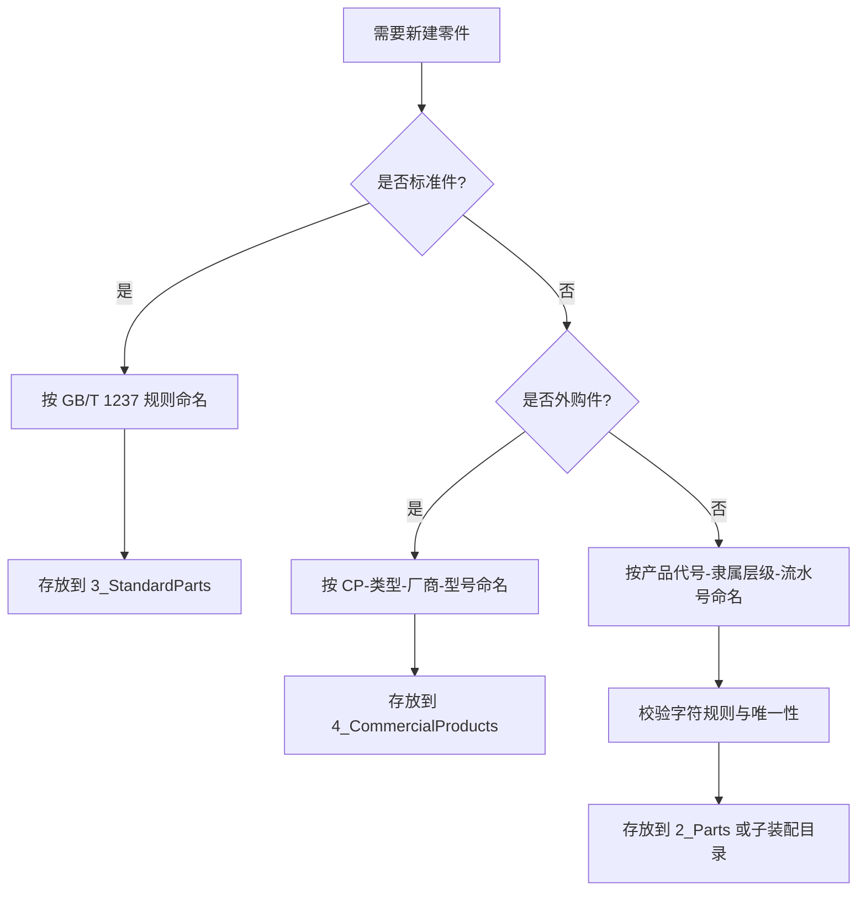

# SolidWorks 建模命名标准（团队可执行版）

> 面向 SolidWorks 与通用三维 CAD 的命名规范。目标是减少返工、避免采购错误、提升跨部门协作效率。

!!! quote "一个 80 元螺钉的时间成本"
    在某海洋仪器项目中，同样是 `M5x20` 内六角螺钉：

    - 非标准命名：采购前需要重新开模、测量、比对目录，约 20 分钟。
    - 标准命名：`GB_T-70.1-2000-M5x20`，采购约 30 秒完成。

    命名规范不是形式，而是用几秒钟命名，换几小时维护时间。

---

## 1. 适用范围与目标

**适用对象**

- 零件（自制件、标准件、外购件）
- 装配体与子装配体
- 工程图、交换文件（STEP/IGES）
- 项目目录结构

**核心目标**

- 可读：名称即信息，不依赖口头解释
- 可检索：同一规则可批量查询
- 可交换：跨软件、跨供应链不乱码
- 可追溯：从文件名回溯结构与来源

!!! warning "先统一规则，再开始建模"
    项目进行中再改命名，通常会触发装配引用丢失、图纸链接断裂与 BOM 映射混乱。

---

## 2. 国家标准引用（完整保留）

### 2.1 GB/T 17825.3-1999《CAD 文件管理 编号原则》

这是 CAD 文件命名的基础性标准，规定了编号的字符集、结构和编制原则。

**核心条款（第 2.1 条）**：

> CAD 文件编号允许使用的字符为：阿拉伯数字 0-9、拉丁字母 A-Z（O、I 除外）、短横线 `-`、圆点 `.`、除号 `/`。

**工程化解释**：

- Windows 文件名不允许 `/`，落地时应替换为 `_`（如 `GB/T` -> `GB_T`）。
- 即使在 Windows 可显示中文，仍建议文件名使用英文与数字，降低 STEP/IGES 与第三方系统乱码风险。
- `O`、`I` 的禁止重点针对流水号、隶属号等易混字段；若产品代号历史上已固化，可在代号字段受控保留。

### 2.2 JB/T 5054.4-2000《产品图样及设计文件 编号原则》

该标准强调“隶属编号”思想：编号应反映产品结构层级。

**推荐结构**：`产品代号-一级隶属-二级隶属-流水号`

**示例**：

- `PIES-S01-SS02-01`
- `PIES-S01-01`

### 2.3 GB/T 1237-2000《紧固件标记方法》

该标准规定了紧固件标记方式，是标准件命名依据。

**工程化命名建议**：

- 保留标准号 + 规格 + 类型关键字
- 将文件名非法字符替换为合法字符

**示例**：

- `GB_T-70.1-2000-M5x20-HEX_SOCKET_CAP_SCREW`
- `GB_T-97.1-2002-5-PLAIN_WASHER`

### 2.4 GB/T 17825.6-1999《CAD 文件管理 更改规则》（版本管理依据）

**已知可核对范围**：本标准规定了 CAD 文件的更改原则、更改方法、更改程序、更改通知单填写以及“更改后的文件名管理”。

!!! note "关于“编号不含版本”的条文说明"
    在公开可查的标准摘要中，可确认 GB/T 17825.6 将“版本”放在“更改管理”语境处理，而不是鼓励将 `v1/v2/最终版` 直接塞入编号主体。

    由于标准全文受版权保护，建议在公司受控标准文本中核对具体条款号后，再在制度中写成“条款号 + 原文”。

**核心目的（工程实践）**：

- 保持编号稳定，避免同一对象因版本变化而“改名失联”
- 让更改通过“流程与记录”可追溯，而不是靠文件名猜测
- 降低装配引用断裂与跨部门误用风险

---

## 3. 命名总则（必须遵守）

| 规则 | 要求 | 说明 |
|---|---|---|
| 字符集 | 使用 `A-Z`、`0-9`、`-`、`_`、`.` | 兼容主流文件系统与交换格式 |
| 语言 | 文件名禁止中文 | 避免 STEP/IGES 或第三方系统乱码 |
| 分隔符 | 统一使用 `-` 或 `_`，不要混用空格 | 便于脚本处理与搜索 |
| 易混字符 | 流水号字段禁用 `O`、`I` | 防止与 `0`、`1` 混淆 |
| 版本写法 | 禁止 `v1`、`最终版`、`修改后` | 版本信息转移到属性/更改单 |

!!! info "推荐格式"
    文件名遵循“类别前缀 + 结构字段 + 关键规格”，避免把关键信息放在备注中。

---

## 4. 痛点一：同名文件冲突（重点）

### 4.1 场景还原

你从某项目复制了一个名为“端盖”的零件到新项目，修改后继续使用。某天打开旧装配体时，端盖形状异常。常见根因是：同名文件在多路径并存，且当前会话已有同名模型被加载，导致引用解析出现错误或混淆。

### 4.2 为什么会发生

- 零件名语义弱（如“端盖.sldprt”）
- 项目之间复制复用但未重命名
- 无 PDM 下缺少中心化“唯一编号 + 生命周期”控制

### 4.3 无 PDM 的可执行方案

!!! success "策略 A：产品代号升级（推荐）"
    核心思想：把 `V2` 作为**产品代号演进**，而不是版本号后缀。

    - 推荐：`PIES-2-S01-01` 或 `PIES-MK2-S01-01`
    - 不推荐：`PIES-S01-01-v2`

    这样做的好处是：编号主体仍是“对象身份”，不会把流程状态混入名称。

!!! tip "策略 B：同名禁令 + 前缀强制"
    自制件名称必须含“产品代号 + 隶属号 + 流水号”，禁止裸名称（如 `端盖.sldprt`、`Bracket.sldprt`）。

!!! tip "策略 C：版本信息外置"
    无 PDM 时，将版本放在以下任一载体：

    - 文件属性（如 `Revision=A/B/C`）
    - 更改台账（Excel/Markdown）
    - 工程图标题栏修订栏

    文件名保持不变，仅在**对象身份变化**时启用新代号（如 `PIES` -> `PIES-MK2`）。

### 4.4 决策规则（无 PDM）

- 仅参数微调、孔位修订、尺寸修订：不改编号，升修订号。
- 几何拓扑或接口变化导致不可互换：升级产品代号（`PIES` -> `PIES-MK2`）。
- 全新结构路线：新建代号族，不复用旧编号。

---

## 5. 命名模板（可直接套用）

=== "自制件"
    **模板**：`<Product>-<Level1>-<Level2>-<Seq>`

    **示例**：

    - `PIES-S01-SS02-01`
    - `PIES-MK2-S01-01`

=== "标准件"
    **模板**：`<STD>-<Spec>-<KeySize>-<EN_DESC>`

    **示例**：

    - `GB_T-70.1-2000-M5x20-HEX_SOCKET_CAP_SCREW`
    - `GB_T-97.1-2002-5-PLAIN_WASHER`

=== "外购件"
    **模板**：`CP-<Type>-<Vendor>-<Model>`

    **示例**：

    - `CP-CONNECTOR-SUBCONN-BH3M`
    - `CP-TRANSDUCER-SONARDYNE-AT01`

---

## 6. 新建零件快速决策（中文流程图）



---

## 7. 推荐目录结构

```text
PIES-ST-TA/
├── 0_Assembly/
│   ├── PIES-ST-TA.sldasm
│   └── PIES-ST-TA-EXPLODE.sldasm
├── 1_Subassembly/
│   ├── PIES-S01-TA/
│   │   ├── PIES-S01-TA.sldasm
│   │   └── PIES-S01-TA-ASM01.sldasm
│   └── PIES-S02-TA/
├── 2_Parts/
│   ├── PIES-ST-01.sldprt
│   ├── PIES-ST-02.sldprt
│   └── PIES-MK2-S01-01.sldprt
├── 3_StandardParts/
│   ├── Bolts/
│   ├── Nuts/
│   └── Washers/
├── 4_CommercialProducts/
│   ├── CP-CONNECTOR-SUBCONN-BH3M/
│   └── CP-TRANSDUCER-SONARDYNE-AT01/
├── 5_Drawings/
│   ├── SLD/
│   └── PDF/
└── README.md
```

---

## 8. 发布前核对清单

- [ ] 文件名不含中文与空格
- [ ] 仅使用允许字符（字母、数字、`-`、`_`、`.`）
- [ ] 流水号字段未使用 `O`、`I`
- [ ] 未使用 `v1`、`最终版`、`修改后` 等伪版本字段
- [ ] 标准件名称可反查到标准号与规格
- [ ] 外购件名称可反查到厂商与型号
- [ ] 自制件名称可反查到产品代号与隶属层级
- [ ] 装配引用、工程图链接、STEP 导出已验证

---

## 9. 参考来源（用于条文核对）

- 国家标准信息公共服务平台（标准检索）：<https://std.samr.gov.cn/>
- 国家标准全文公开系统（标准信息检索）：<https://openstd.samr.gov.cn/bzgk/std/newGbInfo>
- SolidWorks Help（外部参考文件设置）：<https://help.solidworks.com/2025/English/SolidWorks/sldworks/HIDD_OPTIONS_EXTERNAL_REFS.htm>
- GB/T 17825.3-1999《CAD 文件管理 编号原则》
- GB/T 17825.6-1999《CAD 文件管理 更改规则》
- JB/T 5054.4-2000《产品图样及设计文件 编号原则》
- GB/T 1237-2000《紧固件标记方法》

!!! warning "合规提示"
    本文引用以标准名称、编号与公开摘要为主；若用于企业制度发布，请以贵司受控标准全文逐条核对并补全条款号。

---

*本文初稿撰写于 2024 年，本版为 2026-03-25 的增强修订稿。*
