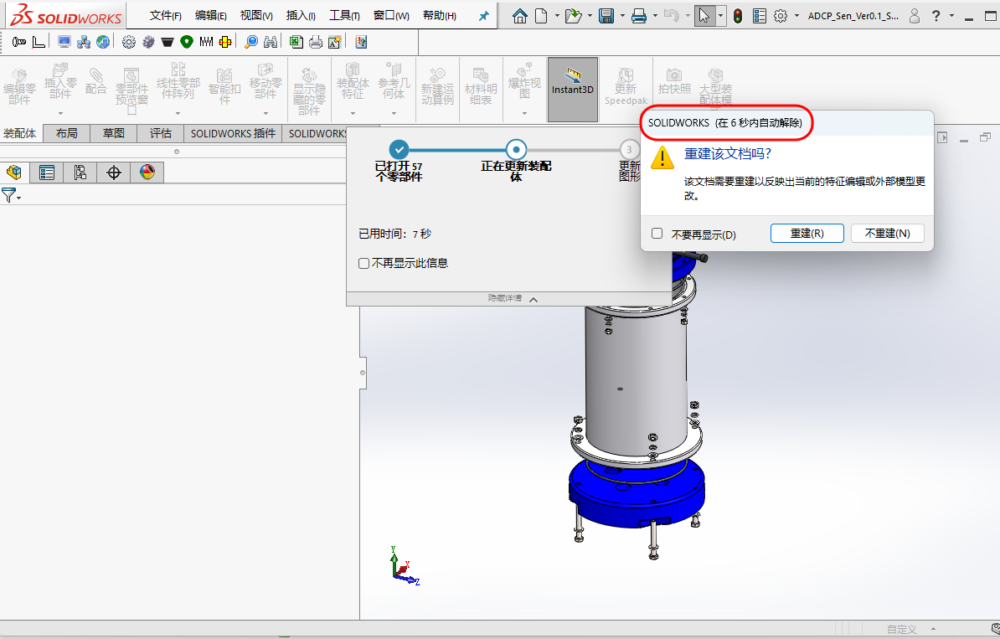

# SolidWorks 建模：从零部件标准化的命名开始

## 1. 目标与标准引用

增强命名的规范性，有助于设计、采购、装配、出图和后期维护等环节的<mark>信息交互与协同</mark>。


### 1.1. 标准1 

GB/T 17825.3-1999《CAD 文件管理 编号原则》，核心条款（第 2.1 条）：

> CAD 文件编号允许使用的字符为：阿拉伯数字 0-9、拉丁字母 A-Z（O、I 除外）、短横线 -、圆点 .、除号 /。

工程化解释：

- Windows 文件名不允许 `/`，落地时应替换为 `-` 或 `_`（如 `GB/T` -> `GB-T`）。
- 即使在 Windows 可显示中文，仍建议文件名使用英文与数字，降低 STEP/IGES 与第三方系统乱码风险。
- `O`、`I` 的禁止重点针对流水号、隶属号等易混字段；若产品代号历史上已固化，可在代号字段受控保留。

### 1.2. 标准2

JB/T 5054.4-2000《产品图样及设计文件 编号原则》，强调“隶属编号”的思路，即编号应尽量反映结构层级。

"推荐结构：" 产品代号_版本_系统_流水号_名称

例如：

- `ADCP_Sen_Ver0.1_S01_01_Transducer-Head.sldprt`
- `ADCP_Sen_Ver0.1_S01_TA_Adcp-Instrument.sldasm `

其中：

- `ADCP` 表示产品代号
- `Sen_Ver0.1` 表示 Sentinel 版本 0.1
- `S01` 表示系统或子系统编号
- `TA(Total Assembly)` 表示当前层级的总装配体
- `01` 表示该层级下的零件流水号

### 1.3. 标准3

GB/T 1237-2000《紧固件标记方法》

"工程化命名建议："

- 保留标准号 + 规格 + 类型关键字
- 将文件名非法字符替换为合法字符

例如：

- `GB-T-70.1-2000_M5x20_Hex-Socket-Cap-Screw`
- `GB-T-97.1-2002_5_Plain-Washer`

## 2. 实操与模板


### 2.1. 命名模板

命名时，对不同类型的零件进行分类处理，有助于后期维护。

自制件 / In-house Parts
    模板：`<Product>_<Version>_<System>_<Seq>_<Name>`

    示例：

    - `ADCP_Sen_Ver0.1_S01_01_Transducer-Head`
    - `ADCP_Sen_Ver0.1_S02_01_Support-Plate`

标准件 / Standard Parts
    模板：`<Standard>_<Spec>_<Type>`

    示例：

    - `GB-T-70.1-2000_M5x20_Hex-Socket-Cap-Screw`
    - `GB-T-97.1-2002_5_Plain-Washer`

    建议：

    - `_` 用于标准号与规格之间的层次分隔
    - `-` 用于类型名称内部的多词组合，如 `Hex-Socket-Cap-Screw`

外购件 / Commercial Parts
    模板：`CP_<Type>_<Vendor>_<Model>`

    示例：

    - `CP_Connector_SubConn_BH3M`
    - `CP_Transducer_Sonardyne_AT01`

    建议：

    - `CP_` 固定前缀表示外购件
    - 供应商与型号之间使用 `_` 连接，保持层级关系清晰

### 2.2. 推荐目录结构

ADCP 示例

    ```text
    ADCP/
    ├── ADCP_Standard-Parts/
    │   └── GB-T-70.1-2000_M5x20_Hex-Socket-Cap-Screw.sldprt
    ├── ADCP_Commercial-Products/
    │   └── CP_Connector_SubConn_BH3M.sldprt
    ├── ADCP_Sen_Ver0.1/
    │   ├── ADCP_Sen_S01_Adcp-Instrument/  
    │   │   ├── ADCP_Sen_Ver0.1_S01_01_Transducer-Head.sldprt
    │   │   ├── ADCP_Sen_Ver0.1_S01_02_Housing.sldprt
    │   │   ├── ADCP_Sen_Ver0.1_S01_03_End-Cap.sldprt
    │   │   └── ADCP_Sen_Ver0.1_S01_TA_Adcp-Instrument.sldasm   
    │   ├── ADCP_Sen_S02_Instrument-Fixture/
    │   │   ├── ADCP_Sen_Ver0.1_S02_01_Support-Plate.sldprt
    │   │   ├── ADCP_Sen_Ver0.1_S02_02_Clamp-Plate.sldprt
    │   │   └── ADCP_Sen_Ver0.1_S02_TA_Instrument-Fixture.sldasm
    │   ├── ADCP_Sen_TA/
    │   │   └── ADCP_Sen_Ver0.1_TA.sldasm   
    ├── ADCP_Sen_Ver0.2/ 
    ├── ADCP_Sen_Ver1.0/
    └── README.md
    ```

说明：

- 次一级文件夹`ADCP_Sen_S01_Adcp-Instrument/`无需版本编号，由上一级的文件夹承担编号。
- 此处的目录结构，符合[版本迭代](revision-control.md)的要求，Ver0.1即迭代版本0.1。
- 目录层级建议使用 `_` 将产品、版本和分类串联。
- 部件名称内部使用 `-` 表示词语组合或部位关系。
- 这样区分后，文件名既能表达结构层级，又保持词义清晰，方便人工识别与自动检索。
- `README.md` 作为该产品线根目录说明文件，说明目录结构与命名规则。

## 3. 其余要点

### 3.1 同名文件冲突

遵守命名的规范性，能避免如下的同名文件冲突的情况：

- 你从某项目复制了一个名为“端盖”的零件到新项目，修改后继续使用。某天再打开旧装配体时，端盖形状异常。
- 常见根因是：多路径下存在同名文件，而当前会话又已经加载了其中一个，最终导致引用解析混淆。会有`是否解除链接关系`的询问，如下图片的提示：

<figure markdown="span">
    { width="720" }
    <figcaption>File-Name-Conflict </figcaption>
</figure>

## 4. 边界与风险

- 本文所述命名规范仅供参考，可以根据团队习惯和需求进行调整，但<mark>不建议违背国标的硬性要求</mark>。

