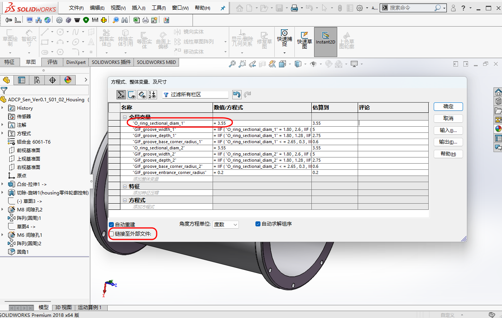
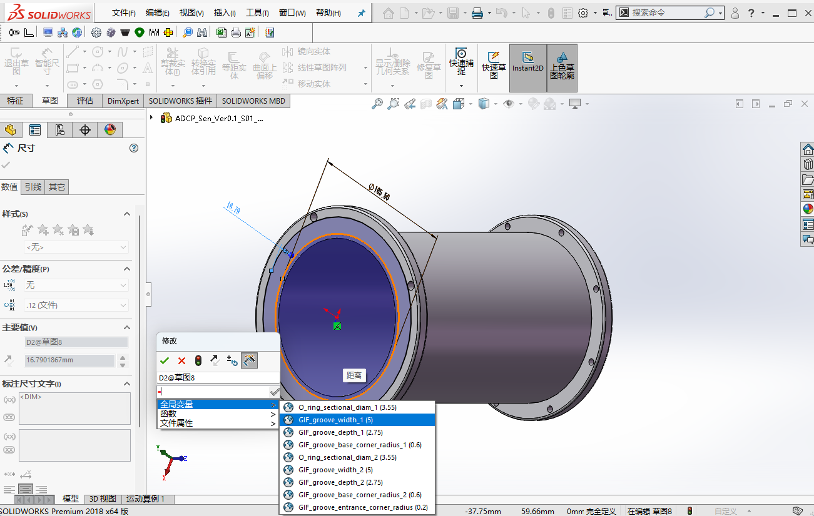

# 参数化建模

## 1. 范围与目标

本文希望回答两个问题：

- 参数化建模的定义
- 参数化建模的适用场景与建模实例

## 2. 标准引用

暂无。

## 3. 实操与模板

### 3.1 适用场景解析

**参数化建模的定义**：通过方程式、全局变量、链接尺寸等方式，建立尺寸之间的数学关系，实现“修改一个参数，相关尺寸自动更新”。

| 类别 | 具体内容 |
| :--- | :--- |
| **适用场景** | - 产品系列化明显的零件 - 需要频繁调整的关键尺寸 - 多个尺寸存在清晰数学关系的结构 |
| **不适用场景** | - 一次性建模的简单零件 - 方案尚未稳定的早期阶段 - 关系链过长、难以解释的尺寸网络 |
| **实操原则** | - 先明确设计意图，再决定是否建立方程 - 核心变量尽量集中管理 - 少而稳，通常比多而全更实用 |

- 由于O形圈的选型及对应凹槽设计，已经形成相应的标准，O形圈一旦选定其凹槽尺寸将固定，因此适用于`Housing`零件、`Vent-Plug`零件的O形圈凹槽的参数化建模。
- ADCP选用的O形圈为美国标准，[AS568 - AEROSPACE SIZE STANDARD FOR O-RINGS](https://www.sae.org/standards/as568-aerospace-size-standard-o-rings)；为适应本地设计、采购，我们以最接近的国标代替，[GB/T 3452.1-2005  液压气动用O形橡胶密封圈 第1部分:尺寸系列及公差](https://std.samr.gov.cn/gb/search/gbDetailed?id=71F772D76858D3A7E05397BE0A0AB82A)。具体对应情况参考下表：

| 使用情景 | 美标型号 | 最接近国标型号 | 对应国标凹槽内径* | 材质、硬度 |
| :---: | :---: | :---: | :---: | :---: |
| Housing | AS568 2-260 | GB/T 3452.1-2005 165*3.55 | 165.5 | |
| Vent-Plug内侧 | AS568 3-904 | GB/T 3452.1-2005 9*1.8 | 9.2 |EPDM, DURO 90A |
| Vent-Plug外侧 | AS568 2-015 | GB/T 3452.1-2005 14.0*1.8 | 14.2 | EPDM, DURO 90A |

* GB/T 3452.1-2005  液压气动用O形橡胶密封圈，对应的O形圈凹槽国标，[GB/T 3452.3-2005 液压气动用O形橡胶密封圈 沟槽尺寸](https://std.samr.gov.cn/gb/search/gbDetailed?id=71F772D780ECD3A7E05397BE0A0AB82A)，国标凹槽内径(mm)以`表13 轴向密封沟槽尺寸(受外部压力)`的数据为准。
### 3.2 背景分析

由上述标准可知，轴向密封凹槽/Groove in flange(GIF)的凹槽尺寸由所选O形圈截面直径确定，它们存在清晰数学关系，如下：

| O形圈截面直径 | 沟槽宽度 | 沟槽深度 | 沟槽底圆角半径 | 沟槽入口圆角半径 |
| :---: | :---: | :---: | :---: | :---: |
| O-ring sectional dia. | Groove width | Groove depth | Bottom corner radius | Entrance corner radius |
| 1.80 | 2.6 | 1.28 | 0.3 | 0.2 |
| 2.65 | 3.8 | 1.97 | 0.3 | 0.2 |
| 3.55 | 5.0 | 2.75 | 0.6 | 0.2 |
| 5.30 | 7.3 | 4.24 | 0.6 | 0.2 |
| 7.00 | 9.7 | 5.72 | 1.0 | 0.2 |

注意：圆角半径可在一个范围内波动，此处取中间值。

为了将上述关系固定下来，建立如下变量与方程式关系(存于`Equations-For-O-Ring-Groove.txt`文件)，可有如下作用：

- 函数关系通过if语句，遍历所有O形圈截面直径对应的参数，以沟槽宽度举例如下："GIF_groove_width_1"= IIF ( "O_ring_sectional_diam_1" = 1.80 , 2.6 , IIF ( "O_ring_sectional_diam_1" = 2.65 , 3.8 , IIF ( "O_ring_sectional_diam_1" = 7.00 , 9.7 , IIF ( "O_ring_sectional_diam_1" = 5.30 , 7.3 , 5.0 ) ) ) )
- 即输入一个O形圈截面直径，即可联动得到相应的沟槽宽度等数据。
- 可不断复用，也可避免手动输入可能导致的出错。
- O形圈截面直径/O_ring_sectional_diam预设了_1、_2两个变量，同一零件即使有两处不同规格的O形圈沟槽，也可对应配置；若有更多沟槽，相应扩展即可。

### 3.3 建模实现

1. 打开`Housing`零件，并导入`Equations-For-O-Ring-Groove.txt`文件：

    - `工具菜单/方程式/输入`，选择`Equations-For-O-Ring-Groove.txt`文件，点击`输入`。
    - 取消勾选`链接至外部文件`，由于`Housing`零件使用的O形圈截面直径为3.55，因此先选择`O_ring_sectional_diam_1`而后修改为3.55，其余相应的变量(如`GIF_groove_width_1`)自动联动。如下图所示:

    <figure markdown="span">
      { width="720" }
      <figcaption>Equation-Settings </figcaption>
    </figure>

    - 在`Housing`零件大口端面上，创建有同心圆的草图，内径为165.5，圆间距(对应凹槽宽度)在输入数据时选择`输入等号/全局变量/GIF_groove_width_1`，如下图所示：
    
    <figure markdown="span">
      { width="720" }
      <figcaption>Referencing-Global-Variables </figcaption>
    </figure>

    - 拉伸切除的深度为凹槽深度，同理选择`GIF_groove_depth_1`;对于凹槽内外的倒角有类似描述，不再赘述。
    - 在`Housing`零件小口端面上，使用`GIF_groove_width_2`，能对两侧凹槽分别控制；其余有类似描述，不再赘述。完成后如下图所示：
    
    <figure markdown="span">
      { width="720" }
      <figcaption>GB-O-Ring-Example </figcaption>
    </figure>

2. 使用说明：

    - 当ASCP其余系列产品需要使用不同的O形圈规格时，只需修改`Housing`零件的O形圈截面直径(`O_ring_sectional_diam_1`、`O_ring_sectional_diam_2`)即可。

3. 建立`Vent-Plug`零件同理，O形圈凹槽的创建过程不再赘述。    

## 4. 其余要点

### 4.1 全局变量

当关键尺寸需要跨特征甚至跨对象协同时，全局变量通常比零散尺寸引用更清楚，也更利于后期复盘。

### 4.2 外部链接参数

若参数需要跨文件调用，应先评估维护成本。能在单一模型或单一装配层级解决的问题，通常不必过早扩展到外部文件联动。

## 5. 边界与风险

- 过度参数化会增加后期维护成本
- 变量命名不清晰时，交接和复盘都很困难
- 复杂方程如果跨文件调用，排错会更慢

## 6. 小结

参数化建模最适合处理稳定、重复且确实存在联动关系的尺寸。真正重要的不是“参数化得多不多”，而是每一个参数关系是否值得建立。

## 7. 参考来源

暂无。
