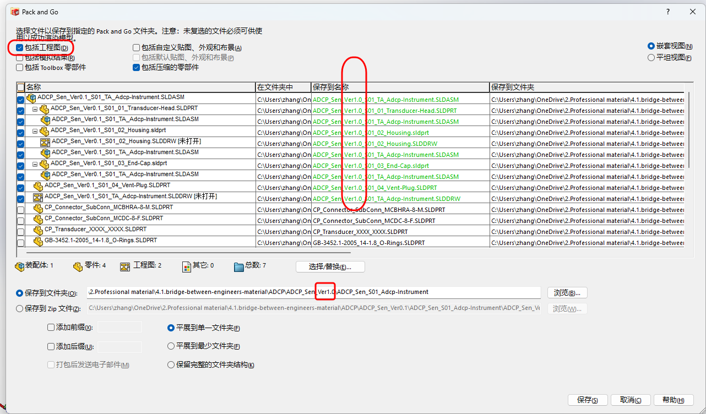
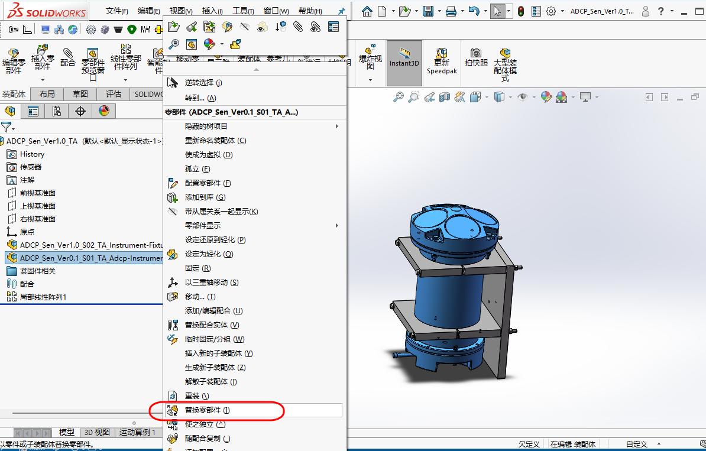
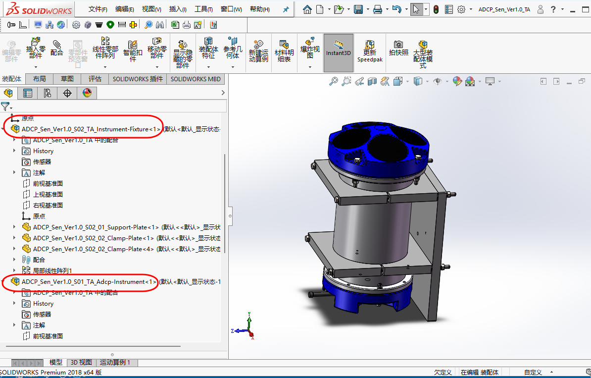

# SolidWorks 建模：以文件的版本迭代管理结束

!!! quote "场景还原"
    - 产品升级到v2，你复制了整个文件夹，重命名为“产品名_v2”。
    - 在v2文件夹中修改了几个零件后，打开v1的装配体，v1的零件也被改成了v2的样子。
    - 更糟的是，你甚至没有意识到这个问题，直到客户投诉说提供的图纸和实物对不上。
    
    在系列化、长期迭代的工程等项目中，版本的迭代管理是必须正视的问题。

## 1. 范围与目标

本文关注：

- 没有 PDM 时，如何做相对稳妥的版本管理
- 修订、改版与新结构路线如何区分
- 装配体、零件与图纸的关系如何保持清楚

## 2. 标准引用

### 2.1 GB/T 17825.6-1999《CAD 文件管理 更改规则》（版本管理依据）

**已知可核对范围**：本标准规定了 CAD 文件的更改原则、更改方法、更改程序、更改通知单填写以及“更改后的文件名管理”。

!!! note "关于“编号不含版本”的条文说明"
    在公开可查的标准摘要中，可确认 GB/T 17825.6 将“版本”放在“更改管理”语境处理，而不是鼓励将 `v1/v2/最终版` 直接塞入编号主体。

**核心目的（工程实践）**：

- 保持编号稳定，避免同一对象因版本变化而“改名失联”
- 让更改通过“流程与记录”可追溯，而不是靠文件名猜测
- 降低装配引用断裂与跨部门误用风险

## 3. 实操与模板

### 3.1 基本修订/迭代策略

判断是否升级版本代号
- 同一对象的小改动，优先走修改单说明的思路。
- 不可互换的结构变化，再考虑升级版本代号。

参考主流PDM的“修订版-迭代”概念：

- **修订版（Revision）**：重大设计变更等场景，如Ver0.1 → Ver1.0
- **迭代（Iteration）**：方案探索等用途，内部存档，如Ver0.1 → Ver0.2

!!! Warning "版本应慎重"
    - 版本修订涉及模型、制图、加工、采购、装配等一系列过程，不是一个简单的文件名改动，要慎重。
    - 不是重大设计变更，不进行版本修订。
    - 版本修订，应用清晰的文档记录。

### 3.2 软件操作

为了演示版本修订的过程而进行版本修订，并无重大设计变更，特此说明。

1. 错误示范：

    - 直接复制`ADCP_Sen_Ver0.1`文件夹并重命名为`ADCP_Sen_Ver1.0`。
    - 将`ADCP_Sen_Ver0.1_S01_TA_Adcp-Instrument`装配体重命名为`ADCP_Sen_Ver1.0_S01_TA_Adcp-Instrument`并打开。
    - 尝试将`ADCP_Sen_Ver0.1_S01_01_Transducer-Head`零件的直径扩大一些，可以看到`Housing`零件的直径并没有随之变化，而且`Housing`零件的凸台拉伸等有联动关系的特征均出现了`问号`，因此我们创建的自上而下的建模联动关系被破坏，如下图所示:

    <figure markdown="span">
      { width="720" }
      <figcaption>Incorrect-Iteration-Demonstration </figcaption>
    </figure>

2. 使用使用`打包/pack and go`功能进行版本修订:

    - 此法能确保链接关系的完整性。
    - 创建`ADCP_Sen_Ver1.0`文件夹及内部的子文件夹(如ADCP_Sen_S01_Adcp-Instrument)，子文件夹为空文件夹。
    - 复制`ADCP_Sen_Ver0.1_TA.sldasm`总装配体文件到`ADCP_Sen_Ver1.0/ADCP_Sen_TA`文件夹下，并重命名为`ADCP_Sen_Ver1.0_TA.sldasm`。
    - 打开`ADCP_Sen_Ver1.0_TA.sldasm`，在Feature Manager中鼠标右击`ADCP_Sen_Ver0.1_S01_TA_Adcp-Instrument.sldasm`，选择`打开子装配体`，选择`文件 菜单/pack and go`。
    - 勾选`包括工程图`、将Ver0.1相关的装配体、零件、图纸统一更名为Ver1.0，保存到文件夹路径修改到Ver1.0的文件夹，显然CP开头的外购商用件和GB标准件在专用文件夹，无需操作。如下图所示：

    <figure markdown="span">
      { width="720" }
      <figcaption>Pack-And-Go-Function </figcaption>
    </figure>

3. 在Feature Manager中，对`ADCP_Sen_Ver1.0_S02_TA_Instrument-Fixture.sldasm`执行类似的操作。

4. 替换装配体：

    - 回到`ADCP_Sen_Ver1.0_TA.sldasm`装配体，鼠标右击`ADCP_Sen_Ver0.1_S01_TA_Adcp-Instrument.sldasm`，选择`替换零部件`，浏览到对应文件夹下的`ADCP_Sen_Ver1.0_S01_TA_Adcp-Instrument.sldasm`，进行替换，如下图所示：

    <figure markdown="span">
      { width="720" }
      <figcaption>Replace-Assembly </figcaption>
    </figure>

    - 对`ADCP_Sen_Ver1.0_S02_TA_Instrument-Fixture.sldasm`执行类似的操作。
    - 保存`ADCP_Sen_Ver1.0_TA.sldasm`装配体，即得到了链接关系正常、名称修订完整的`ADCP_Sen_Ver1.0_TA.sldasm`文件，如下图所示：

    <figure markdown="span">
      { width="720" }
      <figcaption>Situation-After-Completion </figcaption>
    </figure>

## 4. 其余要点

暂无。

## 5. 边界与风险

- 同名文件冲突会直接干扰版本判断
- 版本号写在文件名里，看似直观，长期却容易混乱
- 装配体、零件和图纸若不同步改动，后果往往比单个零件错误更大

## 6. 小结

版本迭代的重点不在于“改名得像不像版本号”，而在于对象身份、修订状态和引用关系是否仍然可控。越是没有 PDM，越要把基本规则想清楚。

## 7. 参考来源

- 机械制图相关国家标准

