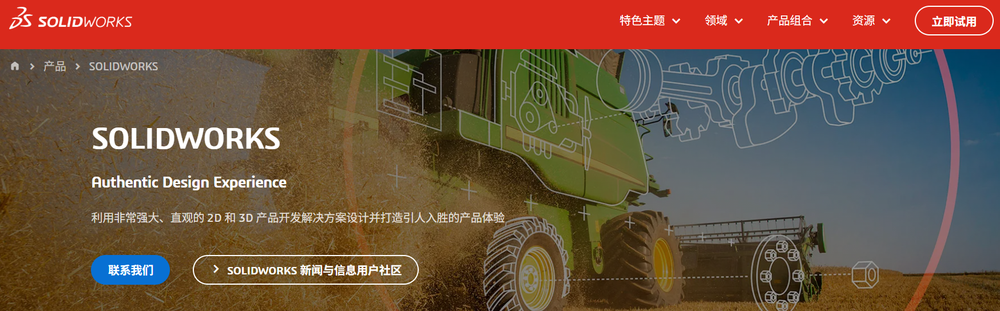

# SolidWorks建模与图纸系列文章(补充-1)：关于软件授权的一点讨论

!!! abstract "本文立场"

    本文讨论的是工程软件使用中的版权意识及其对专业性的影响，而不是对具体个人经历作判断，也不是对仍处在现实约束中的学习者、工程师进行审视。

    对于很多机械设计人员来说，SolidWorks 这类专业软件既是学习工具，也是工作工具。越是如此，越有必要在建模方法、图纸规范之外，补上一节关于授权、版权与专业环境的讨论。

## 1. 范围与目标

本文关注：

- 为什么在建模与图纸系列文章中，需要讨论软件版权问题。
- 如何看待现实中存在的未授权软件使用现象，而不轻视其中的学习者和工程师。
- 工程师在现实条件不够理想时，仍可以保留哪些基本边界。
- 正版软件、授权管理与专业协作环境之间有什么关系。
- 个人、公司、实验室或项目组织者，如何逐步向更合规、更专业的软件环境靠近。

## 2. 标准引用

暂无。

## 3. 实操与模板

### 3.1 为什么在建模系列中讨论版权

本系列文章主要讨论命名、建模方式、参数化、配置、图纸模板、标注、爆炸视图和版本迭代。这些内容看起来都属于技术层面，但它们背后其实有一个共同目标：让工程数据变得可靠、可追溯、可交接。

软件版权问题也属于这个目标的一部分。

如果一个团队希望自己的模型、图纸和设计流程是专业的，就很难长期绕开工具来源、授权状态和协作环境这些问题。正版软件并不只是“花钱买一个安装包”，它往往意味着更清楚的许可边界、更稳定的升级维护、更完整的技术支持，以及与 PDM、PLM、云端协作、多人建模和企业合规流程相连接的可能性。

### 3.2 看到现实，但不把现实当成标准

在一些学习和工作环境中，未授权软件的使用并不罕见。原因可能很复杂：专业软件价格较高，个人学习者难以承担；一些小型团队没有建立软件资产管理意识；有些岗位只要求产出模型和图纸，却没有提供足够合规的工具条件。

这些现实需要被看见。

看见现实，并不意味着轻视其中的人。很多工程师并不是出于恶意，也不是为了从版权问题中获利，而是在有限条件下学习、求职、完成工作和维持生计。若只用简单的道德标签去评价个人，很容易忽略工程教育、企业管理和行业环境中的复杂问题。

但看见现实，也不意味着让自己麻木。

如果我们在心里逐渐接受“反正大家都这样”“软件公司不差这点钱”“只要能出图就行”，版权问题就会从一个不得不面对的现实困难，变成一种被合理化的工作方式。真正值得警惕的，往往不是某个阶段处境不够理想，而是一个人或一个团队开始不再觉得这件事需要改善。

### 3.3 工程师可以保留的几条边界

面对不够理想的环境，工程师未必马上拥有完整的选择权。但仍可以尽量保留一些边界：

- 不主动传播、销售或帮助他人规避软件授权。
- 不把未授权软件当作压低成本、承接项目或获取竞争优势的手段。
- 不把版权问题讲成理所当然的“行业经验”。
- 在有条件时，优先选择正版、教育授权、试用授权、开源软件或公司提供的合规软件。
- 把学习重点放在可迁移的工程能力上，例如建模逻辑、装配关系、GD&T、制造理解、图纸表达和版本管理，而不是依赖某个不稳定的软件环境。
- 一旦进入更规范的公司、实验室或项目环境，主动适应正版软件、授权管理和协作流程。

### 3.4 正版软件带来的不只是“合法”

正版软件最直接的意义当然是尊重开发者和权利人的劳动成果。但从工程实践角度看，它还带来一些更具体的价值。

首先是稳定性。专业建模软件往往涉及复杂的文件格式、插件、标准件库、工程图模板和跨版本兼容问题。合规环境更容易获得更新、补丁和技术支持，也更容易在出现文件损坏、版本冲突或安装问题时找到官方客服寻求支持。

其次是协作能力。真正的工程项目很少只停留在单机建模。随着项目规模扩大，模型需要被多人访问、审阅、发布、修订和归档。正版软件及其配套生态更容易与 PDM、PLM、权限管理、版本控制、云端审阅等流程连接起来。也就是说，正版环境帮助我们理解的不是某个按钮，而是专业工程数据如何被组织和管理。

再次是职业边界。客户、供应商、审计、投标、涉外项目和知识产权审查，都可能涉及软件合规。一个团队若长期忽视授权问题，风险并不只在法律层面，也会影响客户信任、企业形象和工程交付的可持续性。

### 3.5 从个人学习到组织责任

对于个人学习者来说，最现实的路径可能不是立刻购买昂贵的商业授权，而是尽量寻找合规替代：

- 使用官方提供的试用、教育或创客类授权，前提是符合其许可条件。
- 将重点放在机械设计基本功上，而不是只追求某个软件版本的熟练操作。
- 求职或选择合作环境时，留意公司是否提供合规软件、是否有基本的数据管理流程。

对于公司、实验室和项目组织者来说，责任则更明确一些。专业化不是只要求工程师交付结果，也包括提供合规工具、建立软件资产台账、明确授权范围、设置共享库和协作流程，并把这些成本看作工程能力的一部分。

如果一个组织既要求设计结果专业可靠，又长期不愿为工具、授权和数据管理承担成本，那么压力最终会被转嫁给一线工程师。这不是健康的工程文化。

## 4. 其余要点

版权意识并不需要变成对他人的批评。

更有价值的问题也许是：

- 我是否在把不理想的现实说成理所当然？
- 我是否在有条件改善时，仍选择停留在旧习惯里？
- 我是否愿意把软件授权、文件管理和协作流程都看作专业能力的一部分？
- 当我有一天成为项目负责人、部门负责人或公司经营者时，是否愿意为合规工具承担成本？

对工程师而言，专业性不仅体现在模型画得是否漂亮、图纸标得是否准确，也体现在我们如何尊重知识、尊重协作边界、尊重长期维护的秩序。

## 5. 边界与风险

- 本文带有较强的个人思考色彩，谨慎参考。
- 本文假设读者在合规软件环境下操作；部分功能，如 PDM 集成、协作建模、云端审阅和企业级数据管理，可能依赖合法授权及相应服务。
- 现实环境中的软件使用问题往往牵涉个人经济能力、公司管理水平、教育资源和行业习惯。讨论这些问题时，应避免轻率地评价具体个人。

## 6. 小结

SolidWorks 版权问题表面上是软件授权问题，深处则是工程师如何理解专业秩序的问题。

建模规范让模型更可靠，图纸规范让制造沟通更可靠，版本管理让工程数据更可靠。而软件合规，则让工具、团队和项目环境更可靠。

愿这篇补充文章不是一种指责，而是一种反思：在现实并不总是理想的地方，仍然保留对更好工程环境的向往，并在能够选择的时候，选择更清楚、更正当、更专业的那一边。

## 7. 参考来源

- 与 AI 对软件授权等问题的辩论整理
- 2018 年 BSA（Business Software Alliance）发布的[全球调查](https://gss.bsa.org/)：
    - 无授权软件在全球范围内仍以惊人的速度使用，占个人电脑软件总数的37%，仅比2016年下降2%。
    - P.S. ：尽管未明确声明CAD软件的盗版率，但可作为参考。
- SolidWorks 母公司 Dassault Systèmes 官方[反盗版页面](https://www.3ds.com/zh-hans/piracy)明确表示：
    - 市场研究显示，Dassault Systèmes 产品组合中的部分产品存在未经授权使用，以及超出许可证条款的使用。
- 补充[官网链接](https://www.3ds.com/zh-hans/products/solidworks)及截图如下：
    <figure markdown="span">
      { width="720" }
      <figcaption>Solidworks-Official-Website-Screenshot </figcaption>
    </figure>

